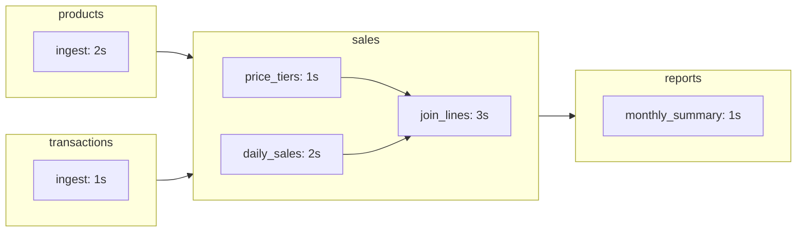

# Duckstring
*There is no DAG.*

Duckstring treats data transformations as software packages. Upstream dependencies are declared per Pond (unit operation), defining the DAG without the need for its direct management. 

Ponds are upgraded and deployed to Duckstring's pull-based Catchment (orchestrator) atomically - like upgrading a package - with the earlier version continuing to execute until there are no consumers dependent on it. Upstream defines constraints on what it can consume, downstream defines when it's needed, and the Catchment optimally executes the sequence of Ponds supplying it with the best currency and frequency as possible.

You should not need to manage the DAG. You should not need global governance. You should know yourself and your suppliers and trust that you'll get what you need when you need it.

## Core Concepts

The main elements:

- **Catchment**: Control environment (FastAPI + UI + CLI)
- **Pond**: Versioned container with declared upstream dependencies
- **Ripple**: Unit operation within a Pond (e.g. a single transformation producing a table)

Ponds are typed or referred to in context:

- **Source**: A parent Pond
- **Sink**: A child Pond
- **Inlet**: A Pond with xternal dependencies and no Sources
- **Outlet**: A Pond with no Sinks (e.g. outputs final data products)

## Installation

```bash
pip install duckstring
```

To enable CLI completions:
```bash
duckstring --install-completion
```

## Quickstart

### 1) Connect to a Catchment

A Catchment is the execution environment and orchestrator, receiving Ponds and managing runs. It runs either as a local daemon or as a remote server, allowing you to start locally and seamlessly upgrade to a hosted/cloud server if you need to later.

Starting or connecting to a Catchment selects it as the default target of later commands - other connected Catchments can be referred to with the `-c {catchment name}` option where relevant.

If you just want to get a feel for how the orchestrator works, take a look at the [Duckstring Playground](https://playground.duckstring.com).

#### Start a Catchment Server

To initiate a Catchment locally, run:

```bash
duckstring catchment init --name dev --port 5000 --root ~/.duckstring/dev
```

This will start a server with name 'dev' (prompted if none specified) at port 5000 and store Catchment details at `~/.duckstring/dev` (default is `~/.duckstring/{name}`). 

This can later be restarted with:

```bash
duckstring catchment start dev
```

#### Connect to a Remote Server

Alternatively, you can connect to a server running a Catchment:

```bash
duckstring catchment connect --name dev --path https://path.to.catchment
```

This will prompt for any necessary auth, and will add the Catchment under the specified name.

#### Connect to *duckstring.com*

There are future plans for a dedicated Catchment service at https://duckstring.com. If you're interested, please [contact me](mailto:dev@duckstring.com).

### 2) Define Pond(s)

#### Demo Ponds

It's recommended to look at an example before attempting to make your own Ponds so that you can get a feel for the structure. 

To do so, cd to a target directory for the demo Ponds and run:

```bash
duckstring pond demo
```

This will create a sequence of Ponds:



#### Custom Pond

Create a project directory and run:

```bash
duckstring pond init example_pond
```

This will create a duckstring pond structure:

```text
root/
|-- src/
|   |-- pond.py
|-- pond.toml
|-- __main__.py
|-- .gitignore
|-- README.md
```

Here `pond.py` contains the code for a single Ripple operation (currently blank), and `pond.toml` specifies the Pond name "example_pond" and version (defaulting to "0.1.0").

### 3) Deploy to Catchment

#### From Local

From a Pond's project root run:

```bash
duckstring pond deploy 
```

This will read the Pond name, version and type (Inlet, Pond, Outlet) from `pond.toml` and deploy the project contents to the Catchment.

Alternatively, you can import the Pond using the Catchment UI.

To upload from all Ponds within a directory, use:

```bash
duckstring pond deploy --all
```

### 3) Execute

Ponds are executed by sending a demand signal from an Outlet. This propagates backwards through the DAG until it reaches each upstream Inlet, causing them to execute, with children beginning upon completion of all of their parents.

Demand comes in two types:

- **push**: Executes in sequence from start to end, bringing all Ponds upstream of the target to a given freshness
- **pull**: Executes whenever Sources update, passing demand upstream

If running irregularly, **push** is simple and preferred.
If running frequently (~speed of slowest Ripple), **pull** is preferred, as it naturally throttles the entire sequence to the rate of the bottleneck Ripple.

These are triggered either once or continuously (**push** on a schedule, **pull** back-to-back):

| | Once | Continuously |
|---|---|---|
| **Push** | Pulse | Tide |
| **Pull** | Tap | Wave |

These examples will use the example Pond `reports`, version `1.0.0`, as the execution reference. All examples may also be alternatively executed using the Catchment UI.

Each of these triggers starts a status monitor that polls the Catchment, hanging up on complete for Pulse and Tap and remaining open until closed (Ctrl+C) for Tide and Wave. 

#### Pulse

```bash
duckstring trigger pulse reports
```

This emits a **push** on `reports`, running each Pond in its lineage once.

#### Tide

```bash
duckstring trigger tide reports 4
```

This executes a Pulse on `reports` any time its staleness (or time since last Pulse) exceeds 4 seconds, causing it to update every 4 seconds. The pipeline takes 7 seconds to execute, so multiple Pulses will be active simultaneously.

You can set the unit for the staleness limit with `--unit {seconds|minutes|hours|days|months|years}`.

Cancel the Tide with:

```bash
duckstring trigger remove reports
```

#### Tap

```bash
duckstring trigger tap reports
```

This emits a **pull** on `reports`, which propagates upstream on idle. Whenever a Pond starts, it sends the **pull** to its Sources, often causing them to start their next generation at the same time. This prepares each Pond for a subsequent Tap to be supplied immediately.

It can be useful to trigger a Tap whenever an application queries an Outlet, so that it updates at a frequency matching its consumption.

#### Wave

```bash
duckstring trigger wave reports
```

This executes a Tap on `reports` any time it starts, causing it to update as frequently as the longest-running Ripple (bottleneck) upstream. The pipeline takes 7 seconds to execute, and the bottleneck is 3s, so multiple Taps will be active simultaneously.

Use Wave whenever data should be supplied as fresh as possible. No Pond (or Ripple) will execute more frequently than the bottleneck process can consume it.

Cancel the Wave with:

```bash
duckstring trigger remove reports
```

#### Windows

Windows set an allowed period in which an Inlet can start, with data considered 'fresh' until the end of that period. They are especially useful in cases where a foreign data source that the Inlet consumes from is known to update only at some frequency (e.g. daily).

It is particularly useful to couple Windows with Wave. A one-day Window with a Wave consumer downstream will run the sequence of Ponds between them *once* daily, matching a Tide with a one-day staleness limit. Unlike Tide, however, the time of the Window can be set for the Inlet explicitly, so that consumption only occurs when the foreign source is known to have updated. Periods of "do not consume" (e.g. during writes) can also be specified this way.

Set a Window against `products` and `transactions` with:

```bash
duckstring trigger window products add --name ten-seconds --every 10s --duration 4s
duckstring trigger window transactions add --name ten-seconds --every 10s
```

This sets a 10s repeating Window on both, with `products` only active for 4s of that Window. A triggered Wave on `reports` will now be throttled to run every 10s (generally, the minimum of any Window).

The Window format is RFC 5545-like. Bounds may be set with `--start` (default today midnight) and `--until`, and `--on` to specify weekdays.  

### 4) Monitor, Control and Manage Failures

#### Monitor
To open the status monitor again:

```bash
duckstring status
```

You may also target a particular Pond, showing only its lineage:

```bash
duckstring status {pond_name}
```

#### Control

Ponds can be controlled (started, stopped) directly:

- **Force**: Force starts a Pond at the same freshness, regardless of Source state (for example to force a run upon deployment of a patch)
- **Wake**: Starts a Pond if its Sources have updated (waiting until they are)
- **Sleep**: Removes all demand (including *wake*) from the Pond
- **Kill**: Halts a running process immediately

Execute these with:

```bash
duckstring control {force|wake|sleep|kill} {pond_name}
```

#### Manage Failures

A Pond can be given a retry budget of two types:

- **Immediate**: A failed process (e.g. Ripple) starts again immediately
- **On Change**: A failed process starts again only once its Sources have updated

These are set as an option in the `pond.toml` file as the default value on deployment (0 if absent), but can be edited with:

```bash
duckstring failure budget {pond_name} --immediate {int} --on-change {int} 
```

When a Pond fails, it enters a `failed` state, causing all downstream Ponds (that require it) to be `blocked` (cannot receive new demand). The state can be cleared by:

```bash
duckstring failure clear {pond_name}
```

### 5) Retrieve Data

#### Get

The simplest way to retrieve data is to load by the Ripple name. This returns the entire contents of the directory, and does not require that the data be in a tabular format (e.g. SQL-compatible).

```bash
duckstring get reports monthly_summary
```

This writes a directory `./ponds/reports/monthly_summary` with the 'monthly_summary' Ripple's contents. You may also override the default location:

```bash
duckstring get reports monthly_summary --path ./monthly_summary
```

#### SQL Query

If the target is an SQL-compatible table (e.g. DuckDB or Parquet), an SQL statement may be sent directly, outputting the result to the command line:

```bash
duckstring query reports --sql "SELECT * FROM monthly_summary WHERE id=1;"
```

Alternatively, include a file path:

```bash
duckstring query reports --sql @path/to/query.sql
```

Using `--table` queries with a default SELECT * FROM {table} LIMIT 10, useful for glimpsing:

```bash
duckstring query reports --table monthly_summary 
```

##### Write to file

To output to a file, include a flag for the file format, followed by the file name:

`--csv`: Comma-separated values
`--json`: JSON records
`--parquet`: Parquet file

This writes by default to `./ponds/reports/monthly_summary/{filename}`. To overrite the default location you may use the `--path` flag.

For example, to execute an sql statement from file `query.sql` and write the result to CSV at the current directory:

```bash
duckstring query reports --sql @query.sql --csv monthly_summary.csv --path .
```

## Further Reading

For more detail on each component, please read the documentation at [docs.duckstring.com](https://docs.duckstring.com) (source in `docs/`). The [Theory](https://docs.duckstring.com/theory) page is a particularly good start for understanding the details of the orchestrator.

