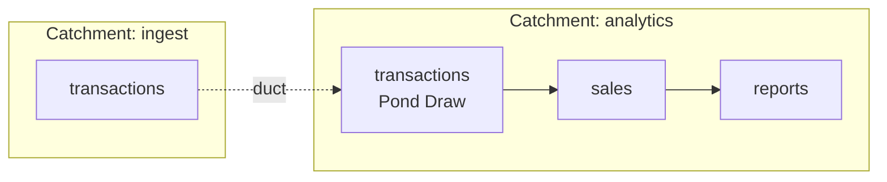

# Catchments

A **Catchment** is the environment Ponds are deployed to. It holds the deployed Ponds, runs them, and stores and catalogs their data. It works the same way on a laptop during development as on a shared server.

## Structure

A Catchment is a single server process with a directory of state: the deployed Pond code, run history, and each Pond's data. The CLI and web UI both talk to it over HTTP. You can register several Catchments, such as `dev` and `prod`, and choose between them with `--catchment`.

Settings that depend on the environment rather than the code, such as triggers, delivery destinations and secrets, are configured on the Catchment instead of in `pond.toml`, and survive redeploys.

## Orchestration

The Catchment decides when each Pond runs, based on the triggers set on it (see [Orchestration](orchestration.md)). When a Pond needs to run, the Catchment starts a worker process for it, called a Duck, which runs the Pond's Ripples and reports back. Ducks run on the Catchment's own machine by default, or on separate cloud compute (see [Management and Execution](management_and_execution.md)).

## Data

The Catchment stores each Pond's published tables, either on local disk or in object storage such as S3. Because it knows every Pond, version and table, it also serves as the catalog: each major version of a Pond is a schema, such as `reports_v1`, containing that version's tables. It also records lineage, at four levels:

- which Ponds feed which, from the declared Sources
- which tables each run actually read and wrote
- which source columns each output column is derived from, where this can be determined exactly
- for any published row, the run that produced it and the window of input it read

Lineage can also be sent to other catalogs as OpenLineage events.

## Querying

You can run read-only SQL over the catalog from the CLI (`duckstring query`), from the web UI's data viewer, or from Python. Access is controlled by API keys, and a Pond can choose which of its tables are exposed to users with read-only access.

<!-- IMAGE: the web UI data viewer showing reports.monthly_summary. -->

## Ingress and Egress

Data enters through Inlets, which are ordinary Ponds whose Ripples read from an external system. Besides being queried, data can leave through a **Spout**, which delivers a table to an external destination, such as an object store or a Postgres database, whenever the Pond publishes new output. Credentials for these destinations come from environment variables or the Catchment's secret store.

## Ducts

Different teams, or different compute tiers, may run separate Catchments. A **duct** connects two Catchments so that Ponds in one can consume Ponds from the other. The upstream Pond appears in the downstream Catchment as a Pond Draw, which copies its data across when it changes, and demand from downstream travels back up the duct. The package graph can then span Catchments in the same way it spans Ponds.

