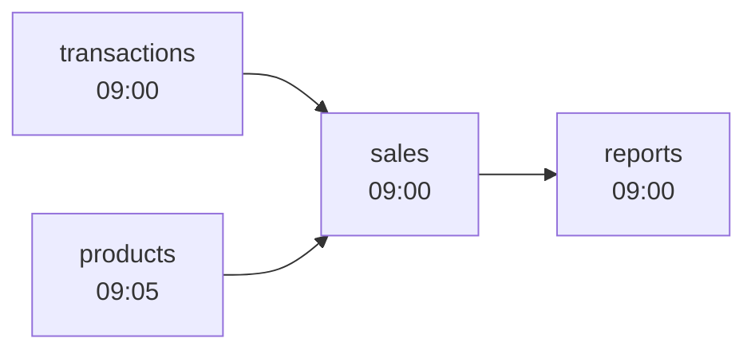
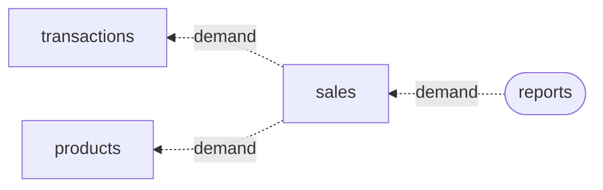
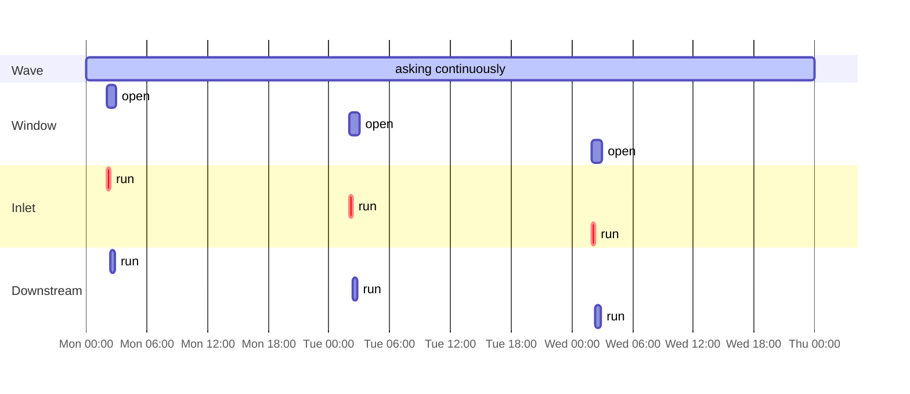

# Orchestration

Duckstring doesn't run Ponds on schedules. Instead, you place a trigger on the Pond whose data you need, usually an Outlet, and Duckstring works backwards to decide what upstream has to run. A Pond that nothing downstream is asking for never runs.

<video autoplay loop muted playsinline style="width: 100%; border-radius: 8px;" aria-label="The demo pipeline in the web UI under a Wave on reports">
  <source src="/img/ripple.webm" type="video/webm" />
  <source src="/img/ripple.mp4" type="video/mp4" />
</video>

The demo pipeline in the web UI, kept current by a Wave on `reports`.

## Structure

The same rules apply at two levels: between Ponds, following the dependencies in `pond.toml`, and between the Ripples inside each Pond. A Pond starts a run when it has been asked for data and its Sources have something newer to give it. There is no limit on how many Pond Runs happen at once, so a Pond can be working on a new run while its downstream Ponds are still processing the previous one.

## Freshness and Demand

### Why pull

Most orchestrators push. A schedule starts the pipeline at its beginning, and each step triggers the next when it finishes. This works well for small pipelines, but it causes problems as they grow:

- Every path runs whether or not anything uses its output. A table nobody reads any more keeps costing compute until someone notices and takes it off the schedule.
- Deploying something new means deciding when it should run and fitting it around everything else, and a mistake can disrupt steps that were already working.
- Fast steps run as often as they can, even when a slower step downstream can only use a fraction of their output.

Duckstring pulls instead. Demand starts at the end of the pipeline and travels upstream, and a Pond runs only when something downstream has asked for its data. As a result, unused paths go quiet on their own. Deploying is also safe: a new Pond, or a new major version of an existing one, sits idle until a consumer is pointed at it, so a deployment never changes what already runs. And, as described below, the whole pipeline settles at the pace of its slowest step, upstream of that step as well as downstream.

### Freshness

To decide whether a Pond needs to run, Duckstring needs a way to say how current its data is. Every Pond has a **freshness**: the point in time its data reflects. For an Inlet, this is the time the data was requested. For any other Pond, it is the freshness of its oldest Source, since the output can't be more current than its oldest input.

A Pond has new data to offer its downstream Ponds whenever its freshness is later than the data they last used.

### How demand travels

A trigger gives a Pond demand. If the Pond's Sources have newer data, it runs. If they don't, it passes the demand to them, and so on upstream until it reaches Ponds that can run. From an idle pipeline, a Tap on `reports` travels all the way to the Inlets, which run first, and the new data then flows back down:

<!-- DIAGRAM: step-by-step version of the above (idle → demand travelling up → Inlets running → sales running → reports running), using the theory doc's queued/running colouring. Possibly better as a short video from the web UI. -->

When a Pond starts a run to meet demand, it immediately asks its Sources for their next update. The Sources can then work on the next batch while the Pond processes the current one, so each step stays one run ahead of its consumer, and no further.

### Throttling to the bottleneck

That one-run-ahead rule sets the pace of the whole pipeline. Take a chain `A` (1 second) → `B` (3 seconds) → `C` (1 second), with `C` demanded continuously. If every step simply reran whenever its input changed, `A` would run three times for each run of `B`, and two of those results would be thrown away. Under pull, `A` only runs again when `B` starts consuming its last result:

```mermaid
gantt
    dateFormat X
    axisFormat %S
    section Push: A
    run      :0, 1
    run      :1, 2
    wasted   :crit, 2, 3
    wasted   :crit, 3, 4
    run      :4, 5
    wasted   :crit, 5, 6
    wasted   :crit, 6, 7
    section Pull: A
    run      :0, 1
    run      :1, 2
    run      :4, 5
    section B
    run      :1, 4
    run      :4, 7
    section C
    run      :4, 5
    run      :7, 8
```

Every step runs once per 3 seconds, the duration of `B`. In the Quickstart demo the slowest step is `join_lines` at 3 seconds, so under a Wave every Pond settles to running about every 3 seconds, with no work produced that nothing uses.

To see this for yourself, the [Orchestration Playground](https://playground.duckstring.com) lets you build a pipeline in the browser, set step durations and triggers, and watch demand and freshness move through it.

### Skipping unchanged work

If none of a Pond's Sources has changed since its last run, Duckstring skips the run and passes the new freshness through without recomputing anything.

## Triggers

There are four triggers, set with `duckstring trigger` or from the web UI:

| Trigger | Runs | Asks for |
|---|---|---|
| Tap | once | anything fresher than the Pond already has |
| Wave | continuously | the same, repeated whenever the Pond finishes |
| Pulse | once | data at least as fresh as the moment it was sent |
| Tide | continuously | a Pulse whenever the data would otherwise become older than a set limit |

A Tap is satisfied by any newer data. If a Pond's Sources have nothing newer, the request passes further upstream until it reaches a Pond that can run. A Pulse is stricter: everything upstream of the target runs until its data is at least as fresh as the time of the Pulse, and the result flows down to the target.

A Tide is how you run something daily. `duckstring trigger tide reports 1d` behaves like a Pulse every day. More precisely, it keeps `reports` at least as fresh as one day old, sending a Pulse whenever the data would pass that age.

Triggers can be placed on any Pond, but we strongly recommend placing them only on Outlets. Demand then always comes from something that genuinely consumes the data, and every Pond upstream runs only as often as its consumers need.

## Windows

Some Inlets read from systems that only update at certain times, such as a warehouse export that lands once a night. Running them more often wastes compute and adds nothing. A **window** declares when an Inlet can produce new data, for example every day from 02:00 for one hour. The Inlet runs at most once per window, and never between windows. Its data is treated as fresh until the end of the window, so downstream demand doesn't ask for more until the next one opens.

Windows are set on the Catchment with `duckstring trigger window`, not in `pond.toml`, since they describe the environment rather than the code.

Here an Inlet has a window from 02:00 to 03:00 each day, and a Wave on an Outlet downstream asks for data continuously. The Inlet runs once as each window opens, the run flows downstream, and the demand waits in between:

## Standard Patterns

| Need | Setup |
|---|---|
| A report refreshed every morning | a Tide of `1d` on the report's Outlet |
| A dashboard kept as current as possible | a Wave on the dashboard's Outlet |
| Data refreshed only when someone looks at it | a Tap each time it is queried |
| An upstream source that updates nightly | a window on its Inlet, plus any trigger downstream |

## See also

- Guides: [Scheduling](../guides/scheduling.md), [Monitoring and Failures](../guides/monitoring_and_failures.md)
- Reference: [Orchestration Theory](../reference/orchestration_theory.md), [duckstring trigger](../reference/cli/trigger.md), [duckstring control](../reference/cli/control.md)
