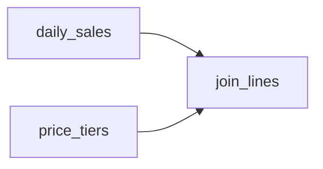

# Ripples

A **Ripple** is a single transformation inside a [Pond](ponds.md). It is a Python function marked with the `@ripple` decorator, and it declares which other Ripples in the same Pond it depends on.

## Structure

Ripples live in the Pond's `src/pond.py`. Each one receives a `pond` handle, which gives it a DuckDB connection and methods for reading and writing data. The `sales` Pond from the Quickstart has three:

```python
from duckstring import ripple

@ripple
def daily_sales(pond):
    ...

@ripple
def price_tiers(pond):
    ...

@ripple(parents=[daily_sales, price_tiers])
def join_lines(pond):
    ...
```



As with Ponds, the order is implied by the declared dependencies. `daily_sales` and `price_tiers` run in parallel, and `join_lines` runs once both have finished. Dependencies on other Ponds are declared in `pond.toml`, not on Ripples.

## Tabular and Generic

Most Ripples read tables and write tables. A Ripple can also publish non-tabular output, such as a trained model or a rendered file, as a named Object. It can even write nothing at all and just call an external service, using Duckstring only for scheduling.

## Data

The Ripples in a Pond share one DuckDB database, so a Ripple can query tables written by the Ripples before it directly. Tables from Source Ponds are read through the `pond` handle. Output is published only when the whole Pond Run succeeds. If a Ripple fails, downstream Ponds keep reading the last successful output.

## Trickles

By default a Ripple rewrites its tables in full on each run. A Ripple can instead write its tables incrementally, keeping a record of what changed so that downstream Ripples only process the changes. Tables written this way are called [Trickles](trickles.md).

## dbt Models

An existing dbt project can be deployed as a Pond by pointing `pond.toml` at it. Each dbt model becomes a Ripple, and the `ref()` dependencies between models set their order.
