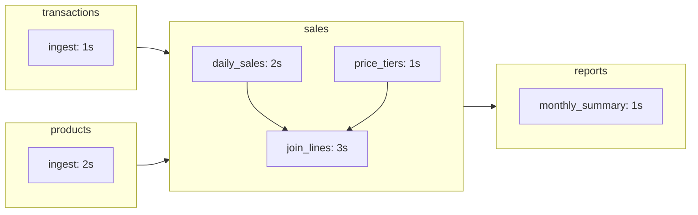

# Quickstart

This walkthrough takes you from a fresh [install](installation.md) to a continuously-running four-Pond pipeline: start a Catchment, deploy the demo Ponds, trigger them, and query the results.

## 1. Start a Catchment

A Catchment is the execution environment: it receives deployed Ponds and decides when they run. Start a local one:

```bash
duckstring catchment init --name dev
```

This registers a Catchment named `dev`, stores its data under `~/.duckstring/dev`, offers to make it your default, and starts the server at `http://127.0.0.1:7474` (configurable with `--host`/`--port`/`--root`). The web UI is served at that same address.

Leave it running and work from a second terminal. Later, restart it any time with:

```bash
duckstring catchment start dev
```

See [Running a Catchment](../guides/running-a-catchment.md) for remote servers and multi-Catchment setups.

## 2. Create the demo Ponds

From a scratch directory:

```bash
duckstring pond demo
```

This creates four Pond projects as subdirectories:



- **transactions**, **products** — Inlets that generate growing synthetic data (a POS event log and a product catalogue).
- **sales** — three Ripples: `daily_sales` and `price_tiers` feed `join_lines`, the 3-second bottleneck of the pipeline.
- **reports** — an Outlet producing a `monthly_summary` table.

Each is an ordinary Pond project: Ripple code in `src/pond.py`, with its name, version, and Sources declared in `pond.toml`. The pipeline above is never written down anywhere — it's implied by each Pond's `[sources]` section.

## 3. Deploy

Deploy all four at once:

```bash
duckstring pond deploy --all --yes
```

Each Pond is packaged and uploaded to the Catchment (`--yes` skips the per-Pond confirmation). They're now visible in the web UI and in:

```bash
duckstring status --once
```

Nothing runs yet — deployment registers a Pond; *demand* makes it run.

## 4. Trigger

Run the whole pipeline once by pushing the Outlet:

```bash
duckstring trigger pulse reports
```

The Pulse propagates upstream to the Inlets and execution cascades back down: `transactions` and `products` run, then `sales`, then `reports`. The command opens a live status view and closes when the pipeline settles (about 7 seconds — the longest path through the graph).

Now keep it running continuously with a standing pull:

```bash
duckstring trigger wave reports
```

A Wave re-arms upstream demand every time a Pond starts, so the pipeline free-runs — throttled only by its bottleneck. With `join_lines` at 3 seconds, every Pond settles into a ~3-second cadence, with several runs in flight at once. The status view stays open; `Ctrl+C` closes it without stopping the Wave.

When you've seen enough:

```bash
duckstring trigger remove reports
```

Existing work drains and the pipeline goes idle. [Triggers](../guides/triggers.md) covers all four trigger types and when to use each.

## 5. Query the results

Pond outputs are published as Parquet on every successful run. Glimpse the Outlet's table:

```bash
duckstring query reports monthly_summary
```

This prints `SELECT * FROM reports.monthly_summary LIMIT 10`. Run arbitrary SQL with `--sql`, or export with `--csv`/`--json`/`--parquet` — see [Querying Data](../guides/querying-data.md).

## Where next

- Open `http://127.0.0.1:7474` and explore the [web UI](../guides/web-ui.md) — the live DAG, run history, and the same trigger/control surface as the CLI.
- Write [your own Pond](../guides/creating-a-pond.md) and add it to the graph.
- Read [Freshness & Demand](../concepts/freshness.md) to understand *why* the Wave behaved the way it did.
