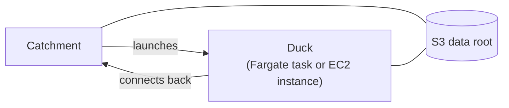

# Cloud Compute on AWS

By default a Catchment runs every Pond on its own machine. With cloud compute set up, individual Ponds can instead run on AWS Fargate or EC2, in your own account and VPC, while the Catchment stays where it is. This guide sets that up. Everything here is configuration: a Pond asking for cloud compute on a Catchment without it simply runs locally, so the same `pond.toml` works everywhere.

## How it fits together



The Catchment launches a Duck for a Pond when it needs to run, and the Duck connects back to the Catchment for its work. Connections only ever go from the Duck to the Catchment, so Ducks need no inbound network access, only outbound access to the Catchment and to S3. Published tables live in S3, where every Duck can reach them.

Cloud compute turns on when both of these hold:

1. The Catchment's data root is in S3.
2. The Catchment has AWS credentials: an instance role, `AWS_*` environment variables, a profile, or `AWS_*` entries in its secret store.

```bash
duckstring catchment settings
```

```text
data root:  s3://acme-lake/duckstring
AWS creds:  yes
cloud:      enabled
```

## Step 1: the data root

```bash
duckstring catchment settings --data-root 's3://acme-lake/duckstring?region=eu-west-2'
```

The data root can only be set before any Pond has published data, since changing it later would strand that data. Prefer credentials from the Catchment's instance role over keys in the URI.

## Step 2: IAM

Three roles are involved.

**The Catchment's role** launches Ducks and reads the bucket:

- `ecs:RunTask`, `ecs:StopTask`, `ecs:DescribeTasks`, `ecs:RegisterTaskDefinition`, `ecs:DescribeTaskDefinition` and `ecs:TagResource`, for Fargate.
- `ec2:RunInstances`, `ec2:TerminateInstances`, `ec2:CreateTags` and `ec2:DescribeInstances`, for EC2 Ducks or the relay.
- `iam:PassRole` for every role it gives to a Duck.
- Read and write access to the data bucket.

:::warning Two permissions that are easy to miss
`ecs:TagResource` is needed because every task is tagged at launch; without it, `RunTask` is denied. `iam:PassRole` is needed to hand a role to a task or instance. Both failures appear only in the Pond's failure message.
:::

**The Duck's role**, used by Ducks as their task or instance role, needs read and write access to the data bucket and nothing else. Ducks never receive the Catchment's credentials.

**The ECS execution role**, for Fargate only, pulls the image and writes logs. Start from the AWS-managed `AmazonECSTaskExecutionRolePolicy` and add the log group:

```json
{
  "Effect": "Allow",
  "Action": ["logs:CreateLogGroup", "logs:CreateLogStream", "logs:PutLogEvents"],
  "Resource": [
    "arn:aws:logs:REGION:ACCOUNT:log-group:/duckstring/duck",
    "arn:aws:logs:REGION:ACCOUNT:log-group:/duckstring/duck:*"
  ]
}
```

:::warning Both resource forms
With only one of the two ARNs, tasks fail with `ResourceInitializationError: failed to validate logger args`, which reads like a configuration problem. `CreateLogGroup` is only exercised the first time, so a broken policy can go unnoticed for weeks and then fail on a new account.
:::

## Step 3: networking

Two security groups:

- **`sg-catchment`**, on the Catchment: inbound on the Catchment's port (7474 by default) from `sg-duck`.
- **`sg-duck`**, on Ducks: no inbound rules at all.

Ducks also need a route to S3 and the Catchment: a public subnet with a public IP, or a private subnet with a NAT gateway or an S3 VPC endpoint. A Duck for a Pond with its own Python dependencies also downloads them when it starts, so it needs a route to PyPI, or a package mirror set in the image with uv's `UV_DEFAULT_INDEX`.

Ducks connect back to the address the Catchment is bound to. If that address isn't reachable from the Ducks' subnets, for example because the Catchment binds to `0.0.0.0` on a private network, set the address they should use:

```bash
DUCKSTRING_CATCHMENT_PUBLIC_URL=http://10.0.1.5:7474
```

Check that the value has a host. A URL built from an empty variable, such as an EC2 metadata lookup without an IMDSv2 token, gives `http://:7474`. The Catchment rejects this at start-up rather than let Ducks fail later.

## Step 4a: Fargate Ducks

Fargate is the default, and the fastest to start (about twenty seconds). Configure it with environment variables on the Catchment:

```bash
DUCKSTRING_FARGATE_IMAGE=<account>.dkr.ecr.<region>.amazonaws.com/duckstring:0.5.0
DUCKSTRING_FARGATE_CLUSTER=duckstring
DUCKSTRING_FARGATE_SUBNETS=subnet-0abc
DUCKSTRING_FARGATE_SECURITY_GROUPS=sg-duck
DUCKSTRING_FARGATE_EXECUTION_ROLE=arn:aws:iam::<account>:role/ecsTaskExecutionRole
DUCKSTRING_FARGATE_TASK_ROLE=arn:aws:iam::<account>:role/duckstring-duck
DUCKSTRING_FARGATE_ASSIGN_PUBLIC_IP=ENABLED
```

Then move a Pond onto it, using one of the built-in sizes (`S`, `M`, `L`, `XL`):

```bash
duckstring duck set sales --duck M
duckstring trigger pulse sales
```

Or declare it in the Pond's `pond.toml`, so it travels with the code:

```toml
[pond]
duck = "M"
```

Each Pond on a built-in size gets its own task. A pool you define, with `duckstring duck pool add`, instead runs all of its Ponds' Ducks on one shared machine of its size.

### Building the image

Duckstring doesn't publish a Duck image. The image runs in your account with access to your data, so you build it and host it yourself. A Duck downloads its Pond's code from the Catchment when it starts, so the image only needs Duckstring and dependencies, and needs rebuilding only when those change.

Ponds that declare their own [Python dependencies](writing_ripples.md#python-dependencies) need nothing extra in the image: the Duck builds the Pond's environment when it starts, installing the image's own Duckstring into it. This happens on every cold start: with only Duckstring's own dependencies it takes about 13 seconds, and more packages take longer. It also needs access to the package index (see [networking](#step-3-networking)). Ponds without a `pyproject.toml` run in the image's environment, so install whatever they import there.

```dockerfile
FROM python:3.13-slim
RUN pip install "duckstring[aws]==0.5.0" pandas scikit-learn
RUN useradd --create-home --uid 10001 duck && mkdir -p /var/lib/duckstring && chown duck /var/lib/duckstring
USER duck
WORKDIR /var/lib/duckstring
ENV DUCKSTRING_STATE_ROOT=/var/lib/duckstring
ENTRYPOINT ["python", "-m"]
```

The repository's `Dockerfile` does the same from a locally built wheel, which it keeps in the image at `/opt/duckstring/` so Ducks can install that same build into Pond environments. Push the image to a private ECR repository in the same account and region:

```bash
docker build --platform linux/amd64 -t duckstring:0.5.0 .
aws ecr create-repository --repository-name duckstring
docker tag duckstring:0.5.0 <account>.dkr.ecr.<region>.amazonaws.com/duckstring:0.5.0
docker push <account>.dkr.ecr.<region>.amazonaws.com/duckstring:0.5.0
```

Build for the architecture the tasks use: `linux/amd64` by default, or `linux/arm64` with `DUCKSTRING_FARGATE_CPU_ARCH=ARM64`. An image built on an Apple-silicon laptop without `--platform` is arm64 and won't run on the default. Pin a version tag rather than `latest`, so the image never changes underneath a running pipeline.

## Step 4b: EC2 Ducks

EC2 suits sizes Fargate doesn't offer (beyond 16 vCPU or 120 GiB), GPUs, or a particular instance type. Ducks start more slowly, in a minute or two, and the Catchment allows for that before treating a Duck as unresponsive.

```bash
DUCKSTRING_EC2_AMI=ami-0abc
DUCKSTRING_EC2_INSTANCE_PROFILE=duckstring-duck-ec2
DUCKSTRING_EC2_SUBNET=subnet-0abc
DUCKSTRING_EC2_SECURITY_GROUPS=sg-duck
DUCKSTRING_EC2_ASSIGN_PUBLIC_IP=ENABLED
```

```bash
duckstring duck pool add heavy --provider ec2 --instance-type m6i.4xlarge
duckstring duck set sales --duck heavy
```

:::warning Subnet and security group are required
Without them, AWS puts the instance in the VPC's default security group, which usually can't reach the Catchment. The Duck boots and installs, and is then marked unresponsive a minute later, which looks like a crash rather than a networking problem.
:::

:::warning The AMI's default Python
An EC2 Duck boots by running `pip3 install` (when `DUCKSTRING_EC2_PIP_SPEC` is set) and then `python3 -m duckstring.duck`. The image's default `python3` must be 3.10 or newer, with a matching `pip3`. Stock Amazon Linux 2023 has 3.9, and a Duck on it exits without a word.

Bake an AMI instead: launch a small instance, make Python 3.11 the default `python3`, install `duckstring[aws]` and your dependencies with `pip install --force-reinstall`, and create an image. Before creating it, check that `find /usr/local/lib/python3.11/site-packages -name '*.py' -size 0 | wc -l` prints `0`. An interrupted install can leave empty files that a later install skips, and a single one produced a Duck that started and exited successfully having done nothing.
:::

## Running cloud Ducks from a laptop

A Catchment on a laptop can run cloud Ducks too, but Ducks can't connect back to a laptop behind NAT. The Catchment can bridge this itself with a relay: a small EC2 instance that the Ducks connect to, with an outbound SSH tunnel from the laptop to it. It's started on the first cloud run and shuts itself down if the laptop goes away for longer than `DUCKSTRING_RELAY_TTL_MINUTES` (30 by default).

The relay is used when the Catchment is bound to a local or private address and these are set:

```bash
DUCKSTRING_RELAY_AMI=ami-0abc              # or it uses DUCKSTRING_EC2_AMI
DUCKSTRING_RELAY_KEY_NAME=my-keypair       # an EC2 key pair
DUCKSTRING_RELAY_SSH_KEY=~/.ssh/my-keypair.pem
DUCKSTRING_RELAY_SECURITY_GROUP=sg-relay   # inbound SSH from you, and the relay port from sg-duck
```

Set `DUCKSTRING_RELAY=off` to disable it. A Catchment with a reachable address, or with `DUCKSTRING_CATCHMENT_PUBLIC_URL` set, never uses the relay.

## The Flock: offloading large recomputes

Sometimes a Pond has to recompute a Trickle in full, after a refresh or when most of a source changed, and the recompute won't fit in its Duck's memory. The Flock sends that computation to Athena, while the Duck keeps the incremental bookkeeping and the publish.

```bash
DUCKSTRING_FLOCK_ENGINE=athena
DUCKSTRING_FLOCK_ATHENA_WORKGROUP=duckstring-flock
DUCKSTRING_FLOCK_ATHENA_DATABASE=duckstring_flock
DUCKSTRING_FLOCK_ATHENA_SCRATCH=s3://acme-lake/flock-scratch
```

```bash
duckstring duck set priced --flock upgrade
```

`upgrade` sends a recompute to Athena when it's clearly too large for the Duck, or after it runs out of memory locally. `always` sends every eligible recompute. The default is `off`, and `DUCKSTRING_FLOCK_MODE` changes the default for the whole Catchment. The size threshold comes from `DUCKSTRING_MEMORY_LIMIT`, so set it on Ducks that use the Flock.

The Duck's role also needs Athena and Glue access, plus `s3:GetBucketLocation` and `s3:ListBucketMultipartUploads` on the scratch bucket. Without those, Athena reports "Unable to verify/create output bucket". Give the scratch prefix a lifecycle rule, since everything in it is temporary.

DuckDB stays the authority on results. Only expressions known to give identical results on both engines are sent: arithmetic without division, `round`, `abs`, `floor`, `ceil` and `coalesce`, among others. Division and `CAST` aren't, because Athena and DuckDB disagree on them. Athena's result is cast to the schema DuckDB would have produced, and rejected if its columns differ. Anything unsupported, rejected or failed runs in the Duck instead.

That fallback means a broken Flock never shows in your data, only in cost and speed. Watch `duckstring_flock_dispatch_failures_total` on [`/metrics`](monitoring_and_failures.md#metrics), and the `flock_error` field in a Pond's status.

## Where data goes

A Pond running on the Catchment's own machine publishes locally first, then copies its output to S3 in the background. A Pond on a cloud Duck publishes straight to S3. A Pond downstream on a different machine waits until its Source's output has reached S3, never reading output that isn't there yet.

Stopping the Catchment doesn't wait for background copies to finish. Nothing is lost, since the Catchment reconciles and re-runs the gap on restart, but recent work may be repeated. To avoid that, drain first:

```bash
duckstring do --all --sleep
```

## Debugging a Duck

Ducks have no inbound access, so there's no SSH. Don't open it: a Duck holds credentials for your data.

**Start with the Pond's failure message.** When a Duck fails, the Catchment asks AWS what happened and includes it: the ECS stop reason and the end of the task's CloudWatch log for Fargate, or the instance state and the end of its boot console for EC2.

A Pond whose environment couldn't be built on the Duck fails with "Building the Pond's environment failed" and uv's output, usually a package the Duck couldn't download or that has no build for the Duck's platform.

**Read the boot console** of an EC2 Duck that died before connecting:

```bash
aws ec2 get-console-output --instance-id i-0abc --latest --output text | tail -40
```

**Use Session Manager** for an EC2 Duck that's running but stuck. Attach `AmazonSSMManagedInstanceCore` to the Duck's role for an audited shell with no inbound rules:

```bash
aws ssm start-session --target i-0abc
```

Fargate Ducks log to the `/duckstring/duck` CloudWatch log group.

## Cost

Duckstring itself costs nothing; you pay AWS for:

- the Catchment's machine, which runs continuously and is most of a small deployment's cost;
- Ducks, per run, since each is stopped when its Pond goes idle;
- Athena, per terabyte scanned, only when the Flock is used;
- S3 storage and requests.

`/metrics` includes each Pond's total run time (`duckstring_pond_run_seconds_total`) and where it runs (`duckstring_pond_duck_target`), for attributing cost to Ponds.

## Checklist

If cloud Ducks don't start:

- [ ] `duckstring catchment settings` shows `cloud: enabled`
- [ ] The Catchment's role has `ecs:TagResource`, and `iam:PassRole` for every role it hands out
- [ ] The execution role has both log-group ARN forms
- [ ] `sg-catchment` allows the Catchment's port from `sg-duck`
- [ ] Ducks have both a subnet and a security group configured
- [ ] The Ducks can reach the Catchment's address, or `DUCKSTRING_CATCHMENT_PUBLIC_URL` is set
- [ ] The image's architecture matches `DUCKSTRING_FARGATE_CPU_ARCH`
- [ ] For EC2, the AMI's default `python3` is 3.10 or newer, with no empty files in site-packages
