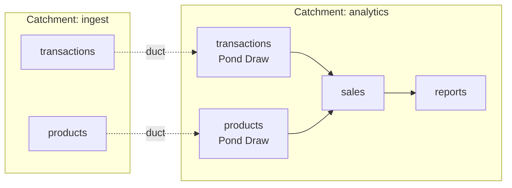

# Connecting Catchments

Sometimes one Catchment isn't enough: separate teams run their own, a production Catchment feeds an analytics one, or a heavy workload gets a machine of its own. A duct connects two Catchments so that Ponds in one can depend on Ponds in the other, just as they would within one Catchment. See [Ducts](../concepts/catchments.md#ducts) for the concept.

This guide connects an `ingest` Catchment, which runs `transactions` and `products`, to an `analytics` Catchment, which runs `sales` and `reports`.

## How it works

A duct is configured on the consuming Catchment. Each upstream Pond it draws appears locally as a **Pond Draw**, with the same name, which local Ponds use as a Source. The Draw copies the upstream Pond's published tables across whenever they change. When local Ponds need newer data, the Draw passes the request upstream as a Tap or Pulse, so the upstream Pond runs as though it had been triggered locally, and its freshness carries through.



## Trust

The consuming Catchment stores the credentials it uses to reach the upstream, and uses them to read data and send demand. Use a key with demand access to the upstream: read access is enough to copy data but not to request new runs. Anyone with full access to the consuming Catchment can act with that key, so only connect Catchments whose operators trust each other.

## Creating a duct

Both Catchments must be registered with your CLI, and the consuming Catchment must be able to reach the upstream's address:

```bash
duckstring catchment connect --name ingest --path https://ingest.example.com --key "$INGEST_DEMAND_KEY"
duckstring catchment connect --name analytics --path https://analytics.example.com --key "$ANALYTICS_FULL_KEY"
```

Create the duct on `analytics`, pulling in the upstream's registered address and key:

```bash
duckstring catchment duct create ingest -c analytics
```

Then choose what to draw, one Pond at a time or everything the upstream has:

```bash
duckstring catchment duct add ingest transactions -c analytics --major 1
duckstring catchment duct add ingest products -c analytics --major 1
# or
duckstring catchment duct sync ingest -c analytics
```

`sync` draws every Pond the upstream currently reports, except any whose name and major version already exist locally. It only adds; Ponds removed upstream stay drawn until you remove them with `duct remove`.

```bash
duckstring catchment duct ls -c analytics
```

## Depending on a Draw

Local Ponds declare a Draw in `[sources]` like any other Pond:

```toml
# sales/pond.toml
[sources]
transactions = "1.0.0"
products = "1.0.0"
```

A Draw's version is always recorded as `{major}.0.0`, because the consuming Catchment only tracks which major line it draws. Pin Draws at `{major}.0.0`: a higher minimum, such as `"1.2.0"`, is rejected at deploy.

Read the tables as usual, with `pond.read_table("transactions.transaction")`. Trickles keep working across the duct: only new changes are copied on each transfer, so downstream Ponds still read changes rather than whole tables.

Triggers go on the local Outlets as usual:

```bash
duckstring trigger tide reports 1d -c analytics
```

The demand travels to `sales`, then to the Draws, and across the duct to `transactions` and `products` in `ingest`.

## Refreshing on read

An upstream Pond can be set to refresh itself whenever it's queried, which suits a consumer that reads occasionally and wants current data when it does:

```bash
duckstring catchment open transactions -c ingest --tap-on-get
```

Each query of `transactions` through the Catchment's query API, such as `duckstring query`, the Python client or the web UI's data viewer, then also sends it a Tap, after returning the data it already has. Transfers over a duct don't trigger it; a Draw requests new data through its own demand. `duckstring catchment close transactions -c ingest` turns this off.

## Watching and removing

Draws appear in `duckstring status` and the UI with the other Ponds, and their transfers have run history like any Pond. The UI can show the graph across Catchments, following each duct upstream.

```bash
duckstring catchment duct remove ingest products -c analytics   # stop drawing one Pond
duckstring catchment duct destroy ingest -c analytics            # remove the duct and all its Draws
```

Local Ponds that depend on a removed Draw can't run until it's drawn again.
