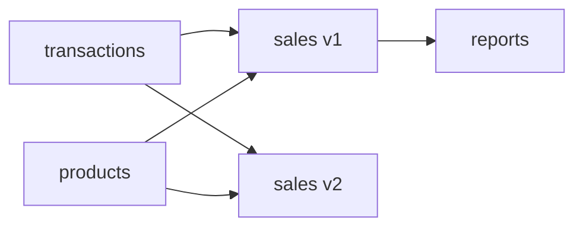

# Upgrades and Breaking Changes

Changing a Pond that other Ponds read from is the problem Duckstring's versioning exists for. A compatible change upgrades everyone at once. A breaking change runs alongside the old version, so each downstream Pond moves to it when its owner is ready. This guide walks through both, using the demo `sales` Pond and its consumer `reports`. See [Versioning](../concepts/ponds.md#versioning) for the concepts.

## Compatible or breaking

Versions are `MAJOR.MINOR.PATCH`:

| Change | Examples | Version |
|---|---|---|
| Fix with no change to output shape | a corrected calculation, a performance improvement | patch: `1.0.0` → `1.0.1` |
| Additive change to output | a new table, a new column, a column type widened (such as `INTEGER` to `BIGINT`) | minor: `1.0.1` → `1.1.0` |
| Anything a consumer could break on | a removed or renamed table or column, a narrowed type, a changed meaning | major: `1.1.0` → `2.0.0` |

A type change counts as widening only when every existing value survives it: a larger integer type, a `DECIMAL` with no fewer digits on either side of the point, a finer timestamp, or `FLOAT` to `DOUBLE`. Any other change, including `INTEGER` to `DOUBLE` and any change to or from `VARIANT`, is breaking.

Duckstring checks the shape of a Pond's output, but not what it means. If a column keeps its name but changes units, that's a breaking change only you can recognise, and it needs a new major version too.

## Compatible changes

Add a `channel` column to `sale_line` in `sales`, bump the version to `1.1.0` in `pond.toml`, and deploy:

```bash
duckstring pond deploy
```

The new version replaces `1.0.0` on the major version 1 line. Its next run publishes the extra column, and `reports`, which pins `sales = "1.0.0"`, reads it without noticing. Triggers, windows, Spouts and alerts on the line are kept.

## What happens with a breaking change deployed as compatible

Suppose `sales` 1.2.0 renames `revenue` to `gross_revenue`. Every successful run records the line's output schema, and each new run is checked against it before publishing. Dropping `revenue` fails the check, so the run fails without publishing:

- `reports` keeps reading the last good output of `sales`, and is shown as blocked until `sales` recovers.
- The failure's message says it's a contract violation, and the UI shows "Failed · Contract violation".
- Alert channels subscribed to `contract` are notified.

To recover, either deploy a fixed 1.x version, which clears the failure automatically, or deploy the change as a new major version, as below.

If you do mean to narrow a column's type within a major version, and know that consumers can take it, `duckstring control reset-contract sales` makes the line forget its recorded schema, so the next run records the new one.

## Breaking changes

Deploy the renamed column as `2.0.0`:

```toml
[pond]
name = "sales"
version = "2.0.0"
```

```bash
duckstring pond deploy
```

`sales` now has two major lines, each an independent Pond with its own runs and data. Version 2 is deployed, but nothing depends on it yet, so it doesn't run. `reports` still pins major version 1, which keeps running as before.



When the owner of `reports` is ready, they update its SQL for the new column name, point its pin at the new major version and release:

```toml
[pond]
name = "reports"
version = "1.1.0"

[sources]
sales = "2.0.0"
```

```bash
duckstring pond deploy
```

`reports` now reads `sales` v2, and demand flows to it instead of v1. Its own output didn't change shape, so `reports` only needed a minor release.

With nothing reading it, `sales` v1 stops running. Retire it once you're sure no one needs it:

```bash
duckstring control sleep sales --major 1
duckstring pond remove sales --major 1
```

Removing keeps the line's run history, and redeploying a 1.x version restores it. `--wipe` removes it completely.

## Minimum versions

A `[sources]` pin also sets a minimum version. If `reports` starts using the `channel` column added in `sales` 1.1.0, it should pin `sales = "1.1.0"`. Deployment then enforces the pin in both directions:

- `reports` can't be deployed while the running `sales` 1.x is older than 1.1.0.
- `sales` can't be rolled back below 1.1.0 while `reports` requires it.

Both are rejected at deploy time with a message naming the conflict.

Rolling back within a major version is otherwise allowed: deploy the older version and it replaces the current one.

## Commands and triggers across majors

Commands that act on a Pond target its highest deployed major by default. Use `--major` to reach another line:

```bash
duckstring status sales --major 1
duckstring trigger tide reports 1d --major 2
```

Triggers belong to a major line. When an Outlet itself moves to a new major version, set its trigger on the new line and remove it from the old one.

## Queries by name

Catalog SQL can name a major version explicitly (`sales_v2.sale_line`) or use the bare Pond name (`sales.sale_line`), which refers to the Pond's served major. The served major stays on the first major version deployed until you promote another, so a dashboard reading `sales.sale_line` isn't switched to v2 by the deployment alone:

```bash
duckstring serve promote sales --major 2
```

Promotion is refused if v2 doesn't publish every table currently served. Consumers that name the version explicitly are unaffected either way.
