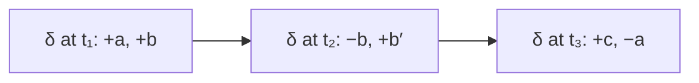
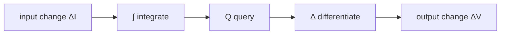
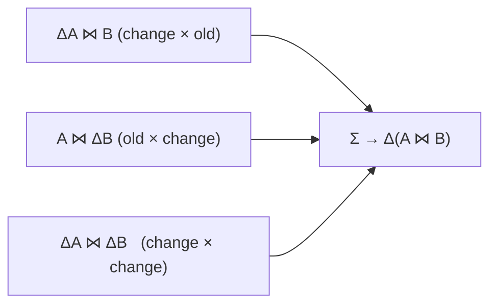
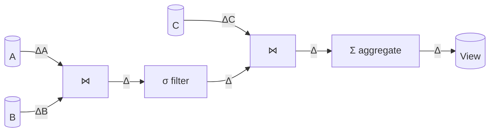
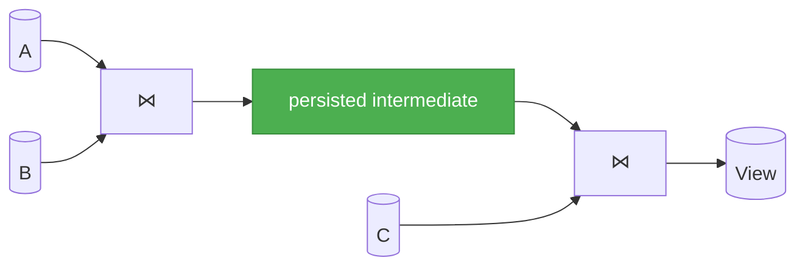

# Incremental Theory

This document outlines the theory of **incremental view maintenance** (IVM): computing the change in a transformation's output directly from the change in its input, rather than rebuilding the output from scratch. It is a companion to the [orchestration theory](/theory); where that document concerns *when* a transformation runs, this one concerns *how little work* a run can do.

## Motivation

A transformation is a function of its inputs — a *view* $V = Q(I)$ for a query $Q$ over input data $I$. When an input changes only a little, recomputing the whole view costs in proportion to the *whole* input, not the change. A pipeline that runs often over slowly-changing data spends almost all of its effort reproducing results identical to the previous run.

Incremental view maintenance asks: given the previous output and the change to the input, can we compute the change to the output directly, at a cost proportional to the size of the *change* rather than the size of the *data*? Formally, for a change $\Delta I$ we seek an operator $Q^\Delta$ with

$$
Q(I + \Delta I) = Q(I) + Q^\Delta(I, \Delta I)
$$

where evaluating $Q^\Delta$ costs $O(|\Delta I|)$ rather than $O(|I|)$.

Two questions follow. First, how do we *represent* a change so that "$+$" and "$-$" make sense uniformly across insertions, deletions, and updates? Second, for which queries can $Q^\Delta$ be made cheap, and how? The remainder of this document develops a single algebraic answer to both, in the modern form given by the theory of **DBSP**.

## Changes as Z-sets

Ordinary set difference is an awkward foundation: a relation is a set of rows, and "remove these, add those" has no single additive object to manipulate. The remedy is to enrich relations with integer **multiplicities** and permit them to be negative.

A **Z-set** over a domain of rows $R$ assigns each row an integer weight, with only finitely many non-zero:

$$
z : R \to \mathbb{Z}, \qquad \bigl|\{\, r : z(r) \neq 0 \,\}\bigr| < \infty .
$$

Read $z(r)$ as "how many copies of $r$": $+1$ a present row, $+k$ a row of multiplicity $k$, and $-1$ a **retraction** of a row. Z-sets form a commutative group under pointwise addition:

$$
(z_1 + z_2)(r) = z_1(r) + z_2(r), \qquad (-z)(r) = -z(r), \qquad \mathbf{0}(r) = 0 .
$$

The decisive property is the **additive inverse**: every change has an exact opposite, and so

$$
z + (-z) = \mathbf{0} .
$$

An ordinary table is the Z-set with weight $1$ on each present row. A deletion of $r$ is $-\{r\}$. An **update** of $r$ to $r'$ is the change $-\{r\} + \{r'\}$ — retract the old image, assert the new. Every elementary edit is thus a single additive object, and a change followed by its retraction cancels to nothing. This cancellation is the basis of everything that follows.

**Consolidation** is the canonical normal form: sum the weights of equal rows and discard any whose total weight is $0$. The example below consolidates an insert, an update, and a redundant pair:

| row | weights seen | consolidated |
|---|---|---|
| $a$ | $+1$ | $+1$ |
| $b$ | $+1,\ -1$ | *(dropped: $0$)* |
| $c$ | $-1,\ +1$ (update from $c$) | *(dropped: $0$)* |
| $c'$ | $+1$ (the new image) | $+1$ |

A Z-set is **positive** if every weight is $\ge 0$ — a genuine table or multiset. A general change need not be positive, and that is precisely what lets it express removal.

## Epochs and the changelog

Changes arrive over time. We stamp each with an **epoch** $t$ — a logical timestamp that totally orders the successive versions of the data. (In the [orchestration model](/theory) this epoch is a node's *freshness*.)

The **changelog** is the append-only stream of stamped changes,

$$
\delta : \text{Epoch} \to \mathbb{Z}[R], \qquad \delta_t = \text{the change applied at epoch } t,
$$

writing $\mathbb{Z}[R]$ for the group of Z-sets over $R$. The changelog records *what changed, and when*; it is only ever appended to, so the full history of edits is preserved rather than overwritten.

## Integration and differentiation

The changelog (a stream of changes) and the data's value at a moment (its **state**) are two faces of one object, related by a pair of mutually inverse stream operators.

**Integration** $\mathcal{I}$ accumulates the changelog into the state at each epoch — the running consolidated sum:

$$
S_t \;=\; \mathcal{I}(\delta)_t \;=\; \sum_{u \le t} \delta_u .
$$

$S_t$ is the table as it stands at epoch $t$: the *integrated history*.

**Differentiation** $\mathcal{D}$ recovers the per-epoch change from a stream of states:

$$
\mathcal{D}(S)_t \;=\; S_t - S_{t-1} .
$$

The two are exact inverses,

$$
\mathcal{D}\,\mathcal{I} \;=\; \mathcal{I}\,\mathcal{D} \;=\; \mathrm{id}.
$$

Two consequences carry the rest of the theory.

**Continuous consolidation.** Since $S_t = S_{t-1} + \delta_t$, the state is maintained by folding each new change into the running total *as it arrives* — an $O(|\delta_t|)$ update, performed online with no rescan of the data. The materialised "current value" and the append-only changelog can therefore be kept side by side at all times: the former is always exactly the latter, integrated up to now. The state is thus a derived, parallel view of the log, kept current continuously as changes land.

**Windowed change.** The net change between two epochs is a differentiation over an interval:

$$
\Delta_{(a,\,b]} \;=\; \sum_{a < u \le b} \delta_u ,
$$

the consolidated sum of the changes in that window — within which an insert-then-delete of the same row cancels. A consumer that last read at epoch $a$ needs exactly $\Delta_{(a,b]}$ to advance to $b$, never the whole state.

Because group addition is commutative and associative, applying a batch of changes is **order-independent**, and consolidation makes re-applying a given epoch's change **idempotent**. Maintenance is therefore indifferent to granularity: processing one row at a time, one epoch's batch at a time, or one large batch at a time all yield the same integrated state. Incrementality and continuity are the same property viewed at different batch sizes.

## DBSP: queries as stream circuits

DBSP models a computation as a **circuit** over streams of Z-sets, built from a few primitives: the pointwise group operations ($+$, $-$), a unit **delay** $z^{-1}$ that shifts a stream one epoch later, and the derived integration $\mathcal{I}$ and differentiation $\mathcal{D}$. Any relational operator $Q$ is **lifted** to act on a stream epoch-by-epoch; write the lifted form $Q^{\uparrow}$.

The **incrementalisation** of a query is the operator mapping input *changes* to output *changes*:

$$
Q^\Delta \;=\; \mathcal{D} \circ Q^{\uparrow} \circ \mathcal{I} .
$$

In words: integrate the input changes to reconstruct the input states, run the query, then differentiate the output back to a change.

This identity is *always correct*, but read naively it is no cheaper than recomputation — it reconstructs the full state and re-runs $Q$. The entire craft of IVM is rewriting $Q^\Delta$ into a form that touches only the change. Which rewrites are available depends on the algebraic shape of $Q$.

## Linear operators are free

$Q$ is **linear** if it distributes over the group:

$$
Q(a + b) = Q(a) + Q(b), \qquad Q(-a) = -Q(a) .
$$

A linear operator commutes with both $\mathcal{I}$ and $\mathcal{D}$, so its incrementalisation collapses:

$$
Q^\Delta \;=\; \mathcal{D} \circ Q^{\uparrow} \circ \mathcal{I} \;=\; Q^{\uparrow} .
$$

That is: **apply the query directly to the change**. No state is consulted; the cost is $O(|\Delta I|)$.

**Selection** $\sigma_\varphi$ — keep the rows satisfying a predicate $\varphi$ — is linear: a row is in the result if and only if it is in the input and passes $\varphi$, independently of every other row. Hence $\Delta(\sigma_\varphi V) = \sigma_\varphi(\Delta V)$: filter the change and apply nothing to the unchanged remainder.

**Projection** $\pi_C$ — keep columns $C$ — is linear too. It can collapse rows that agree on $C$; in the Z-set their weights simply add, and a consolidation after projection restores the normal form. So $\Delta(\pi_C V) = \pi_C(\Delta V)$.

Projection also licenses **column pruning**. Because the result depends only on the columns it actually references (those in $C$, plus those used by predicates and joins upstream), the inputs need be read only in those columns. Reading narrow is a lossless reduction of work that composes with everything beneath it.

## Restricting the work to changed keys

Linearity says *what* to compute on a change. A second principle bounds *which input rows need be consulted at all*. When rows are combined **by a key** — as in a join or a grouped aggregate — an output associated with a key value can only change if some input row carrying that key changes. Let

$$
K \;=\; \pi_{\text{key}}(\Delta I)
$$

be the set of key values the change touches. Rows whose key lies outside $K$ contribute identically before and after, so they cancel in the difference and may be excluded from the computation. Restricting the inputs to $K$ — a semijoin $\ltimes$ against the changed keys — is what converts a small change against a large table into work proportional to the change. The next section applies it to the join.

## Bilinear operators: the join

The **join** $\bowtie$ is the first operator that is not linear. It is **bilinear** — linear in each argument *separately* — because its weights multiply over matching rows:

$$
(A \bowtie B)(r) \;=\; \sum_{a \,\bowtie\, b \,=\, r} A(a)\,B(b) .
$$

Let $A, B$ be the prior states and $\Delta A, \Delta B$ the changes. Expanding the product of the new states,

$$
(A + \Delta A) \bowtie (B + \Delta B) = (A \bowtie B) + (\Delta A \bowtie B) + (A \bowtie \Delta B) + (\Delta A \bowtie \Delta B),
$$

gives the change as the **product rule** (compare the calculus identity $d(fg) = f\,dg + g\,df$):

$$
\Delta(A \bowtie B) \;=\; \Delta A \bowtie B \;+\; A \bowtie \Delta B \;+\; \Delta A \bowtie \Delta B .
$$

Each term pairs a *change* with a *state*. A common regrouping uses the new state on one side and the old on the other, eliminating the cross term:

$$
\Delta(A \bowtie B) \;=\; \Delta A \bowtie B \;+\; (A + \Delta A) \bowtie \Delta B .
$$

Either way, **a term whose change is empty vanishes**: if only $A$ changed, $\Delta(A \bowtie B) = \Delta A \bowtie B$, with no contribution from $B$.

The remaining cost lives in pairing a small change against a large state — $\Delta A \bowtie B$ still names all of $B$. This is where key restriction applies: only rows of $B$ whose join key lies in $\pi_{\text{key}}(\Delta A)$ can match, so

$$
\Delta A \bowtie B \;=\; \Delta A \bowtie \bigl(B \ltimes \pi_{\text{key}}(\Delta A)\bigr),
$$

restricting $B$ to the changed keys *before* the join. A small change drives a keyed lookup, not a full scan.

Because a deletion is carried as a full-row $-1$ (as established for Z-sets above), the product rule handles deletions and updates with no special case: a retracted row carries its full image into the join exactly as an insertion would, but with the opposite sign, so the retraction of the joined output rows is produced automatically.

An **outer join** keeps unmatched rows, padded with nulls. It decomposes into an inner join together with the unmatched (anti-joined) remainder of each preserved side, and each part is maintained as above. The only subtlety is the **transition** of a key between matched and unmatched as its partner appears or disappears; re-evaluating the join over just the affected keys and taking the difference $\text{out}_{\text{new}} - \text{out}_{\text{old}}$ captures that transition automatically, inserting and retracting the null-padded rows as required.

## Incremental aggregation

An aggregate maps a *group* of rows to a value. Grouping is itself a linear partition by key, so the question is whether each group's summary can be maintained from the change without rescanning the group's members. Aggregates fall into a well-known hierarchy.

**Distributive.** The summary of a combined group is a fixed combine of the parts — for sub-groups $A, B$ added as Z-sets:

$$
g(A + B) = g(A) \otimes g(B)
$$

for an associative, commutative operation $\otimes$. If $(\,\cdot\,,\otimes)$ has inverses — i.e. forms a group — then retraction is supported, and a change contributes $\pm$ its weighted summary. **count** and **sum** are distributive over $(\mathbb{Z}, +)$: a row $r$ of weight $w$ adds $w$ to the count and $w \cdot r.\mathrm{val}$ to the sum. Maintenance is $O(|\Delta|)$ — fold the change's contribution into a per-group accumulator.

**Algebraic.** The summary is a *bounded tuple* of distributive accumulators with a finalisation map applied on read. The **mean** keeps $(\text{sum}, \text{count})$ and finalises $\text{sum}/\text{count}$; the **variance** keeps $\bigl(\textstyle\sum x^2,\ \sum x,\ n\bigr)$ and finalises

$$
\mathrm{Var} = \frac{\sum x^2 - \bigl(\sum x\bigr)^2 / n}{\,n - 1\,} .
$$

The tuple is maintained distributively in $O(|\Delta|)$; the finalisation runs only when the value is read.

**Holistic.** No bounded summary exists. An exact **median**, exact **distinct count**, or arbitrary **percentile** requires state proportional to the group, and so cannot be maintained incrementally in bounded space by these means.

A revealing boundary case is **min** and **max**. They combine cleanly under the idempotent operation $\max$ — for positive groups, $\max(A + B) = \max(\max A,\, \max B)$ — but $(\mathbb{R}, \max)$ is a monoid with *no inverses*. Insertion is therefore cheap (combine the incoming value with the stored extreme), but **deletion has no inverse**: retracting the current maximum leaves the next-largest, which the summary never retained, so the group must reconsult its surviving members. Min and max are thus maintainable for growth alone; a retraction forces a bounded rescan of the affected group.

This makes the organising principle precise: a distributive aggregate is a **homomorphism** from the group of changes (under $+$) into a commutative group of accumulators, so a change maps to an accumulator-change that is simply added. The hierarchy measures how much of that structure each aggregate retains — a full group (distributive), a bounded tuple of groups (algebraic), a monoid without inverses (min/max under deletion), or none (holistic).

## Composition: a DAG of operators

A query is a directed acyclic graph of operators: sources at the leaves, each internal node an operator over its inputs. Incrementalisation **composes** — if every operator $Q_i$ has an incremental form $Q_i^\Delta$, the whole query is maintained by feeding each node's output change into its consumers as their input change. This is the operator analogue of the chain rule: the differential of a composition is the composition of the differentials.

Two structural points follow.

**Shape affects cost, not result.** Joins associate, so a multi-way join can be evaluated left-deep, $((A \bowtie B) \bowtie C)$, or bushy, $(A \bowtie B) \bowtie (C \bowtie D)$. The result and its change are identical across shapes; only the cost differs, since intermediate sizes depend on the order of combination. No input is privileged — the product rule applies to any binary node wherever it sits in the tree.

**Sharing.** A sub-result consumed by several nodes need be computed once per change and reused, exactly as common-subexpression elimination in ordinary evaluation. Whether to also *persist* that sub-result across successive changes is the separate question of materialisation.

## Materialisation

The product-rule term $\Delta A \bowtie B$ needs the *state* $B$, not merely its change. Incremental maintenance therefore requires access to operand states, and there are two ways to have them.

**Persisted, indexed state.** Keep each operator's integrated state on hand, **indexed by key**, so that $\Delta A \bowtie B$ probes $B$ in time near $O(|\Delta A| \log |B|)$ rather than scanning it. This is the classic IVM trade: memory, plus write amplification as every change updates the index, bought back as sub-linear maintenance. It is what lets a long-lived view absorb an indefinite stream of small changes without ever rescanning its inputs.

**Reconstructed state — recompute per batch.** Persist nothing between batches; for each batch, integrate the changelog to obtain the operand states and evaluate the key-restricted expression in bulk. This spends no memory between batches and no index-maintenance cost. It wins when batches are large enough that one bulk pass over the restricted slice beats many indexed probes, or when the intermediate state is too large to keep resident.

The decision is per boundary. A natural design **materialises at chosen cut-points** — persisting the sub-results reused often, or across many batches — while leaving the rest of the graph to recompute inline from the changelog within a batch. The persisted cut-points are exactly where computation is shared and where state survives between batches; everything between them is ephemeral. Crucially, both strategies compute the *same* change; materialisation is an efficiency decision, never a correctness one.

## Determinism

Cancellation is by **full-row identity**: a retraction $-\{r\}$ annihilates a prior $+\{r\}$ only when the two rows are identical. Maintenance is therefore sound only when every operator is a **deterministic** function of its inputs. A non-deterministic projection — stamping a row with the wall-clock time, or a random value — would emit a row on insertion that fails to match its own later retraction, leaving phantom rows that never cancel. The discipline that keeps IVM correct is exactly that the maintained query be a pure function of the data.

## Summary

- **Changes are Z-sets** — relations with integer weights — forming a commutative group with exact additive inverses, so insertion, deletion, and update are one kind of object and cancellation is uniform.
- A **changelog** stamps changes by epoch; **integration** folds it into state and **differentiation** recovers change, the two being continuous inverses. The integrated history is a parallel, derived view of the log, maintainable online at any batch granularity.
- **DBSP** frames a query as a stream circuit whose incrementalisation is $\mathcal{D} \circ Q^{\uparrow} \circ \mathcal{I}$; the work is to rewrite this to touch only the change.
- **Linear** operators (selection, projection) apply directly to the change and are free; **bilinear** ones (join) obey a product rule, and their cost is bounded by restricting inputs to the changed keys and columns.
- **Aggregates** are maintainable when their summary forms a group (distributive) or a bounded tuple of groups (algebraic); holistic aggregates, and the deletion of extrema, are the boundary where bounded incremental state runs out.
- Operators compose into a **DAG** whose incremental form is the composition of theirs; **materialisation** of intermediate state is an orthogonal efficiency choice that leaves the computed change unchanged.

Together these give view maintenance whose cost scales with the *change*, not with the *data*.
