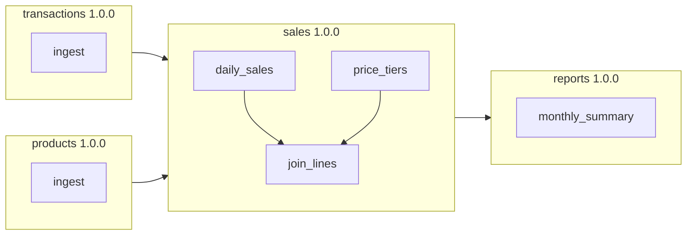

# Duckstring

*There is no DAG.*

Duckstring is built on a single observation: data transformations have the same dependency structure as software packages. If you version each transform and let it declare its parents — the same way `pyproject.toml` declares dependencies — the execution DAG forms itself. What you get is independent deployment, automatic version compatibility routing, and a pipeline that runs at optimal parallelism without a scheduler you have to think about.

## The problem

Large transform pipelines hit two walls.

The first is **coordination**. Whether the pipeline is one giant DAG or a mesh of smaller ones, a breaking change still ripples through the organisation: every consumer must update in lockstep, releases must be choreographed, and somebody has to govern the graph as a whole. Splitting the pipeline into domains moves the wall; it doesn't remove it.

The second is **ownership**. When the pipeline is defined globally — in a scheduler, an orchestrator, a central repository of DAGs — no single team truly owns their slice of it. Changing your own transform means touching shared infrastructure.

Software packaging solved both problems decades ago. A package is owned by its maintainers, versioned with SemVer, and declares what it depends on. Nobody coordinates a global release of PyPI. Consumers upgrade when they're ready, and old majors keep working until they do.

Duckstring applies that model to data transforms.

## The model

A transform is a **Pond**: a versioned Python package that declares its parent Ponds in [`pond.toml`](reference/pond-toml.md). Inside a Pond, the individual operations — typically one per output table — are **Ripples**. Deploying a Pond is like publishing a package: atomic, versioned, and independent of everyone else's deploys. A new major version runs *alongside* the old one until no consumer depends on it.

The DAG still exists — it's implicit in the package graph. You just never build it, draw it, or govern it. Upstream declares constraints on what may be consumed; downstream declares when data is needed; the runtime works out the rest, executing the sequence of Ponds with the best currency and frequency it can.

Execution is **freshness-based**, not schedule-based. Instead of cron expressions and DAG runs, every node carries a freshness timestamp and demand flows through the graph like Kanban signals: pull demand propagates upstream and naturally throttles the whole pipeline to its bottleneck; push demand drives a target to a given freshness. [Theory](theory.md) covers the full model.

## Vocabulary

| Term | Meaning |
|---|---|
| **Pond** | A versioned package of transforms — the unit of ownership, versioning, and deployment |
| **Ripple** | A single operation within a Pond, typically producing one table |
| **Catchment** | The reference runtime: a server that receives deployed Ponds and executes them |
| **Source** / **Sink** | A Pond's parent / child |
| **Inlet** | A Pond with no Sources — it ingests from external systems |
| **Outlet** | A Pond with no Sinks — it produces final data products |

The **Catchment** is a convenience, not the product: Duckstring is the packaging standard, and the Catchment is its batteries-included runtime (FastAPI server, web UI, CLI) for teams that want the full stack.

## Where to start

- **[Playground](getting-started/playground.md)** — feel the orchestration model in your browser, nothing to install.
- **[Installation](getting-started/installation.md)** and the **[Quickstart](getting-started/quickstart.md)** — a running four-Pond pipeline in a few minutes.
- **[Concepts](concepts/ponds.md)** — Ponds, Ripples, freshness, and versioning in depth.
- **[Theory](theory.md)** — the full orchestration spec, for those who want the mechanics.
