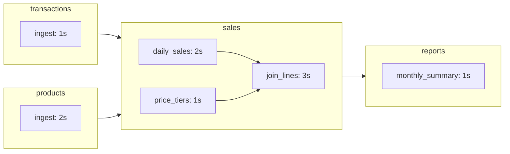

# Quickstart

## 1. Install

Start by installing the package:

```bash
pip install duckstring
```

To enable the CLI completions, also run:

```bash
duckstring --install-completion
```

## 2. Start a Catchment

Duckstring's execution environment is called a *Catchment* -  a FastAPI daemon either local (e.g. during development) or on a server. The Catchment hosts the code (Ponds), their configuration, execution state and references to their data (catalog). Think of it as a Pond's ecosystem.

Start by creating one locally:

```bash
duckstring catchment init --name dev
```

This registers a Catchment named `dev`, stores its data under `~/.duckstring/dev`, offers to make it your default, and starts the server at `http://127.0.0.1:7474` (configurable with `--host`/`--port`/`--root`). The web UI is served at that same address. You can have multiple different Catchments under various names.

Leave it running and work from a second terminal. Later, restart it any time with:

```bash
duckstring catchment start dev
```

See [Running a Catchment](../guides/running-a-catchment.md) for remote servers and multi-Catchment setups.

## 3. Create the Demo Ponds

From a scratch directory or repo root:

```bash
duckstring pond demo --ripple
```

This creates four Pond projects as subdirectories:



This example demonstrates Duckstring's pull-based orchestration model. The data is synthetic, small, and each stage of the pipeline sleeps for the specified number of seconds to show how tasks are triggered.

Within each Pond are named "Ripples" - these are the true unit operations for the pipeline. Of all Ripples across the three Ponds in this example, the "join_lines" step takes the longest at 3s. Running the pipeline back to back, the orchestrator naturally throttles every *other* Ripple to the same 3s bottleneck - no wasted compute.

The Ripple logic is held in the `src/pond.py` file within each Pond's code. Note that the Pond sequence (DAG) is never specified expliclity - it's impolied by each Pond's `[sources]` section in its `pond.toml` specification file. Similarly, the sequence of Ripples is implied at declaration:

```python
@ripple(parents=[daily_sales, price_tiers])
```

There's no hard rule that you **must** use multiple Ponds or even Ripples - however, in practice it can be very helpful to break up projects into distinct *versionable components* (Ponds), and distinct *logical units* (Ripples) within those components. Like software packages, by declaring only their direct dependencies, there's no need to separately manage their pipeline.

## 3. Deploy

Deploy all four Ponds at once:

```bash
duckstring pond deploy --all --yes
```

Each Pond is packaged and uploaded to the Catchment (`--yes` skips the per-Pond confirmation). 

Uploading Ponds like this has a few behaviours:

- If no Pond of that name exists, upload new
- If a Pond with that name and version exists, overwrite
- If a Pond with that name and *major* version exists, upgrade the existing node to this *minor*/*patch* version
- If a Pond with that name and a *lower major* version exists, add a new node

The Ponds are now visible in the web UI, and in:

```bash
duckstring status --once
```

Running without the `--once` flag polls the Catchment every 1s, allowing you to monitor state on the CLI.

## 4. Trigger

In Duckstring, runs are always triggered by the terminal Pond - an Outlet - and not the start of the pipeline. Trigger a run with:

```bash
duckstring trigger pulse reports
```

This executes in sequence every dependency for the `reports` Pond. Mechanistically, this sends a `pulse` - a single request for data of a given freshness (now) from the target Pond to all its parents, recursively. Executing a trigger via CLI starts a `status` view, which updates until the pipeline settles (~7s).

To execute as frequently as possible (to minimise latency), you can instead execute a `wave`:

```bash
duckstring trigger wave reports
```

This functions like a `pulse`, but allows every dependency to run as frequently as it can be used - in this case 3s, equal to the `join_lines` bottleneck duration. Note that this actually runs two `sales` Ponds **concurrently** - execution is against a Ripple.

As the `wave` never stops, close the `status` view with `Ctrl+C`, then remove the trigger with:

```bash
duckstring trigger remove reports
```

On the UI, you can also simply click on the target Pond and hit the "Pulse" or "Wave" buttons to trigger the runs.

See [Triggers](../guides/triggers.md) for detail on each of the four trigger types:

- Pulse: One request for a target freshness
- Tide: A Pulse executed at a specified period (e.g. daily)
- Tap: One request for fresh data from each parent (e.g. tied to queries, to scale update frequency according to usage)
- Wave: A Tap executed upon every update

## 5. Query

Tabular data is published as Parquet, as a named object, with the Pond's name as schema. You can query this with:

```bash
duckstring query reports monthly_summary
```

This prints to console the result of the query `SELECT * FROM reports.monthly_summary LIMIT 10`. Run arbitrary SQL with `--sql`, or export with `--csv`/`--json`/`--parquet`. See [Querying Data](../guides/querying-data.md).
