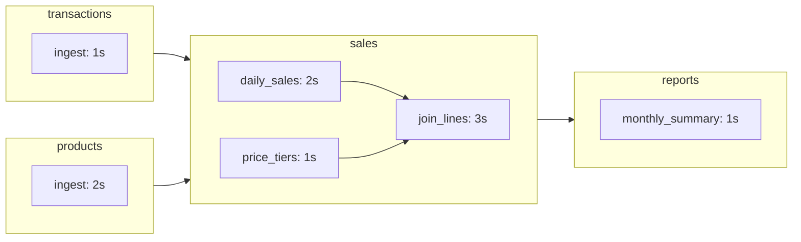

# Quickstart

This guide runs Duckstring on your own machine: it starts a Catchment, deploys a small demo pipeline, runs it, and queries the result. It takes about five minutes.

:::tip
To see how the demo pipeline is scheduled before installing anything, the [Playground](https://playground.duckstring.com) runs it in your browser, with a short guided tour.
:::

## 1. Install

Duckstring needs Python 3.10 or newer.

```bash
pip install duckstring
```

The CLI is `duckstring`, or `ds` for short. To turn on tab completion for your shell:

```bash
duckstring --install-completion
```

## 2. Start a Catchment

A *Catchment* is Duckstring's runtime. It holds the code you deploy, decides when each part of a pipeline runs, runs it, and keeps a catalog of the data it produces. Start one on your machine:

```bash
duckstring catchment init --name dev
```

This creates a Catchment called `dev`, keeps its state in `~/.duckstring/dev`, offers to make it your default, and starts it at http://127.0.0.1:7474, where its web UI is also served. Use `--host`, `--port` and `--root` to change those.

Leave it running and use a second terminal for the rest of this guide. To start it again later:

```bash
duckstring catchment start dev
```

To run a Catchment on a server instead, see [Running on a Server](guides/running_on_a_server.md).

## 3. Create the demo Ponds

In an empty directory:

```bash
mkdir demo && cd demo
duckstring pond demo
```

This creates four *Ponds*, each in its own subdirectory. A Pond is a versioned project of transformations, and each step inside it is a *Ripple*:



The pipeline isn't defined anywhere as a whole. Each Pond's `pond.toml` lists the Ponds it reads from, its *Sources*. Here is `sales/pond.toml`:

```toml
[pond]
name = "sales"
version = "1.0.0"

[sources]
transactions = "1.0.0"
products = "1.0.0"
```

In the same way, each Ripple in a Pond's `src/pond.py` names the Ripples it depends on:

```python
@ripple(parents=[daily_sales, price_tiers])
def join_lines(pond):
    ...
```

The demo's data is small and synthetic, and each Ripple sleeps for the time shown above so you can watch the pipeline run.

## 4. Deploy

Deploy all four Ponds:

```bash
duckstring pond deploy --all --yes
```

`--all` deploys every Pond in the subdirectories, and `--yes` skips the confirmation for each. The Ponds now appear in the web UI, and in:

```bash
duckstring status --once
```

Without `--once`, `status` keeps refreshing until you stop it.

Nothing has run yet. Duckstring only runs a Pond when something asks for its output.

Deploying a Pond again follows its version number. A new minor or patch version replaces the running one, and a new major version runs alongside it. See [Upgrades and Breaking Changes](guides/upgrades.md).

## 5. Run the pipeline

Triggers go at the end of a pipeline, on the Pond whose output you want. Here that's `reports`. Run it once with a *Pulse*:

```bash
duckstring trigger pulse reports
```

A Pulse brings `reports` up to date as of now. Duckstring works back through its Sources and runs `transactions` and `products`, then `sales`, then `reports`. The command shows the live status until everything settles, after about 12 seconds.

To keep `reports` as fresh as the pipeline allows, use a *Wave*:

```bash
duckstring trigger wave reports
```

No Pond runs more often than the slowest step can use its output, so every Pond settles at a run about every 3 seconds, the time `join_lines` takes. Runs of `sales` overlap: a new one starts while the previous one is still in `join_lines`, because each Ripple waits only for its own inputs.

A Wave keeps going, so press `Ctrl+C` to leave the status view, then remove it:

```bash
duckstring trigger remove reports
```

The same triggers are on each Pond's panel in the web UI. There are four in all:

| Trigger | What it does |
|---|---|
| Tap | Asks once for newer data, running upstream Ponds only if nothing newer is already available |
| Pulse | Brings the Pond up to date as of now, once |
| Wave | Keeps the Pond as fresh as the pipeline allows |
| Tide | Keeps the Pond no older than a limit, such as `1d` for a daily job |

See [Scheduling](guides/scheduling.md) for choosing between them.

## 6. Query the results

The Catchment keeps a catalog of every Pond's tables, with each Pond as a schema. Query one:

```bash
duckstring query reports monthly_summary
```

This runs `SELECT * FROM reports.monthly_summary LIMIT 10`. Use `--sql` to run any query, and `--csv`, `--json` or `--parquet` to export the result. See [Querying](guides/querying.md).

## Next steps

- [Ponds](concepts/ponds.md) and [Orchestration](concepts/orchestration.md) explain the ideas behind what you just ran.
- [Writing Ripples](guides/writing_ripples.md) covers building your own Pond, and [Testing with Puddles](guides/testing_with_puddles.md) running it locally before deploying.
- `duckstring pond demo --trickle` creates the incremental demo (`orders`, `catalog` → `priced` → `revenue`), explained in [Trickles](concepts/trickles.md).
- The [Playground](https://playground.duckstring.com) runs the same demo pipeline in the browser, with a guided tour of how it's scheduled.
