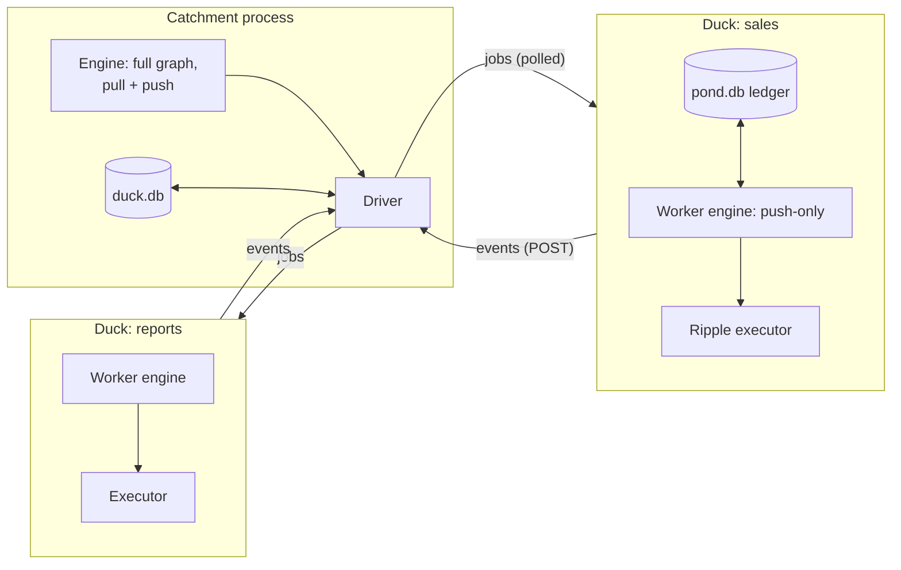

# Architecture

How the reference runtime executes the model the rest of these docs describe. Useful for operating a Catchment with confidence, contributing, or building an alternative runtime.

## Two tiers: Catchment and Ducks

**The Catchment owns the decisions.** It runs the full orchestration engine — every Pond *and* every Ripple, pull and push — because the model's signature behaviours (bottleneck-paced Waves, pre-armed Taps) emerge from Ripple-level pull, which can't be decided from Pond-level state alone. It holds triggers and windows, applies the freshness rules from [Theory](../theory.md), and emits exactly one kind of instruction: *begin a Pond Run at freshness F*.

**A Duck owns one Pond's execution.** Each executing Pond gets a dedicated worker subprocess — its Duck. Given `begin_run(F)`, the Duck pushes every Ripple in its Pond to `F` using a push-only copy of the same engine, runs the Ripple functions in a thread pool against the Pond's DuckDB registry, exports the Parquet snapshots, and reports each completion back. Ducks are spawned on a Pond's first run, kept warm while a standing trigger is active, and stopped when the Pond goes idle.

The split mirrors the conceptual model: the Catchment is pull's home (demand, coordination, history); the Duck is push's (do this work, to this freshness, to completion).

## One engine, shared

The orchestration rules live in a pure engine package (`duckstring.engine`) with no FastAPI, no database, no HTTP — a state machine over freshness, demand, and time, directly implementing the pseudocode in [Theory](../theory.md). The Catchment embeds the full engine; the Duck embeds its push-only subset. The engine is also a behaviour-for-behaviour port of the [playground's](../getting-started/playground.md) TypeScript reference implementation, so the simulation you can poke at in a browser and the runtime executing your data are the same machine.

## Transport: Ducks always dial back

All communication is Duck-initiated: a Duck holds a short poll on `GET /api/duck/{pond}/jobs` for commands and POSTs progress to `/api/duck/{pond}/events`. The Catchment never needs to reach a Duck.

This buys two properties. First, **location transparency**: a Duck on the same machine and a Duck across a network run identical code — remote execution is just a different way of launching the process (`DUCKSTRING_CATCHMENT_URL` tells a Duck where to dial). Second, **resilience**: because the Duck doesn't depend on being reachable, it doesn't depend on the Catchment being up either. Events are idempotent on freshness, so replays after a gap are harmless.

## Resilience

The design goal: no single process is precious.

- **Catchment down, Duck running** — the Duck finishes its in-flight runs from its own ledger and engine, buffers its events, and replays them when the Catchment returns.
- **Duck dies mid-run** — the Catchment's liveness check notices (process gone, or silent past 60 s) and fails the run through the ordinary [fault-tolerance](../guides/fault-tolerance.md) path — budgets, blocking, run history all apply. A stuck-but-alive Duck reports itself failed via its own watchdog.
- **Catchment restarts** — engine state (freshness, demand, triggers, windows, fault states, budgets) rebuilds from the database; interrupted Pond Runs are re-dispatched. A restarted Duck reconciles against its ledger and re-runs only the Ripples that hadn't completed.
- **Run cadence under failure** — there is no global scheduler state to corrupt; demand and freshness are the only coordination, and both are durable.

## Storage

Everything lives under the Catchment root, in three layers with distinct owners:

| Path | Owner | Contents |
|---|---|---|
| `duck.db` | Catchment | The system of record: deployed versions and topology, the live graph, freshness/demand/fault state, triggers, windows, budgets, and the canonical run history (one row per Ripple attempt, with errors and tracebacks). SQLite. |
| `ponds/{name}/{version}/` | Catchment | Each deployed version's source, exactly as uploaded — the immutable artifact. |
| `ponds/{name}/registry.duckdb` | Duck | The Pond's live working database — every table its Ripples write. Private to the Pond. |
| `ponds/{name}/data/*.parquet` | Duck | The published snapshots, exported atomically (write-then-rename) after each successful run. The only thing Sinks and queries read. |
| `ponds/{name}/pond.db` | Duck | The Duck's run ledger — its operational record for crash recovery and event replay. The Catchment's history remains canonical. |

Identity in `duck.db` follows the versioning model: the Pond *name*, each immutable deployed *version*, and a *selection* pointer per `(name, major)` are separate records — which is what makes [deploys atomic and majors concurrent](../concepts/versioning.md). Paths in the database are root-relative, so the whole directory is relocatable and a backup of the root is a backup of the Catchment.

## Flow control

There is none — deliberately. The Catchment never caps concurrent Pond Runs and never rate-limits; completions clock the cascade, as the [demand model](../concepts/freshness.md) prescribes. Cross-Pond data flows only through the exported snapshots, so any number of runs can overlap without read contention; within a Pond, concurrent table writes queue with retry rather than fail. The result is a runtime whose throughput is set by the pipeline's actual bottleneck and nothing else.
