# Theory

This document outlines the theory governing the orchestration mechanics. 

## Motivation

Most of the time when running a sequence of data transformations (a pipeline), the process is set to run either on a schedule (e.g. cron job) or continuously (new run triggered immediately upon completion of previous). This certainly satisfies many purposes, but can often be wasteful - in staleness (data age), compute, or both.

When upgrading a component of a chain of operations, the pipeline requires adjusting to accommodate the change. If the change is breaking, this might force upgrades downstream - a requirement that is increasingly difficult to satisfy as the complexity of the pipeline grows. Ideally the pipeline would be robust to adding new transformations atomically, leaving upgrades that are not supported yet by downstream consumers naturally neglected until consumers exist - without the need for global governance of the sequence.

The core objective of the scheduling system discussed here is to define each transformation such that it is aware of, and can edit the state of, itself and its own parents only. No global governance should be required - pipelines built as robust to changes and dependencies as software packages.

### General Constraints

Consider a process consisting of three transformations - call them "unit operations" - in series, each taking 10 minutes to complete. The total time from start to end of the pipeline (the *lead time*) is the sum of these durations: 30 minutes. More generally, where some operations run in parallel, the total lead time is the sum duration of the unit operations on the *critical path* - the longest route through the process.

For:

- Set of unit operations on critical path $P$
- $n$ total unit operations on critical path
- Unit operation $k$, where $k \in P$
- Duration $d_k$

$$
{Lead\ Time}=\sum_{k \in P}^{n} d_k
$$

Lead time like this is unavoidable and optimal. However, when run continuously, the total age of results (the *staleness*) can be up to double this. The minimum period between completed runs (the *cycle time*) for such continuous operation is equal to the lead time when running back-to-back like this. 

The result is a sawtooth function of staleness $T$, ranging from lead time $L$ to cycle time $C$ above that:

$$
T(t) = L + (t \bmod C)
$$

In general, the worst case staleness is $L + C$, equal to $2L$ in the case of back-to-back execution.

### Continuous Parallel Execution

One way to reduce staleness is to run as much of the pipeline as possible in parallel. If instead of running the pipeline back-to-back, we run every *unit operation* back-to-back, the cycle time reduces to the duration of the longest unit operation (the *bottleneck*):

$$
C = \max_{k \in P} d_k
$$

If every unit operation is approximately the same duration, this optimally trades additional compute time for minimised staleness. However, if there is a great difference in durations for each unit operation, the faster operations will run more frequently than they can be consumed - their results (and compute) wasted.

### Change Gating

Unnecessary runs can be avoided by setting each unit operation to only execute if there have been changes upstream, e.g. by watermarking rows or runs and keeping track of the most recently consumed results from upstream. This is very common and effective, as it causes every unit operation to run at a minimum period equal to the maximum period of all operations upstream - that is, operations downstream are throttled by the upstream bottleneck.

There is, however, no such throttling for operations *upstream* of the bottleneck. If a bottleneck much longer than the other operations occurs late in the sequence, most of the effort upstream is wasted.

### Globally-Defined Pipelines

In most pipeline orchestration systems, it's required to directly specify in some global context the graph of operations - often called the DAG (Directed Acyclic Graph). This very simply manages the sequencing of unit operations such that each runs only once the previous has completed, and allows setting the DAG to run on a given schedule (or upon some trigger).

This approach is often trivial for small DAGs, and satisfies most purposes. However, as it is governed globally, it requires significant oversight and can become unwieldy for very large DAGs. A change to any unit operation often requires rerunning the DAG from start to finish. Generally, only one run of the pipeline concurrently can be safely executed without side effects, meaning the staleness is rarely close to optimal.

If a path on the DAG is rarely used (or stops being used entirely), managing this can be difficult. At a minimum, the rate of update must be governed by some central authority, which can be difficult to do effectively in larger teams. Some options are:

- Maintain a separate DAG for lower-frequency paths
    - Difficult if they consume data from a higher-frequency path, e.g. aligning with completion times
- Just execute more frequently than necessary
    - Wasteful, though often done in practice due to governance difficulties

## Pull vs Push

Most of the approaches discussed above are considered *push* systems, borrowing terminology from scheduling in manufacturing, where the completion of some task is pushed downstream to enable further processing. The scheduling is inherently *supply-driven*, where the availability of some supply is what enables processing to continue. This requires accurate anticipation of consumption rate to avoid overproduction.

The alternative is *pull*, where scheduling is *demand-driven*. Under this approach, operations execute because of the presence of demand downstream. This has some advantages:

- Work is only done if there is consumption
- No demand forecasting is required - production rate naturally matches demand
- Unused/low-use paths in a DAG are automatically shut down or throttled to match their consumption rate
- Continuous execution (with change-gating) is throttled both upstream *and* downstream of the bottleneck

### Kanban

Kanban is a famously simple pull-based scheduling process, pioneered by Japanese manufacturing (especially Toyota). It involves sending tokens (classically, physical cards) back to a supplier when a product is consumed, allowing the supplier to keep track of how much stock has been consumed. Crucially, the tokens are delivered at the *start* of their being used for the downstream process, allowing the supplier to begin production immediately so that stock is available the next time it is needed.

Typically, the supplier will then log these tokens against a range:

- Red: High tokens, indicating high consumption and low stock -> accelerate production
- Yellow: Moderate tokens, standard consumption and stock -> standard production
- Green: Low tokens, low consumption and high stock -> stop production

Unlike manufacturing, where the number of units is meaningful, data pipelines are binary - either updated or not. Consequently, a Kanban-like process need only track the presence of *any* demand, where the Red/Green boundary is simply one:

- Has demand: Start production
- Has no demand: Stop production

### Pull

It is helpful to imagine a unit operation as a node in a directed graph (the DAG). Each node is aware of its parents, and can notify the parents of their demand or otherwise send signals upstream. A node does *not* necessarily have awareness of its children - only the capability to receive signals from them.

Each node follows the simple rules:

- Am I waiting on my parents?
    - Change gating
    - Emulates a consumer being unable to proceed if there is no stock from a supplier
- Have I received demand from anyone downstream?
    - Demand gating
    - Emulates a consumer sending a Kanban token to its supplier
- If both (and I'm not already processing):
    - Send demand to all my parents
    - Clear my own demand
    - Start processing
- When my processing completes:
    - Indicate I have updated, so that processes waiting on me can begin

To handle starts from an idle state, when demand is received it is immediately sent to any parent that is idle (not running and has no demand).

#### Examples

Consider a simple chain of nodes:

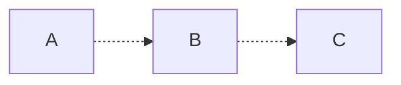

Nodes without demand have no fill; nodes with demand that cannot yet run (queued) are orange; running nodes are green. A held demand token is marked with a trailing `•`:

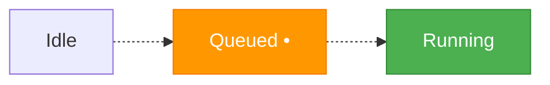

We denote a node's *generation* as `· gN`, so `A · g3` indicates A has run three times. A held demand token is shown with a trailing `•`. If a node is ahead of its child, the edge between them is solid; otherwise it is dashed.

##### Cold Start

1) All start idle, with each node starting at generation 0:

    ```mermaid
    flowchart LR
        classDef running fill:#4CAF50,stroke:#388E3C,color:#fff;
        classDef queued fill:#FF9800,stroke:#F57C00,color:#fff;

        A["A · g0"] .-> B["B · g0"]
        B .-> C["C · g0"]
    ```

2) C is given demand and enters the queued state:

    ```mermaid
    flowchart LR
        classDef running fill:#4CAF50,stroke:#388E3C,color:#fff;
        classDef queued fill:#FF9800,stroke:#F57C00,color:#fff;

        A["A · g0"] .-> B["B · g0"]
        B .-> C["C · g0 •"]:::queued
        C <.- D([Demand]):::queued
    ```

    1) As its parent is idle, C immediately sends demand to B, putting it into the queued state also:

    ```mermaid
    flowchart LR
        classDef running fill:#4CAF50,stroke:#388E3C,color:#fff;
        classDef queued fill:#FF9800,stroke:#F57C00,color:#fff;

        A["A · g0"] .-> B["B · g0 •"]:::queued
        B .-> C["C · g0 •"]:::queued
    ```

    2) B then does the same to A:

    ```mermaid
    flowchart LR
        classDef running fill:#4CAF50,stroke:#388E3C,color:#fff;
        classDef queued fill:#FF9800,stroke:#F57C00,color:#fff;

        A["A · g0 •"]:::queued .-> B["B · g0 •"]:::queued
        B .-> C["C · g0 •"]:::queued
    ```

    3) A has no parents, so there's nothing to wait for - it begins its run. Demand is cleared and the node starts, putting it in the running state:

    ```mermaid
    flowchart LR
        classDef running fill:#4CAF50,stroke:#388E3C,color:#fff;
        classDef queued fill:#FF9800,stroke:#F57C00,color:#fff;

        A["A · g0"]:::running .-> B["B · g0 •"]:::queued
        B .-> C["C · g0 •"]:::queued
    ```

3) A completes, meaning it has updated relative to B and B can start:

    ```mermaid
    flowchart LR
        classDef running fill:#4CAF50,stroke:#388E3C,color:#fff;
        classDef queued fill:#FF9800,stroke:#F57C00,color:#fff;

        A["A · g1"] --> B["B · g0 •"]:::queued
        B .-> C["C · g0 •"]:::queued
    ```

    1) Demand is sent to its parent A, putting it in the queued state:

    ```mermaid
    flowchart LR
        classDef running fill:#4CAF50,stroke:#388E3C,color:#fff;
        classDef queued fill:#FF9800,stroke:#F57C00,color:#fff;

        A["A · g1 •"]:::queued --> B["B · g0 •"]:::queued
        B .-> C["C · g0 •"]:::queued
    ```

    2) Demand is cleared and B starts, putting it in the running state:

    ```mermaid
    flowchart LR
        classDef running fill:#4CAF50,stroke:#388E3C,color:#fff;
        classDef queued fill:#FF9800,stroke:#F57C00,color:#fff;

        A["A · g1 •"]:::queued --> B["B · g0"]:::running
        B .-> C["C · g0 •"]:::queued
    ```

    3) A has demand and begins its run simultaneously:

    ```mermaid
    flowchart LR
        classDef running fill:#4CAF50,stroke:#388E3C,color:#fff;
        classDef queued fill:#FF9800,stroke:#F57C00,color:#fff;

        A["A · g1"]:::running --> B["B · g0"]:::running
        B .-> C["C · g0 •"]:::queued
    ```

4) A completes before B and sits idle:

    ```mermaid
    flowchart LR
        classDef running fill:#4CAF50,stroke:#388E3C,color:#fff;
        classDef queued fill:#FF9800,stroke:#F57C00,color:#fff;

        A["A · g2"] --> B["B · g0"]:::running
        B .-> C["C · g0 •"]:::queued
    ```

5) B completes, meaning it has updated relative to C and C can start:

    ```mermaid
    flowchart LR
        classDef running fill:#4CAF50,stroke:#388E3C,color:#fff;
        classDef queued fill:#FF9800,stroke:#F57C00,color:#fff;

        A["A · g2"] --> B["B · g1"]
        B --> C["C · g0 •"]:::queued
    ```

    1) Demand is sent to its parent C, putting it in the queued state:

    ```mermaid
    flowchart LR
        classDef running fill:#4CAF50,stroke:#388E3C,color:#fff;
        classDef queued fill:#FF9800,stroke:#F57C00,color:#fff;

        A["A · g2"] --> B["B · g1 •"]:::queued
        B --> C["C · g0 •"]:::queued
    ```

    2) Demand is cleared and C starts, putting it in the running state:

    ```mermaid
    flowchart LR
        classDef running fill:#4CAF50,stroke:#388E3C,color:#fff;
        classDef queued fill:#FF9800,stroke:#F57C00,color:#fff;

        A["A · g2"] --> B["B · g1 •"]:::queued
        B --> C["C · g0"]:::running
    ```

    3) B has demand and begins its run simultaneously, sending demand back to A:

    ```mermaid
    flowchart LR
        classDef running fill:#4CAF50,stroke:#388E3C,color:#fff;
        classDef queued fill:#FF9800,stroke:#F57C00,color:#fff;

        A["A · g2 •"]:::queued --> B["B · g1"]:::running
        B --> C["C · g0"]:::running
    ```

    4) A has demand and begins its run simultaneously:

    ```mermaid
    flowchart LR
        classDef running fill:#4CAF50,stroke:#388E3C,color:#fff;
        classDef queued fill:#FF9800,stroke:#F57C00,color:#fff;

        A["A · g2"]:::running --> B["B · g1"]:::running
        B --> C["C · g0"]:::running
    ```

6) A, B and C each eventually complete their run:

    ```mermaid
    flowchart LR
        classDef running fill:#4CAF50,stroke:#388E3C,color:#fff;
        classDef queued fill:#FF9800,stroke:#F57C00,color:#fff;

        A["A · g3"] --> B["B · g2"]
        B --> C["C · g1"]
    ```

This is generally the outcome of a pull-based execution: each node runs the same number of times as the distance from the end of the DAG, with upstream nodes slightly less stale than downstream.

##### Continued Run

1) C is given demand and enters the queued state:

    ```mermaid
    flowchart LR
        classDef running fill:#4CAF50,stroke:#388E3C,color:#fff;
        classDef queued fill:#FF9800,stroke:#F57C00,color:#fff;

        A["A · g3"] --> B["B · g2"]
        B --> C["C · g1 •"]:::queued
        C <.- D([Demand]):::queued
    ```

2) As its parent is a generation ahead, it starts a run:

    1) Demand is sent to its parent, putting it in the queued state:

    ```mermaid
    flowchart LR
        classDef running fill:#4CAF50,stroke:#388E3C,color:#fff;
        classDef queued fill:#FF9800,stroke:#F57C00,color:#fff;

        A["A · g3"] --> B["B · g2 •"]:::queued
        B --> C["C · g1 •"]:::queued
    ```

    2) Demand is cleared and the node started, putting it in the running state:

    ```mermaid
    flowchart LR
        classDef running fill:#4CAF50,stroke:#388E3C,color:#fff;
        classDef queued fill:#FF9800,stroke:#F57C00,color:#fff;

        A["A · g3"] --> B["B · g2 •"]:::queued
        B --> C["C · g1"]:::running
    ```

3) B repeats the same, sending demand upstream and starting:

    ```mermaid
    flowchart LR
        classDef running fill:#4CAF50,stroke:#388E3C,color:#fff;
        classDef queued fill:#FF9800,stroke:#F57C00,color:#fff;

        A["A · g3"] --> B["B · g2"]:::running
        B --> C["C · g1"]:::running
    ```

4) A has no parents, so can start as soon as it receives demand:

    ```mermaid
    flowchart LR
        classDef running fill:#4CAF50,stroke:#388E3C,color:#fff;
        classDef queued fill:#FF9800,stroke:#F57C00,color:#fff;

        A["A · g3"]:::running --> B["B · g2"]:::running
        B --> C["C · g1"]:::running
    ```

5) A, B and C each eventually complete their run:

    ```mermaid
    flowchart LR
        classDef running fill:#4CAF50,stroke:#388E3C,color:#fff;
        classDef queued fill:#FF9800,stroke:#F57C00,color:#fff;

        A["A · g4"] --> B["B · g3"]
        B --> C["C · g2"]
    ```

Each subsequent run on a previously-executed pull advances each node by one generation, without waiting for the updates to propagate from start to finish.

##### Branching

The chain above is the simplest case. The advantages of demand-driven scheduling become clearer when paths branch and merge. Consider a graph where `C` consumes both `A` and `B`, while `D` consumes only `B`:

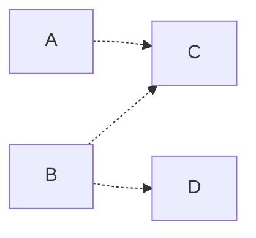

Here `B` is *shared*: it supplies two consumers, `C` and `D`, which may run at different rates. We will follow what happens when `D` is placed under continuous demand but `C` is not.

1) All nodes start idle at generation 0:

    ```mermaid
    flowchart LR
        classDef running fill:#4CAF50,stroke:#388E3C,color:#fff;
        classDef queued fill:#FF9800,stroke:#F57C00,color:#fff;

        A["A · g0"] .-> C["C · g0"]
        B["B · g0"] .-> C
        B .-> D["D · g0"]
    ```

2) `D` is given continuous demand. As its parent `B` is idle, the demand jumps straight to `B`, which is a source and can begin immediately:

    ```mermaid
    flowchart LR
        classDef running fill:#4CAF50,stroke:#388E3C,color:#fff;
        classDef queued fill:#FF9800,stroke:#F57C00,color:#fff;

        A["A · g0"] .-> C["C · g0"]
        B["B · g0"]:::running .-> C
        B .-> D["D · g0 •"]:::queued
    ```

3) `B` and `D` settle into a steady cycle — `B` producing, `D` consuming and re-arming `B` — while `A` and `C` are never touched and remain at generation 0:

    ```mermaid
    flowchart LR
        classDef running fill:#4CAF50,stroke:#388E3C,color:#fff;
        classDef queued fill:#FF9800,stroke:#F57C00,color:#fff;

        A["A · g0"] .-> C["C · g0"]
        B["B · g6"]:::running --> D["D · g5"]:::running
        B --> C
    ```

    `A` and `C` are left *stale* — and crucially, no compute is wasted producing results nobody consumes. This is the property absent from naive continuous-parallel execution: throttling applies to the *entire sub-graph upstream of the actual demand*, not merely downstream of a bottleneck.

4) Now `C` is given demand. Its parents are `A` (idle) and `B` (running). The demand jumps to the idle `A`, waking it. No demand is sent to `B` because it is not idle:

    ```mermaid
    flowchart LR
        classDef running fill:#4CAF50,stroke:#388E3C,color:#fff;
        classDef queued fill:#FF9800,stroke:#F57C00,color:#fff;

        A["A · g0"]:::running .-> C["C · g0 •"]:::queued
        B["B · g6"]:::running --> D["D · g5"]:::running
        B --> C
    ```

    `B` does not run twice to serve two consumers — it continues its single cycle, and both `C` and `D` consume whatever it produces.

5) Once `A` and `B` are both ahead of `C`, `C` runs, taking the freshest result available from each:

    ```mermaid
    flowchart LR
        classDef running fill:#4CAF50,stroke:#388E3C,color:#fff;
        classDef queued fill:#FF9800,stroke:#F57C00,color:#fff;

        A["A · g1"] --> C["C · g0"]:::running
        B["B · g7"]:::running --> D["D · g6"]:::running
        B --> C
    ```

The shared node `B` runs at the rate of its *fastest* consumer (`D`), and the slower consumer `C` takes the latest result available whenever it happens to run.

##### Continuous Demand

A single demand advances each node once and then settles. To keep a pipeline continuously fresh, the demand is simply *re-asserted* each time the demanded node completes its run. Every completion issues a fresh pull, and the pipeline runs back-to-back at its fastest sustainable rate.

The instructive case is a bottleneck in the *middle* of the chain. Consider `A` (1s) → `B` (3s) → `C` (1s), with `C` continuously demanded:

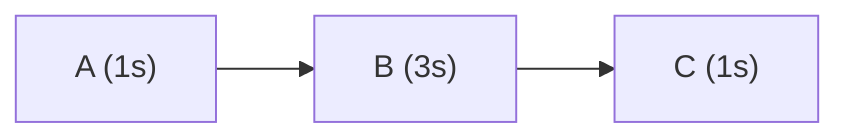

`B` is the bottleneck. A naive parallel scheme would run the 1-second `A` three times for every run of `B`, discarding two of its results. Under pull this does not happen: `A` is re-armed only when `B` actually consumes its output, so `A` is throttled to `B`'s period despite being far quicker. Following the steady-state cycle (times in seconds):

| t | A | B | C | event |
|---|---|---|---|---|
| 0 | runs | — | — | `A` produces the first result |
| 1 | runs | runs | — | `B` starts consuming `A`, and re-arms it; `A` produces one result ahead |
| 2 | idle | running | — | `A` has a result buffered, so it waits |
| 4 | runs | runs | runs | `B` finishes, consumes the buffered `A`, re-arms it; `C` runs |
| 5 | running | running | done | `C` completes and re-asserts its demand |
| 7 | … | runs | runs | the cycle repeats with period 3s |

`A` runs exactly once per cycle, matching `B`'s 3-second period — neither over- nor under-producing. The bottleneck sets the rhythm for the *entire* chain, both upstream and down. The mechanism that achieves this is that a node holding standing demand re-arms its parent only *one generation ahead*: enough to keep the bottleneck fed without it ever idling, but never enough to pile up unconsumed work.

### Push (To Meet Demand)

When continuously demanded, **pull** orchestration maintains low staleness effectively and returns updates as frequently as possible. However, executing demand against a node will only ever take data as fresh as its immediate parents - if there is a requirement for the result of the run to produce data that results from sources *at the time of the request*, the more familiar **push** orchestration is needed. 

Additionally, if data is only required to update at a period far longer than the bottleneck process (e.g. weekly or daily, as is common), **pull** would either be consistently behind or would require executing upstream nodes more than would be expected to be consumed.

Under *push*, an initiated run from upstream is followed by runs from each of its children until the end of the DAG is reached. However, unlike most orchestration approaches, the request is made from the *leaves* of the DAG rather than pushed down from the roots. This maintains most of the advantages of the pull-based approach (paths with no demand are not executed) without the attempt to minimise staleness by executing the path as often as possible. Unlike *pull*, *push* demand can stack - work should begin on previous requests if their freshness is satisfied, otherwise it's possible that a node would never run if its demand updates faster than it can be supplied.

Under *push*, each node follows the simple rules:

- If I get demand for a given freshness from downstream:
    - Set this demand against each parent, on top of any other demand they have
- Am I waiting on my parents to meet my required freshness?
    - Change gating
    - Emulates a consumer being unable to proceed if there is no stock for this *priority order* from a supplier
- If not (and I'm not already processing):
    - Clear any demand that has been satisfied
    - Start processing
- When my processing completes:
    - Set my freshness to that of my parents

#### Examples

##### Cold Start

Consider the same chain, all idle at generation 0. A push always carries a *target* freshness — the request "produce data at least this fresh". We will write the target as a generation for illustration (in reality it is a timestamp), so a push for generation 1 asks every node to reach generation 1.

1) All start idle at generation 0:

    ```mermaid
    flowchart LR
        classDef running fill:#4CAF50,stroke:#388E3C,color:#fff;
        classDef queued fill:#FF9800,stroke:#F57C00,color:#fff;

        A["A · g0"] .-> B["B · g0"]
        B .-> C["C · g0"]
    ```

2) `C` receives a push for generation 1. Unlike a pull, the target is forwarded *eagerly* to every ancestor that isn't already that fresh — it does not wait for runs to complete. The push reaches `B`, then `A`, in a single step:

    ```mermaid
    flowchart LR
        classDef running fill:#4CAF50,stroke:#388E3C,color:#fff;
        classDef queued fill:#FF9800,stroke:#F57C00,color:#fff;

        A["A · g0 •"]:::queued .-> B["B · g0 •"]:::queued
        B .-> C["C · g0 •"]:::queued
    ```

3) `A` has no parents, so its inputs trivially satisfy the target and it runs. `B` and `C` hold their push, waiting on their parents:

    ```mermaid
    flowchart LR
        classDef running fill:#4CAF50,stroke:#388E3C,color:#fff;
        classDef queued fill:#FF9800,stroke:#F57C00,color:#fff;

        A["A · g1"]:::running .-> B["B · g0 •"]:::queued
        B .-> C["C · g0 •"]:::queued
    ```

4) `A` completes. `B`'s input now meets the target, so `B` runs. When `B` completes, `C` runs in turn:

    ```mermaid
    flowchart LR
        classDef running fill:#4CAF50,stroke:#388E3C,color:#fff;
        classDef queued fill:#FF9800,stroke:#F57C00,color:#fff;

        A["A · g1"] --> B["B · g1"]:::running
        B .-> C["C · g0 •"]:::queued
    ```

5) `C` completes, having reached the target. The push is satisfied and cleared at each node, leaving the whole chain current and idle:

    ```mermaid
    flowchart LR
        classDef running fill:#4CAF50,stroke:#388E3C,color:#fff;
        classDef queued fill:#FF9800,stroke:#F57C00,color:#fff;

        A["A · g1"] --> B["B · g1"] --> C["C · g1"]
    ```

Unlike pull, no node is left trailing its parent — every node reaches the same target generation. The result is exactly that of triggering a conventional DAG run, but initiated from the *consumer* rather than pushed from the source, so paths with no demand are still never run.

##### Starting After Pull

Recall the staggered state a pull leaves behind, where each node trails its parent by one generation. Suppose the chain has been idle in exactly that state — `A` is two generations ahead of `C`:

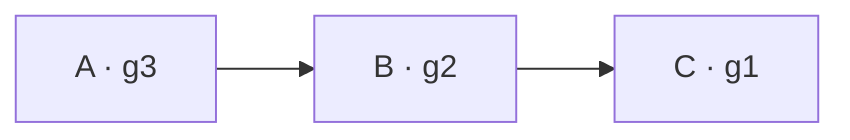

A *single pull* on `C` would advance it to `C · g2`, consuming `B · g2` — still one behind `A`. To make `C` fully current we issue a **push**. Unlike a pull, it does not wait for runs to complete before moving upstream; it propagates eagerly to every ancestor that is not yet at the target (a node holding a push token is queued, shown orange with a `•`):

1) `C` receives a push, demanding data at current freshness (we will denote this as a generation 4, though in reality it would be a timestamp). `C` is not current, so the push is forwarded to `B`; `B` is not current, so it is forwarded to `A`:

    ```mermaid
    flowchart LR
        classDef running fill:#4CAF50,stroke:#388E3C,color:#fff;
        classDef queued fill:#FF9800,stroke:#F57C00,color:#fff;

        A["A · g3 •"]:::queued --> B["B · g2 •"]:::queued
        B --> C["C · g1 •"]:::queued
    ```

2) `A` has no parents so runs immediately:

    ```mermaid
    flowchart LR
        classDef running fill:#4CAF50,stroke:#388E3C,color:#fff;
        classDef queued fill:#FF9800,stroke:#F57C00,color:#fff;

        A["A · g4"]:::running --> B["B · g2 •"]:::queued
        B --> C["C · g1 •"]:::queued
    ```

3) When `A` finishes, `B`'s parents satisfy its required freshness, so it runs:

    ```mermaid
    flowchart LR
        classDef running fill:#4CAF50,stroke:#388E3C,color:#fff;
        classDef queued fill:#FF9800,stroke:#F57C00,color:#fff;

        A["A · g4"] --> B["B · g2"]:::running
        B --> C["C · g1 •"]:::queued
    ```

4) `B` completes, adopting its parents' freshness `g4` directly — it never produces the intermediate `g3`. This enables `C` to run:

    ```mermaid
    flowchart LR
        classDef running fill:#4CAF50,stroke:#388E3C,color:#fff;
        classDef queued fill:#FF9800,stroke:#F57C00,color:#fff;

        A["A · g4"] --> B["B · g4"]
        B --> C["C · g1"]:::running
    ```

5) `C` completes, leaving all in the idle state at the same generation and freshness:

    ```mermaid
    flowchart LR
        classDef running fill:#4CAF50,stroke:#388E3C,color:#fff;
        classDef queued fill:#FF9800,stroke:#F57C00,color:#fff;

        A["A · g4"] --> B["B · g4"] --> C["C · g4"]
    ```

The entire sequence is brought up-to-date with a single push, with no additional unconsumed work done upstream.

##### Branching

Push shares pull's most valuable property: it only ever drives the paths it actually needs. Take the same branching graph, where `C` consumes both `A` and `B`, and `D` consumes only `B`:


1) All idle at generation 0. `D` receives a push for generation 1:

    ```mermaid
    flowchart LR
        classDef running fill:#4CAF50,stroke:#388E3C,color:#fff;

        A["A · g0"] .-> C["C · g0"]
        B["B · g0"] .-> C
        B .-> D["D · g0 •"]:::queued
    ```

2) `D`'s only parent is `B`, so the target propagates to `B` alone. `A` and `C` are not ancestors of `D` and are never touched:

    ```mermaid
    flowchart LR
        classDef running fill:#4CAF50,stroke:#388E3C,color:#fff;

        A["A · g0"] .-> C["C · g0"]
        B["B · g0 •"]:::queued .-> C
        B .-> D["D · g0 •"]:::queued
    ```

3) `B` runs and completes, then `D` runs against it and reaches the target. The push is satisfied, leaving `A` and `C` untouched at generation 0:

    ```mermaid
    flowchart LR
        classDef running fill:#4CAF50,stroke:#388E3C,color:#fff;

        A["A · g0"] .-> C["C · g0"]
        B["B · g1"] --> D["D · g1"]
        B .-> C
    ```

Just as with pull, the unconsumed path (`A` and the join `C`) is left stale and no compute is spent on it. The difference between push and pull is *how much* of a demanded path runs — push brings it fully current, pull advances it one step — not *which* paths run. Both are triggered from the point of demand, so both leave low-demand sub-graphs quiet.

## Triggers

The **pull** and **push** methods can both be executed either once (e.g. linked to a single notification from a consumer) or continuously (e.g. executed back-to-back or on a schedule). Duckstring names each of these four trigger types explicitly:

| | Once | Continuously |
|---|---|---|
| **Pull** | Tap | Wave |
| **Push** | Pulse | Tide |

These are intentionally water-themed, to extend the natural fluid-oriented nomenclature that is common in data engineering (lake, streaming etc.). 

- **Tap**
    - A single resupply, like taking goods off a shelf at a supermarket
    - Pulls data at a given freshness from parents
    - Demand propagates upstream to replenish
- **Wave**
    - Executes a new Tap every time the target node completes
    - Every node updates as frequently as it can, without wasted effort
- **Pulse**
    - A single priority order, like requesting a custom product
    - Causes data at the specified freshness to flow from the roots to the target node
- **Tide**
    - Executes a new Pulse every time the staleness, or the last Pulse time, exceeds a maximum, to keep the data no more stale than that (if possible)
    - Has the effect of executing the DAG with a period equal to this "maximum staleness" (e.g. staleness of 1 day creates a daily execution)
    - If an upstream **bottleneck** (the slowest unit operation) is longer than the bound, the DAG naturally throttles to that bottleneck with no accumulation of Pulses

### Which Should You Use?

The two families answer different questions, and the right choice follows from how often an Outlet is consumed relative to how long its pipeline takes to run.

**Reach for push (Pulse/Tide) when consumption is infrequent** — a daily report over an hour-long pipeline, or anything updated far less often than it takes to produce. Push is the intuitive, conventional behaviour: it guarantees that on completion the result is no older than the request, and runs nothing unnecessary. Its only weakness is that if requests arrive faster than the bottleneck can supply, upstream nodes outpace it — but a Tide avoids even this, throttling to the bottleneck with no accumulation.

**Reach for pull (Tap/Wave) when consumption is frequent** — at or above the bottleneck's rate. Pull guarantees that no node ever runs faster than it is consumed, and that nothing is more stale than strictly necessary. A Wave on an Outlet keeps it as fresh as the slowest required input allows, with no wasted runs anywhere upstream.

In practice the choice need not be agonised over, because **the two compose freely**: a node may hold pull and push demand at once. It runs whenever its parents are fresher than itself (servicing the pull and re-arming upstream), and separately clears its push once the target freshness is reached. A common arrangement is a Tide setting a freshness floor on an Outlet, with ad-hoc Taps from queries layered on top to pull it fresher on demand — the two never conflict, since demand is simply *any*.

## Eager vs Gated

So far every parent has been treated as essential — a node waits for *all* of them before running, i.e. every parent **gates** the run. In practice a node often has parents it would *like* to incorporate but need not wait for, and which it can therefore run **eagerly** without. We distinguish two kinds of parent:

- **Required** (gating): the node must not run until this parent is fresh enough. The node is only as fresh as the *stalest* required parent. Conventional dependencies are required.
- **Optional** (eager): the node incorporates this parent if it happens to be ready, but never waits on it. An optional parent that lags behind simply contributes its latest available result; it never gates a run.

The distinction changes both gating rules:

- A node runs when its **required** parents satisfy the condition (fresher than itself for pull, at-or-past the target for push). Optional parents are ignored when deciding *whether* to run.
- A push target propagates upward only to **required** parents. There is no point forcing an optional parent to a target the node will not wait for; it is taken on a best-effort basis at whatever freshness it has reached.

This means an optional path is never on the critical path. A slow optional parent does not hold up its child, and is itself only run as often as some *other*, demanded path happens to pull it.

##### Example: an optional node slower than the bottleneck

Consider a node `C` with a required parent `A` (1s) and an optional parent `B` (4s), under a continuous Wave on `C`:

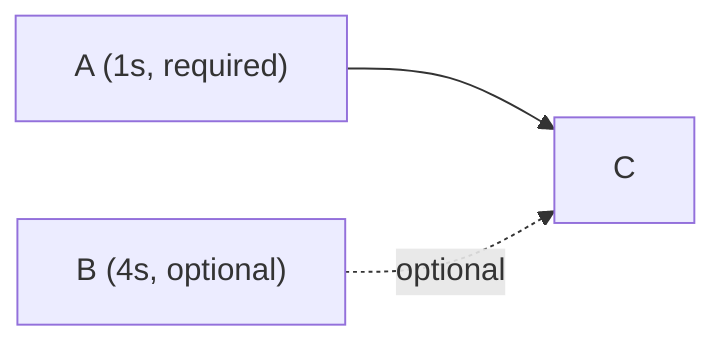

Because `B` is optional, `C` never waits for it. `C` is gated only by `A`, so the chain `A → C` runs back-to-back at `A`'s 1-second period. `B`, meanwhile, runs at its own pace — and `C` simply picks up whatever the latest `B` result is each time it runs:

| t | A | C | B | note |
|---|---|---|---|---|
| 0 | runs | — | runs | both `A` and `B` (optional) begin |
| 1 | runs | runs | running | `C` runs against `A`; `B` is still working, so `C` uses no `B` yet |
| 2 | runs | runs | running | `C` runs again — still gated only by `A`, not waiting on `B` |
| 4 | runs | runs | done | `B` finally completes; the *next* `C` will incorporate it |
| 5 | runs | runs | runs | `C` now includes the latest `B`; `B` starts its next run |

`C` (and `A`) run every second throughout, never throttled to `B`'s 4-second duration. Had `B` been *required*, `C` would have been forced down to a 4-second period to wait for it. Marking it optional keeps the demanded path fast while still folding in `B`'s slower updates whenever they land.

This is what makes optional parents useful for enrichment-style inputs — a large, slowly-rebuilt reference table feeding a fast main path, for example — where stalling the main path to wait on the slow input would be far worse than occasionally using a slightly older copy of it.

## Freshness

In the examples above, **pull** used a generation number for demonstration purposes, while **push** referred to a request for data resulting from root nodes executing after a given timestamp. 

These concepts are unified by a node's **freshness** `F`, which tracks the run start time of the oldest root used to supply that node. The difference between now and the freshness of a node is approximately its staleness or age. Note that it is distinctly *not* the time at which the run finished, as a recent transformation using stale data is still stale.

Freshness has the advantage of being independent of the specific DAG under which nodes were executed, unlike alternatives like run IDs. 

At completion of a run, a node will adopt the freshness of its parents. This is calculated by:

$$
F_{parents} =
\begin{cases}
\min_r F_r & \text{Any required parents } r \text{ exist} \\
\max_k F_k & \text{Only optional parents } k \text{ exist} \\
now & \text{No parents exist (root node)}
\end{cases}
$$

Where there are required parents, a node is only as fresh as the stalest of the set it was waiting on. Where there are only optional parents, a node is as fresh as the freshest, as it was not waiting on any of the others. If there aren't any parents at all, it is the time at the start of the run (roots mint new freshness).

Using **freshness**, the change gating rules for *push* and *pull* are:

- **Pull**: $F_{parents} > F_{self}$
- **Push**: $F_{parents} \ge F_{demand}$

### Example: Diamond Dependency

Consider a diamond where `X` consumes two intermediate nodes drawing on a common source `S`:

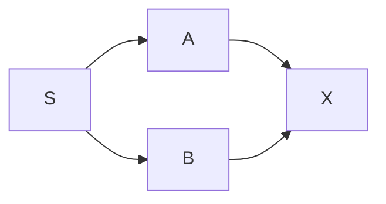

Suppose `S` has reached generation 12, with `A` and `B` having last run against different generations of `S`:

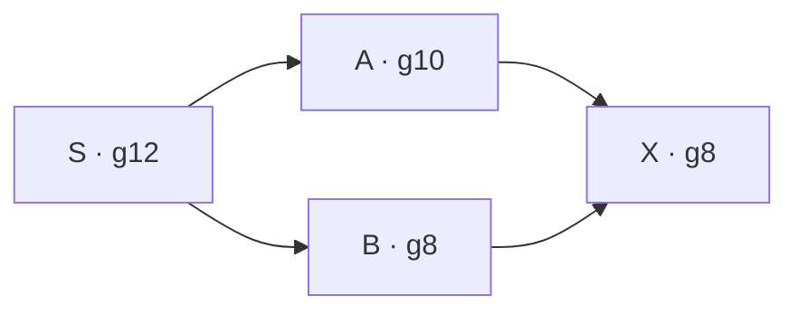

`A` was built from `S` at generation 10, `B` from `S` at generation 8. When `X` runs (both parents required), it can be no fresher than its stalest input: `F_X = min(10, 8) = 8`. The diamond therefore stays internally consistent — `X` reflects a single, coherent point across both paths, never a splice of `A` at 10 with `B` at 8. If instead `B` were an *optional* parent, `X` would take the minimum over its required parents alone (`A · g10`), using whatever `B` it had on a best-effort basis.

## Batch-Updating Data Sources

Many foreign data sources update in **batches** - for example, updating every morning at 2am. If this is known, it's wasted effort for a root node to execute (or check for updates) more frequently than the expected update frequency of the source. 

To address this, a window (or collection of windows) can be set against a root node - for example, "2am to 2am the following day". This defines the window in which a node can run *at most once*. 

Data consumed during a window is considered "fresh" until the end of the window - a node running during a window takes the window *end time* as its freshness, not the time of the run. This subtly modifies the meaning of **freshness** to mean "fresh until". When windows are not present on a node there's no change to behaviour as discussed so far (the node is simply considered fresh until `now`), but it does lead to the potentially unexpected result that freshness can be *in the future*. 

On a node with a window, the upstream Freshness is determined by:

$$
F_{parents} = \min \{ end_w \mid start_w \le now \} \text{for all windows } w
$$

The behaviour of both *pull* and *push* is unchanged in this framing. The first time a node is demanded during a window, it simply runs. The second time, it sees that `now` is not greater than the node's freshness (the end of the window), so it doesn't run and instead queues until the start of the *next* window.

It's worth noting that windows can be either contiguous (window end is the start of the next window) or have gaps, but may never overlap. During gaps the node can't run and instead queues until the next window. Gaps like this are useful if there is a period in which the source can't reliably be consumed, for example during a scheduled table write.

### Staleness

Prior to this adjustment to the meaning of **freshness**, the **staleness** (the age of the data consumed at the root nodes) was simply determined by the difference between `now` and a node's **freshness** `F`:

$$
staleness = now - F
$$

This is no longer correct, as for a window with a 1 day duration for example, at the start of the window the staleness is *-1 day*, despite really being not stale at all. This creates a problem for Tide especially, which executes against a staleness maximum. A Tide of 1 day would execute every *2 days*.

Consequently, each node tracks a delay `D`. This is normally zero, but for root nodes it is equal to the duration of the window it ran against. Downstream nodes inherit `D` by taking the largest `D` from the set of parents with `F` equal to the overall parent freshness:

$$
D = max(D_p) \text{ where } F_p = F_{parents} \text{ for all parents } p
$$

**Staleness** is then the difference between `now` and the **freshness** `F` *minus the delay* `D`:

$$
staleness = now - (F - D) = now + D - F
$$

This corrects Tide behaviour. A run against a window with a 1 day duration has `D = 1d`, and `F = now + 1d`. The staleness correctly produces the expected 0 in this case:

$$
staleness = now + D - F = now + 1d - (now + 1d) = 0
$$

### Example: Wave with Window

Consider `A → B → C`, where `A` is a root node with a 1-day window, and `C` is held under a continuous Wave, first applied at the beginning of A's window:

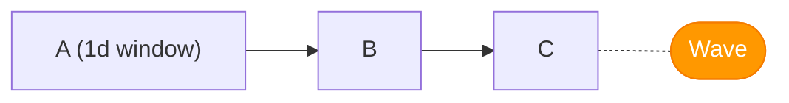

1) Upon the first Tap emitted by the wave, the demand propagates back to `A`, which runs to `F = +1d`.

2) `B` then starts, sending demand back to `A`.

3) As `A`'s `F` is already equal to the end of the window, it does not run, and sits queued.

4) When `B` completes, `C` starts, sending demand back to `B`, which cannot run because `A` has not updated - it sits queued also.

5) When `C` completes, its Wave renews its demand, but it cannot run because `B` has not updated - it sits queued also.

6) When a day passes, `A` enters a new window and can start, allowing `B` and `C` to run after it, again with each entering the queued state.

The Wave throttles itself to once per day, with no superfluous runs anywhere in the chain — purely because `A`'s freshness only advances daily. When a root node has a window, Wave execution naturally throttles to that window's period. 

This is a convenient result. Any pipeline requiring periodic execution due to supply limitations can be managed at the *root* through windows, with downstream consuming eagerly, and the DAG will naturally throttle to avoid wasted runs. This allows the choice of execution mode (Wave/Tide, or Tap/Pulse upon request) to be explicitly about the *service requirements*, with no care needed about the *supply conditions*.

## Ponds and Ripples

The model so far is a flat graph of nodes. In practice it is useful to group nodes into versioned, independently-owned units. We call a single node a **Ripple** — a unit operation exactly as discussed. A **Pond** is a group of Ripples, where all Ripples in that Pond will always execute to completion (push-style) when the Pond is triggered to start. A parent Ripple in a Pond is always treated as required for freshness purposes.

To continue the water-based nomenclature, we introduce the terms:

- **Source**: A parent of a Pond
- **Sink**: A child of a Pond
- **Inlet**: A Pond with no Sources
- **Outlet**: A Pond with no Sinks

The advantage of this grouping is to allow dependency management and version control to be pulled up to the level of the Pond. The Pond keeps track of the Ponds on which it depends and performs a macroscopic transformation - the Ripples are simply the irreducible components of that process.

Consider a Pond `p1` with a DAG of Ripples `r1`, `r2`, `r3` inside it:

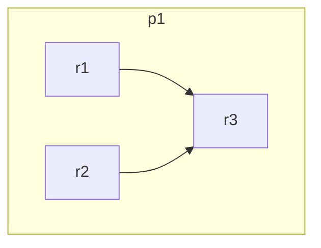

The simplest conceptual framing is to imagine the Pond as two zero-duration boundary nodes, `p1.start` and `p1.end`, before and after the Ripples within it. The head is parent to all root Ripples and the tail child to all leaf Ripples:

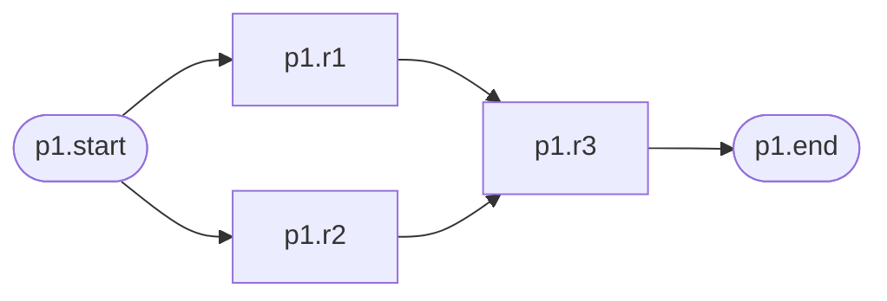

These boundary nodes are not merely conceptual — they sit in the graph as real (if instantaneous) nodes, and the ordinary demand and freshness rules apply to them unchanged. 

Pond relationships are between these boundary nodes. Consider a pond p2 with one Ripple, with p2 depending on p1:

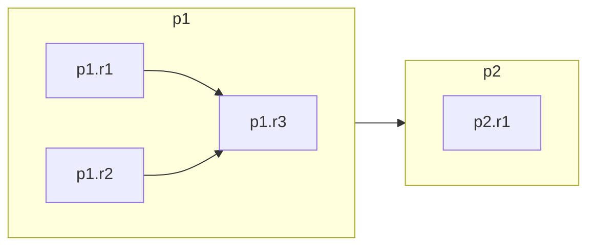

This is in practice the set of nodes:

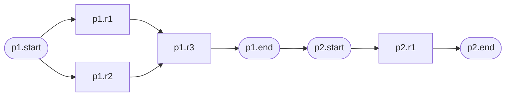

### Pond State Variables

As the boundary nodes are zero-duration, this framing is theoretically identical to setting all root Ripples of the child Pond to have all leaf ripples of the parent Pond:

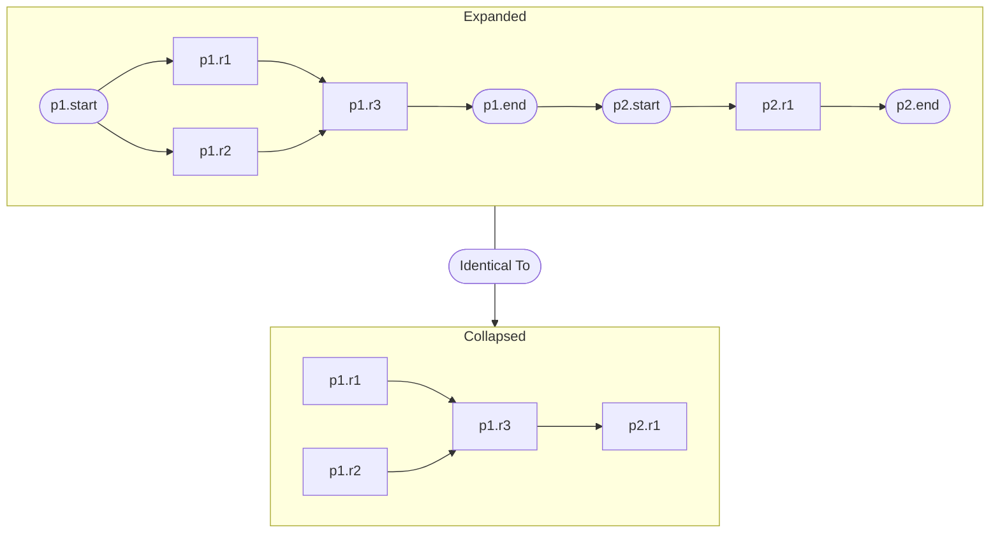

However, including the boundary nodes confers a few simplification advantages.

A Pond start node is always upstream of a Pond end node, and all its Ripples are between them. This implies:

- All events that immediately propagate to all parents are guaranteed to transfer from the end to the start
    - **push** tokens 
    - **pull** tokens, if the start is idle
- Immediately transferred information is shared between the start and end nodes, meaning these can be held as state variables against the Pond

This lets a Pond be triggered as a single unit - a **Pond Run**. The complete behaviour is given by the pseudocode below: a Pond and a Ripple each carry a little state, and react to a handful of events (demand arriving, a run starting, a run completing). The aim is to capture *every* rule exhaustively in one place; the worked example that follows traces them step by step.

```
Pond:
    state:
        startF          # freshness of the most recently started Pond Run
        endF            # freshness of the most recently completed Pond Run
        sourceF         # freshness available from this Pond's Sources (derived, below)
        D               # window delay (see Staleness); 0 unless fed by a window
        hasReceivedPull # a Sink (or trigger) has asked for resupply
        hasPull         # a Pond Run is wanted in pull
        targets         # set of unsatisfied push target freshnesses (empty if none)

    # sourceF is recomputed from the Sources (or window, for an Inlet):
    derive sourceF:
        if Inlet (no Sources):
            if any windows exist:
                currentWindow = window where start <= now < end, if any
                if currentWindow:
                    sourceF = currentWindow.end     # "fresh until" the window end
                    D       = currentWindow.end - currentWindow.start
                else:
                    sourceF = null                  # between windows: cannot run
            else:
                sourceF = now ; D = 0               # live source
        else if any Source is Required:
            sourceF = min(Source.endF over Required Sources)   # blocks on the stalest
        else:
            sourceF = max(Source.endF over all Sources)        # any optional Source suffices

    on hasReceivedPull becomes true:
        if startF == endF:                          # cold start: wake the whole Pond
            hasPull = true
            Ripple.hasPull = true for all Ripples
        else:                                       # running: only sustain the leaves
            Ripple.hasPull = true for all leaf Ripples
        hasReceivedPull = false

    on hasPull becomes true:
        for each Source where Source.startF <= startF:    # any Source that has not started work ahead of this Pond
            Source.hasReceivedPull = true           # cold-start propagation between Ponds

    on receiving a push target T (from a Pulse, Tide, or Sink):
        if T <= endF or T in targets: return        # already satisfied, or already requested
        add T to targets                            # keep every outstanding request, not just the latest
        for each required Source:
            send push target T to Source            # push propagates eagerly upstream

    start a Pond Run when:
        (targets nonempty and sourceF >= min(targets))   # inputs can satisfy the oldest request, OR
        or (hasPull and sourceF > startF)                # pull with fresher input

    on starting a Pond Run:
        if hasPull and not Inlet (no Sources): 
            for each Source: 
                Source.hasReceivedPull = true       # propagate pull
        startF  = sourceF                           # won't restart in pull until sourceF advances
        hasPull = false                             # won't restart in pull until renewed
        remove every T <= startF from targets       # this Run takes the freshest input, satisfying them all
        D = max(Parent.D over Parents where Parent.endF == startF)   # carry worst-case delay
        for each Ripple: send push target startF to Ripple   # every Ripple must reach startF; initiates the run

Ripple:
    state:
        startF, endF        # freshness of most recently started / completed Ripple Run
        sourceF             # freshness available from this Ripple's parents (derived)
        hasPull
        targets

    derive sourceF:
        if root (no parent Ripples): sourceF = Pond.startF
        else:                        sourceF = min(Parent.endF over all parents)
                                     # there are no optional parent Ripples, so min suffices

    on hasPull becomes true (set by a child, or the Pond's hasReceivedPull handler):
        if root (no parents):
            Pond.hasPull = true                     # lets the Pond start a Run as pull
        else:
            for each parent where Parent.startF <= startF: # any parent that has not started work ahead of this Ripple
                Parent.hasPull = true               # cold-start propagation between Ripples

    on receiving a push target T (from the Pond's run-start stamp):
        if T <= endF or T in targets: return        # the Pond stamps every Ripple, so no further propagation
        add T to targets

    start a Ripple Run when:
        (targets nonempty and sourceF >= min(targets))   # inputs can satisfy the oldest request, OR
        or (hasPull and sourceF > startF)                # pull with fresher input

    on starting a Ripple Run:
        startF = sourceF
        if hasPull:
            if not root: Parent.hasPull = true for all parents   # pull propagation upstream
            hasPull = false                         # cleared; must be renewed before next run
        remove every T <= startF from targets       # this Run takes the freshest input, satisfying them all

    on completing a Ripple Run:
        endF = startF                               # notify children
        Pond.endF = min(Ripple.endF over all Ripples)   # if advanced, the Pond Run completed
```

Under *pull*, a Pond will continuously initiate new Pond Runs any time its `sourceF` advances, or until the pull demand is cleared without renewal from a Sink. This could mean multiple Pond Runs are in operation simultaneously, which is intentional.

Under *push*, a Pond Run will start any time there is change in its Source if that change satisfies a target, until all targets are satisfied. Consequently, there can be many concurrent push runs in the pipeline simultaneously.

Every Ripple in a Pond Run will *eventually* reach the `Pond.startF` freshness, as this is added to the Ripple's target set at run start. The Pond Runs may therefore be identified (and logged) by their `Pond.startF` freshness.

### Triggers

Triggers are each modelled as a zero-duration pseudo-node (like a Pond's boundary nodes) attached as child to the Pond. These each have special properties:

- **Tap**: Sets `Source.hasReceivedPull = true`, then deletes itself
- **Wave**: Sets `Source.hasReceivedPull = true` every time the pseudo-node runs
- **Pulse**: Adds `now` to the Source's targets, then deletes itself
- **Tide**: Adds `now` to the Source's targets whenever `now + Source.D - (max(Source.targets) ?? Source.startF) >= limit`, using the staleness of either the most recently started run or the most recent *push* target

The trigger is, in effect, just another Sink.

### Example: Tap

To see the Pond rules in motion, we trace a single **Tap** on the two-Pond example: `p1` (an Inlet, with `r1`, `r2` → `r3`) feeding `p2` (a single Ripple `s1`). Every Ripple takes the same fixed time to run. We label each Ripple with the generation it is currently producing (`gN`), colour running Ripples green and queued ones orange, and mark a held pull token with `•`. A Pond's title shows its `startF / endF` as generations, tinted green while running and orange while queued. As `p1` is an Inlet, each of its runs mints the next generation.

1) **Idle.** Both Ponds rest at generation 0, holding no demand:

    ```mermaid
    flowchart LR
        subgraph p1 ["p1 — 0 / 0"]
            direction LR
            r1["r1 · g0"] -.-> r3["r3 · g0"]
            r2["r2 · g0"] -.-> r3
        end
        subgraph p2 ["p2 — 0 / 0"]
            direction LR
            s1["s1 · g0"]
        end
        p1 -.-> p2
    ```

2) **Tap on `p2`** 

    1) A Tap on `p2` sets `p2.hasReceivedPull`
    2) As `p2` is at a cold start (`startF == endF`), the pull is taken up by `p2.hasPull` and `p2.r1.hasPull`, and `p2.hasReceivedPull` clears
    3) As `p2.hasPull` has been set, and `p1.startF <= p2.startF` (`p1` has not started work ahead of `p2`), `p2` sets `p1.hasReceivedPull` (cold-start propagation to Sources)
    4) With `p1` also a cold start, `p1` and all its Ripples receive `hasPull`, and `p1.hasReceivedPull` clears
    5) The result is all Ponds and Ripples having pull demand, with `p1` and `p2` in a queued state:

    ```mermaid
    flowchart LR
        classDef queued fill:#FF9800,stroke:#F57C00,color:#fff;
        subgraph p1 ["p1 — 0 / 0 · pull"]
            direction LR
            r1["r1 · g0 •"]:::queued -.-> r3["r3 · g0 •"]:::queued
            r2["r2 · g0 •"]:::queued -.-> r3
        end
        subgraph p2 ["p2 — 0 / 0 · pull"]
            direction LR
            s1["s1 · g0 •"]:::queued
        end
        p1 -.-> p2
        p2 <-.- T([Tap])

        style p1 fill:#3a2e12,stroke:#F57C00
        style p2 fill:#3a2e12,stroke:#F57C00
        style T fill:#3a2e12,stroke:#F57C00
    ```

3) **`p1` Run #1 (g1)** 
    1) `p1` is an Inlet with no Windows, so `p1.sourceF = now`
    2) It has pull demand, and `p1.sourceF > p1.F` (where `p1.F` starts at `g0`), so it starts a **Pond Run**: `startF` → `g1`
    3) On each Ripple `g1` is added to the Ripple's targets, and the roots `p1.r1`, `p1.r2` start, each clearing their own pull token
    4) As it is waiting on its parents, `p1.r3` keeps its token and stays queued, along with `p2`
    5) The result is `p1` in a running state (`p1.startF > p1.endF`), its first layer of Ripples running while downstream waits:

    ```mermaid
    flowchart LR
        classDef running fill:#4CAF50,stroke:#388E3C,color:#fff;
        classDef queued fill:#FF9800,stroke:#F57C00,color:#fff;
        subgraph p1 ["p1 — 1 / 0"]
            direction LR
            r1["r1 · g1"]:::running --> r3["r3 · g0 •"]:::queued
            r2["r2 · g1"]:::running --> r3
        end
        subgraph p2 ["p2 — 0 / 0 · pull"]
            direction LR
            s1["s1 · g0 •"]:::queued
        end
        p1 -.-> p2
        style p1 fill:#16301a,stroke:#388E3C
        style p2 fill:#3a2e12,stroke:#F57C00
    ```

4) **`p1.r1` and `p1.r2` end, allowing `r3` and `p1` Run #2 (g2) to start** 
    1) `p1.r1`, `p1.r2` finish g1, so `p1.r3` starts
    2) `p1.r3` has pull, so it sets `p1.r1.hasPull` and `p1.r2.hasPull` and then clears its own `p1.r3.hasPull`
    3) On receiving pull, as they are roots, `p1.r1` and `p1.r2` both set `p1.hasPull`
    4) As `p1.hasPull` and `p1.sourceF (now) > p1.F`, it starts a new **Pond Run**: `startF` → `g2`
    5) On each Ripple `g2` is added to the Ripple's targets, and the roots `p1.r1`, `p1.r2` start, each clearing their own pull token
    6) The result is a simultaneous start of (`p1.r1`, `p1.r2`) at `g2` and (`p1.r3`) at `g1`, with `p2` continuing to wait:

    ```mermaid
    flowchart LR
        classDef running fill:#4CAF50,stroke:#388E3C,color:#fff;
        classDef queued fill:#FF9800,stroke:#F57C00,color:#fff;
        subgraph p1 ["p1 — 2 / 0"]
            direction LR
            r1["r1 · g2"]:::running --> r3["r3 · g1"]:::running
            r2["r2 · g2"]:::running --> r3
        end
        subgraph p2 ["p2 — 0 / 0 · pull"]
            direction LR
            s1["s1 · g0 •"]:::queued
        end
        p1 -.-> p2
        style p1 fill:#16301a,stroke:#388E3C
        style p2 fill:#3a2e12,stroke:#F57C00
    ```

5) **`p1.r3` finishes g1 and `p2` starts Run #1** 
    1) `p1.r3` completes and is the last leaf Ripple in `p1` to finish `g1`, so sets `p1.endF = g1`
    2) As `p2.hasPull` and `p2.sourceF (g1) > p2.startF (g0)`, it starts a new **Pond Run**: `startF` → `g1`
    3) `p2` sets `p1.hasReceivedPull` then clears `p2.hasPull`
    4) As `p1.startF != p1.endF` (not cold start), `p1` only sets its leaf's pull demand, `p1.r3.hasPull`, then clears `p1.hasReceivedPull`
    5) `p2.r1.targetF = g1` is set, and the root `p2.r1` starts, clearing its pull
    6) The result is `p2` in a running state, with `p1.r3` having pull demand

    ```mermaid
    flowchart LR
        classDef running fill:#4CAF50,stroke:#388E3C,color:#fff;
        classDef queued fill:#FF9800,stroke:#F57C00,color:#fff;
        subgraph p1 ["p1 — 2 / 1"]
            direction LR
            r1["r1 · g2"]:::running --> r3["r3 · g1 •"]:::queued
            r2["r2 · g2"]:::running --> r3
        end
        subgraph p2 ["p2 — 1 / 0"]
            direction LR
            s1["s1 · g1"]:::running
        end
        p1 -.-> p2
        style p1 fill:#16301a,stroke:#388E3C
        style p2 fill:#16301a,stroke:#388E3C
    ```
    
6) **`p1.r1` and `p1.r2` finish, allowing `p1.r3` to start, sending demand to roots, and `p1` starts Run #3**:
    1) `p1.r1` and `p1.r2` finish, setting `p1.r1.endF = g2` and `p1.r2.endF = g2`
    2) `p1.r3` has demand and `p1.r3.sourceF (g2) > p1.r3.startF (g1)`, so it starts
    3) `p1.r3` sets `p1.r1.hasPull` and `p1.r2.hasPull`
    4) On receiving pull, as they are roots, `p1.r1` and `p1.r2` both set `p1.hasPull`
    5) As `p1.hasPull` and `p1.sourceF (now) > p1.F`, it starts a new **Pond Run**: `startF` → `g3`
    6) On each Ripple `g3` is added to the Ripple's targets, and the roots `p1.r1`, `p1.r2` start, each clearing their own pull token
    7) The result is a simultaneous start of (`p1.r1`, `p1.r2`) at `g3` and (`p1.r3`) at `g2`, with `p2` running at `g1`:

    ```mermaid
    flowchart LR
        classDef running fill:#4CAF50,stroke:#388E3C,color:#fff;
        subgraph p1 ["p1 — 3 / 1"]
            direction LR
            r1["r1 · g3"]:::running --> r3["r3 · g2"]:::running
            r2["r2 · g3"]:::running --> r3
        end
        subgraph p2 ["p2 — 1 / 0"]
            direction LR
            s1["s1 · g1"]:::running
        end
        p1 -.-> p2
        style p1 fill:#16301a,stroke:#388E3C
        style p2 fill:#16301a,stroke:#388E3C
    ```

7) **All complete, exhausting pull demand** 
    1) Every Ripple completes, leaving no pull demand, `p2` idle but `p1` still running as `p2.startF != p2.endF`:

    ```mermaid
    flowchart LR
        subgraph p1 ["p1 — 3 / 2"]
            direction LR
            r1["r1 · g3"] --> r3["r3 · g2"]
            r2["r2 · g3"] --> r3
        end
        subgraph p2 ["p2 — 1 / 1"]
            direction LR
            s1["s1 · g1"]
        end
        p1 --> p2
        style p1 fill:#16301a,stroke:#388E3C
    ```

8) **`p1.r3` runs to satisfy push demand**
    1) `p1.r3.sourceF (g3) >= p1.r3.targetF (g3)`, so it runs (to complete the started Pond Run):

    ```mermaid
    flowchart LR
        classDef running fill:#4CAF50,stroke:#388E3C,color:#fff;
        subgraph p1 ["p1 — 3 / 2"]
            direction LR
            r1["r1 · g3"] -.-> r3["r3 · g3"]:::running
            r2["r2 · g3"] -.-> r3
        end
        subgraph p2 ["p2 — 1 / 1"]
            direction LR
            s1["s1 · g1"]
        end
        p1 --> p2
        style p1 fill:#16301a,stroke:#388E3C
    ```

9) **Quiescent.** Run #3 drains through `r3` and `p1` settles at `g3`; `p2` rests at `g1`:

    ```mermaid
    flowchart LR
        subgraph p1 ["p1 — 3 / 3"]
            direction LR
            r1["r1 · g3"] -.-> r3["r3 · g3"]
            r2["r2 · g3"] -.-> r3
        end
        subgraph p2 ["p2 — 1 / 1"]
            direction LR
            s1["s1 · g1"]
        end
        p1 --> p2
    ```

A single Tap thus settles with:

| | `p1` | `p2` |
|---|---|---|
| Pond Runs | 3 | 1 |
| Final `endF` | g3 | g1 |
| Max Ripple Depth | 3 | 1 |

This is the general result for a single Tap from a cold start on a sequence of Ponds - each Pond runs for the same number of generations as the maximum Ripple depth from the initiating Tap. Note that all tasks (apart from the concluding *push* runs) finish at approximately the same time, ready to supply any new Taps (or Wave) immediately.

## Fault Tolerance

A failed Pond will not supply fresh data downstream, potentially breaking the entire sequence. 

Failures occur at a Ripple level and cause the associated Pond Run to fail. This is recorded as `Pond.isFailed = true`, and `Pond.failedF = Ripple.startF`.

Retries come in two types:
- Immediately - retry the failed Ripple straight away, within the same Pond Run
- On Change - retry the whole Pond Run once the Sources have moved on

Each has a budget (default 0). If the *Retry Immediately* budget is 1 and the *Retry On Change* budget is 1, the failing Ripple would execute twice per Pond Run before giving up, and twice again when the Sources updated, for a total of 4.

*Retry On Change* runs when its counter is non-zero, `Pond.sourceF > Pond.startF` and `Pond.isFailed = true` - in essence acting as another type of demand. A Pond is considered recovered if `Pond.endF > Pond.failedF`, resetting budgets and clearing fail states.

When a Pond fails it also becomes *blocked* (`Pond.isBlocked = true`), and a Pond with any blocked *required* Source is blocked in turn, so the condition carries all the way down to the Outlets. A blocked Pond still processes any of its existing demand, but won't accept new demand, as to do so would attempt work guaranteed to fail.

A Pond is unblocked by clearing the failure beneath it (e.g. by acknowledging a fix, or directly restarting the Pond):
- `Pond.isFailed = false`
- `Pond.failedF = null`
- `Pond.isBlocked = false`

This extends the Pond pseudocode:

```
Pond (added state):
    retryImmediately    # number of Ripple Run retries allowed within one Pond Run (config; default 0)
    retryOnChange       # number of extra Pond Runs allowed after a Source updates (config; default 0)
    isFailed            # a Pond Run gave up and has not been superseded by a fresher success
    isBlocked           # this Pond is failed, or a required Source is failed/blocked
    failedF             # freshness of the freshest frontier that has failed (NEVER if none)
    failures            # number of Pond Run failures since last success (counted against retryOnChange)
    immediateLeft[F]    # number of Ripple Run retries still available in that Pond Run

    on starting a Pond Run:                     # (in addition to the existing handler)
        immediateLeft[startF] = retryImmediately    # a fresh Ripple-retry budget for this Pond Run
        # while isBlocked, skip the existing re-arm-Sources step: a blocked Pond consumes what its
        # Sources have already produced, but never asks them for more

    start a Pond Run when:                      # (replaces the existing condition)
        ( not isFailed and (
            (targets nonempty and sourceF >= min(targets))      # push, OR
            or (hasPull and sourceF > startF) ) )               # pull — runs even while blocked,
        or                                          #   draining what a Source already produced
        ( failedF != NEVER                          # retry on change: a failed Pond watches its
          and failures <= retryOnChange             #   Sources like a held demand and re-runs once
          and sourceF > startF )                    #   they move on (startF == failedF if nothing newer began)

    on a Ripple Run failing (reported with the Ripple; F = Ripple.startF is the Run it was reaching):
        if immediateLeft[F] > 0:
            immediateLeft[F] -= 1
            re-stamp target F on the Ripple         # retry the Ripple straight away, in the same Run
        else:                                       # the Run gives up — this Pond has failed
            failedF  = max(failedF, F)              # remember the freshest freshness we failed at
            failures += 1                           # every failed Run counts, even simultaneous ones
            isFailed = true
            setBlocked(true)
            drop immediateLeft[F]

    on completing a Pond Run:                   # (in addition to the existing endF advance)
        if isFailed and endF > failedF:             # a Run fresher than the failure has succeeded
            isFailed = false ; failedF = NEVER ; failures = 0
            setBlocked( any required Source is isFailed or isBlocked )   # may stay blocked from upstream

    on receiving a pull or push demand:
        if isBlocked: ignore                        # a blocked Pond takes no new demand, nor propagates
        else: ...                                   # (the existing hasReceivedPull / target rules)

    setBlocked(b):                              # write isBlocked; on a change, tell the Sinks
        if b == isBlocked: return
        isBlocked = b
        notify each Sink                            # the one signal that travels downstream

    on a Source becoming (un)failed or (un)blocked:     # a Sink reads only its own Sources
        setBlocked( isFailed or any required Source is isFailed or isBlocked )

    on unblocking (operator clear, or a `start` trigger):
        isFailed = false ; failedF = NEVER ; failures = 0
        setBlocked( any required Source is isFailed or isBlocked )
```

## Summary

Conventional pipelines are triggered from the *point of supply* — a schedule or a completed upstream run pushes work downstream. This forces a choice between running too often (wasting compute and producing results nobody consumes) and running too rarely (accepting stale data), and it demands central governance to decide the rate of every path.

Duckstring instead triggers from the *point of demand*. Two complementary methods drive a graph of unit operations:

- **Pull** is demand-driven resupply, borrowed from Kanban. A node runs when something downstream has asked for its output *and* it has fresher input to consume, re-arming its own parents as it goes. This throttles every path to its actual consumption rate — both upstream *and* downstream of any bottleneck — and leaves unused paths idle at no cost.
- **Push** is a demand-driven *priority order*. A target freshness propagates eagerly from the consumer up through its ancestors, bringing the whole demanded path current in a single coordinated run — the familiar behaviour of triggering a DAG, but still initiated by the consumer so unused paths stay quiet.

Both reduce to a single quantity, **freshness**: a timestamp describing how current a node's output is, inherited from its parents (the stalest of the required ones). Demand is a simple boolean — *is there any?* — so shared and branching paths need no per-consumer accounting, and a slow *optional* parent never holds up a fast required path.

Each method has a one-shot and a continuous form, giving the four triggers — **Tap** and **Wave** for pull, **Pulse** and **Tide** for push.

Finally, unit operations (**Ripples**) are grouped into versioned, independently-owned **Ponds**. Modelling a Pond as its Ripples book-ended by zero-duration boundary nodes lets dependency management, version control, and triggering be lifted to the Pond level without changing any of the underlying node rules — the boundary nodes are real participants in the graph, not merely a conceptual device. The result is a scheduler that approaches the optimal trade of compute against staleness, while pushing governance of the pipeline down to the owners of each Pond rather than a central authority.