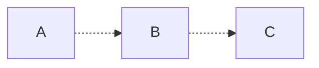
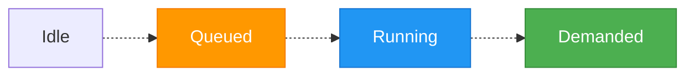

# Theory

This document outlines the theory governing the orchestration mechanics. 

## Motivation

Most of the time when running a sequence of data transformations (a pipeline), the process is set to run either on a schedule (e.g. cron job) or continuously (new run triggered immediately upon completion of previous). This certainly satisfies many purposes, but can often be wasteful - in currency (data freshness), compute, or both.

### General Constraints

Consider a process consisting of three transformations - call them "unit operations" - in series, each taking 10 minutes to complete. The total time from start to end of the pipeline (the *lead time*) is the sume of these durations: 30 minutes. More generally, where some operations run in parallel, the total lead time is the sum duration of the unit operations on the *critical path* - the longest route through the process.

For:

- Set of unit operations on critical path $P$
- $n$ total unit operations on critical path
- Unit operation $k$, where $k \in P$
- Duration $d_k$

$$
{Lead\ Time}=\sum_{k \in P}^{n} d_k
$$

Lead time like this is unavoidable and optimal. However, when run continuously, the total age of results (the *staleness*) can be up to double this. The minimum period between completed runs (the *cycle time*) for such continuous operation is equal to the lead time when running back-to-back like this. 

The result is a sawtooth function of staleness $T$, ranging from lead time $L$ to cycle time $C$ above that:

$$
T(t) = L + (t \bmod C)
$$

In general, the worst case currency is $L + C$, equal to $2L$ in the case of back-to-back execution.

### Continuous Parallel Execution

One way to reduce staleness is to run as much of the pipeline as possible in parallel. If instead of running the pipeline back-to-back, we run every *unit operation* back-to-back, the cycle time reduces to the duration of the longest unit operation (the *bottleneck*):

$$
C = \max_{k \in P} d_k
$$

If every unit operation is approximately the same duration, this optimally trades additional compute time for minimised staleness. However, if there is a great difference in durations for each unit operation, the faster operations will run more frequently than they can be consumed - their results (and compute) wasted.

### Change Gating

Unnecessary runs can be avoided by setting each unit operation to only execute if there have been changes upstream, e.g. by watermarking rows or runs and keeping track of the most recently consumed results from upstream. This is very common and effective, as it causes every unit operation to run at a minimum period equal to the maximum period of all operations upstream - that is, operations downstream are throttled by the upstream bottleneck.

There is, however, no such throttling for operations *upstream* of the bottleneck. If a bottleneck much longer than the other operations occurs late in the sequence of, most of the effort upstream is wasted.

### Globally-Defined Pipelines

In most pipeline orchestration systems, it's required to directly specify in some global context the graph of operations - often called the DAG (Directed Acyclic Graph). This very simply manages the sequencing of unit operations such that each runs only once the previous has completed, and allows setting the DAG to run on a given schedule (or upon some trigger).

This approach is often trivial for small DAGs, and satisfies most purposes. However, as it is governed globally, it requires significant oversight and can become unwieldy for very large DAGs. A change to any unit operation often requires rerunning the DAG from start to finish. Generally, only one run of the pipeline concurrently can be safely executed without side effects, meaning the staleness is rarely close to optimal.

If a path on the DAG is rarely used (or stops being used entirely), managing this can be difficult. At a minimum, the rate of update must be governed by some central authority, which can be difficult to do effectively in larger teams. Some options are:

- Maintain a separate DAG for lower-frequency paths
    - Difficult if they consume data from a higher-frequency path, e.g. aligning with completion times
- Just execute more frequently than necessary
    - Wasteful, though often done in practice due to governance difficulties

## Pull vs Push

Most of the approaches discussed above are considered *push* systems, borrowing terminology from scheduling in manufacturing, where the completion of some task is pushed downstream to enable further processing. The scheduling is inherently *supply-driven*, where the availability of some supply is what enables processing to continue. This requires accurate anticipation of consumption rate to avoid overproduction.

The alternative is *pull*, where scheduling is *demand-driven*. Under this approach, operations execute because of the presence of demand downstream. This has some advantages:

- Work is only done if there is consumption
- No demand forecasting is required - production rate naturally matches demand
- Unused/low-use paths in a DAG are automatically shut down or throttled to match their consumption rate
- Continuous execution (with change-gating) is throttled both upstream *and* downstream of the bottleneck

### Kanban

Kanban is a famously simple pull-based scheduling process, pioneered by Japanese manufacturing (especially Toyota). It involves sending tokens (classically, physical cards) back to a supplier when a product is consumed, allowing the supplier to keep track of how much stock has been consumed. Crucially, the tokens are delivered at the *start* of their being used for the downstream process, allowing the supplier to begin production immediately so that stock is available the next time it is needed.

Typically, the supplier will then log these tokens against a range:

- Red: High tokens, indicating high consumption and low stock -> accelerate production
- Yellow: Moderate tokens, standard consumption and stock -> standard production
- Green: Low tokens, low consumption and high stock -> stop production

Unlike manufacturing, where the number of units is meaningful, data pipelines are binary - either updated or not. Consequently, a Kanban-like process need only track the presence of *any* demand, where the Red/Green boundary is simply one:

- Has demand: Start production
- Has no demand: Stop production

### Demand-Based Orchestration

It is helpful to imagine a unit operation as a node in a directed graph (the DAG). Each node is aware of its parents, and can notify the parents of their demand or otherwise send signals upstream. A node does *not* necessarily have awareness of its children - only the capability to receive signals from them.

Each node follows the simple rules:

- Am I waiting on my parents?
    - Change gating
    - Emulates a consumer being unable to proceed if there is no stock from a supplier
- Have I received demand from anyone downstream?
    - Demand gating
    - Emulates a consumer sending a Kanban token to its supplier
- If both (and I'm not already processing):
    - Send demand to all my parents
    - Clear my own demand
    - Start processing
- When my processing completes:
    - Indicate I have updated, so that processes waiting on me can begin

To handle starts from an idle state, when demand is received it is immediately sent to any parent that is idle (not running and has no demand).

#### Examples

Consider a simple chain of nodes:



Nodes without demand are no colour, nodes with demand but no changes upstream (queued) are orange, nodes that are running are blue, and those that are running *and have demand* (demanded) are green:



We will denote the number of times a node has updated (its *generation*) with a colon, such that "A:3" indicates A has run 3 times. If a node is ahead of its child, the edge between them will be solid - otherwise, it will be dotted.

##### Cold Start

1) All start idle, with each node starting at generation 0:

    ```mermaid
    flowchart LR
        classDef running fill:#2196F3,stroke:#1976D2,color:#fff;
        classDef queued fill:#FF9800,stroke:#F57C00,color:#fff;
        classDef demanded fill:#4CAF50,stroke:#388E3C,color:#fff;

        A[A:0] .-> B[B:0]
        B .-> C[C:0]
    ```

2) C is given demand and enters the queued state:

    ```mermaid
    flowchart LR
        classDef running fill:#2196F3,stroke:#1976D2,color:#fff;
        classDef queued fill:#FF9800,stroke:#F57C00,color:#fff;
        classDef demanded fill:#4CAF50,stroke:#388E3C,color:#fff;

        A[A:0] .-> B[B:0]
        B .-> C[C:0]:::queued
        C <.- D((Demand)):::queued
    ```

    1) As its parent is idle, C immediately sends demand to B, putting it into the queued state also:

    ```mermaid
    flowchart LR
        classDef running fill:#2196F3,stroke:#1976D2,color:#fff;
        classDef queued fill:#FF9800,stroke:#F57C00,color:#fff;
        classDef demanded fill:#4CAF50,stroke:#388E3C,color:#fff;

        A[A:0] .-> B[B:0]:::queued
        B .-> C[C:0]:::queued
    ```

    2) B then does the same to A:

    ```mermaid
    flowchart LR
        classDef running fill:#2196F3,stroke:#1976D2,color:#fff;
        classDef queued fill:#FF9800,stroke:#F57C00,color:#fff;
        classDef demanded fill:#4CAF50,stroke:#388E3C,color:#fff;

        A[A:0]:::queued .-> B[B:0]:::queued
        B .-> C[C:0]:::queued
    ```

    3) A has no parents, so there's nothing to wait for - it begins its run. Demand is cleared and the node starts, putting it in the running state:

    ```mermaid
    flowchart LR
        classDef running fill:#2196F3,stroke:#1976D2,color:#fff;
        classDef queued fill:#FF9800,stroke:#F57C00,color:#fff;
        classDef demanded fill:#4CAF50,stroke:#388E3C,color:#fff;

        A[A:0]:::running .-> B[B:0]:::queued
        B .-> C[C:0]:::queued
    ```

4) A completes, meaning it has updated relative to B and B can start:

    ```mermaid
    flowchart LR
        classDef running fill:#2196F3,stroke:#1976D2,color:#fff;
        classDef queued fill:#FF9800,stroke:#F57C00,color:#fff;
        classDef demanded fill:#4CAF50,stroke:#388E3C,color:#fff;

        A[A:1] --> B[B:0]:::queued
        B .-> C[C:0]:::queued
    ```

    1) Demand is sent to its parent A, putting it in the queued state:

    ```mermaid
    flowchart LR
        classDef running fill:#2196F3,stroke:#1976D2,color:#fff;
        classDef queued fill:#FF9800,stroke:#F57C00,color:#fff;
        classDef demanded fill:#4CAF50,stroke:#388E3C,color:#fff;

        A[A:1]:::queued --> B[B:0]:::queued
        B .-> C[C:0]:::queued
    ```

    2) Demand is cleared and B starts, putting it in the running state:

    ```mermaid
    flowchart LR
        classDef running fill:#2196F3,stroke:#1976D2,color:#fff;
        classDef queued fill:#FF9800,stroke:#F57C00,color:#fff;
        classDef demanded fill:#4CAF50,stroke:#388E3C,color:#fff;

        A[A:1]:::queued --> B[B:0]:::running
        B .-> C[C:0]:::queued
    ```

    2) A has demand and begins its run simultaneously:

    ```mermaid
    flowchart LR
        classDef running fill:#2196F3,stroke:#1976D2,color:#fff;
        classDef queued fill:#FF9800,stroke:#F57C00,color:#fff;
        classDef demanded fill:#4CAF50,stroke:#388E3C,color:#fff;

        A[A:1]:::running --> B[B:0]:::running
        B .-> C[C:0]:::queued
    ```

5) A completes before B and sits idle:

    ```mermaid
    flowchart LR
        classDef running fill:#2196F3,stroke:#1976D2,color:#fff;
        classDef queued fill:#FF9800,stroke:#F57C00,color:#fff;
        classDef demanded fill:#4CAF50,stroke:#388E3C,color:#fff;

        A[A:2] --> B[B:0]:::running
        B .-> C[C:0]:::queued
    ```

6) B completes, meaning it has updated relative to C and C can start:

    ```mermaid
    flowchart LR
        classDef running fill:#2196F3,stroke:#1976D2,color:#fff;
        classDef queued fill:#FF9800,stroke:#F57C00,color:#fff;
        classDef demanded fill:#4CAF50,stroke:#388E3C,color:#fff;

        A[A:2] --> B[B:1]
        B --> C[C:0]:::queued
    ```

    1) Demand is sent to its parent C, putting it in the queued state:

    ```mermaid
    flowchart LR
        classDef running fill:#2196F3,stroke:#1976D2,color:#fff;
        classDef queued fill:#FF9800,stroke:#F57C00,color:#fff;
        classDef demanded fill:#4CAF50,stroke:#388E3C,color:#fff;

        A[A:2] --> B[B:1]:::queued
        B --> C[C:0]:::queued
    ```

    2) Demand is cleared and C starts, putting it in the running state:

    ```mermaid
    flowchart LR
        classDef running fill:#2196F3,stroke:#1976D2,color:#fff;
        classDef queued fill:#FF9800,stroke:#F57C00,color:#fff;
        classDef demanded fill:#4CAF50,stroke:#388E3C,color:#fff;

        A[A:2] --> B[B:1]:::queued
        B --> C[C:0]:::running
    ```

    3) B has demand and begins its run simultaneously, sending demand back to A:

    ```mermaid
    flowchart LR
        classDef running fill:#2196F3,stroke:#1976D2,color:#fff;
        classDef queued fill:#FF9800,stroke:#F57C00,color:#fff;
        classDef demanded fill:#4CAF50,stroke:#388E3C,color:#fff;

        A[A:2]:::queued --> B[B:1]:::running
        B --> C[C:0]:::running
    ```

    4) A has demand and begins its run simultaneously:

    ```mermaid
    flowchart LR
        classDef running fill:#2196F3,stroke:#1976D2,color:#fff;
        classDef queued fill:#FF9800,stroke:#F57C00,color:#fff;
        classDef demanded fill:#4CAF50,stroke:#388E3C,color:#fff;

        A[A:2]:::running --> B[B:1]:::running
        B --> C[C:0]:::running
    ```

6) A, B and C each eventually complete their run:

    ```mermaid
    flowchart LR
        classDef running fill:#2196F3,stroke:#1976D2,color:#fff;
        classDef queued fill:#FF9800,stroke:#F57C00,color:#fff;
        classDef demanded fill:#4CAF50,stroke:#388E3C,color:#fff;

        A[A:3] --> B[B:2]
        B --> C[C:1]
    ```

This is generally the outcome of a pull-based execution: each node runs the same number of times as the distance from the end of the DAG.

##### Continued Run

1) C is given demand and enters the queued state:

    ```mermaid
    flowchart LR
        classDef running fill:#2196F3,stroke:#1976D2,color:#fff;
        classDef queued fill:#FF9800,stroke:#F57C00,color:#fff;
        classDef demanded fill:#4CAF50,stroke:#388E3C,color:#fff;

        A[A:3] --> B[B:2]
        B --> C[C:1]:::queued
        C <.- D((Demand)):::queued
    ```

2) As its parent is a generation ahead, it starts a run:

    1) Demand is sent to its parent, putting it in the queued state:

    ```mermaid
    flowchart LR
        classDef running fill:#2196F3,stroke:#1976D2,color:#fff;
        classDef queued fill:#FF9800,stroke:#F57C00,color:#fff;
        classDef demanded fill:#4CAF50,stroke:#388E3C,color:#fff;

        A[A:3] --> B[B:2]:::queued
        B --> C[C:1]:::queued
    ```

    2) Demand is cleared and the node started, putting it in the running state:

    ```mermaid
    flowchart LR
        classDef running fill:#2196F3,stroke:#1976D2,color:#fff;
        classDef queued fill:#FF9800,stroke:#F57C00,color:#fff;
        classDef demanded fill:#4CAF50,stroke:#388E3C,color:#fff;

        A[A:3] --> B[B:2]:::queued
        B --> C[C:1]:::running
    ```

3) B repeats the same, sending demand upstream and starting:

    ```mermaid
    flowchart LR
        classDef running fill:#2196F3,stroke:#1976D2,color:#fff;
        classDef queued fill:#FF9800,stroke:#F57C00,color:#fff;
        classDef demanded fill:#4CAF50,stroke:#388E3C,color:#fff;

        A[A:3] --> B[B:2]:::running
        B --> C[C:1]:::running
    ```

4) A has no parents, so can start as soon as it receives demand:

    ```mermaid
    flowchart LR
        classDef running fill:#2196F3,stroke:#1976D2,color:#fff;
        classDef queued fill:#FF9800,stroke:#F57C00,color:#fff;
        classDef demanded fill:#4CAF50,stroke:#388E3C,color:#fff;

        A[A:3]:::running --> B[B:2]:::running
        B --> C[C:1]:::running
    ```

5) A, B and C each eventually complete their run:

    ```mermaid
    flowchart LR
        classDef running fill:#2196F3,stroke:#1976D2,color:#fff;
        classDef queued fill:#FF9800,stroke:#F57C00,color:#fff;
        classDef demanded fill:#4CAF50,stroke:#388E3C,color:#fff;

        A[A:4] --> B[B:3]
        B --> C[C:2]
    ```

Each subsequent run on a previously-executed pull advances each node by one generation, without waiting for the updates to propagate from start to finish.

TODO:
- Outline behaviour with branching, e.g. with A -> C, B -> C, B -> D, to demonstrate that parents of less frequent pathways can be left stale while others execute
    - Deliberate on demand being *any*, so if there is existing demand, it has no additional effect
- Describe the other mode - push - that can also be executed
    - Nodes can have either pull or push tokens or both
- Freshness concept in place of generations, and conditions under which push and pull execute
- Introduce the encapsulation of nodes into Ponds and Ripples:
    - A Ripple is a node as has been discussed so far
    - A Pond is a sequence of Ripples but with a zero-duration pseudo-node parent to all root Ripples, and a similar pseudo-node child to all leaf Ripples
- Summarise simplifications that can be made under this framing:
    - All auto-propagating condtions affect both head and tail pseudo-nodes, meaning they can be tracked as an overall state variable against the pond itself, or hop directly from tail to head
        - Push tokens
        - Pull tokens when idle
    - Ponds can be triggered as a "pond run"
        - Pull tokens always jump straight to the head when idle
        - All ripples must have also been idle
        - Each ripple gets a push token to ensure all in the pond are executed to the same freshness
        - If the pond has pull demand, each ripple also gets a pull token
    - New pond runs are initiated if a root ripple restarts