# Theory

This document outlines the theory governing the orchestration mechanics. 

## Motivation

Most of the time when running a sequence of data transformations (a pipeline), the process is set to run either on a schedule (e.g. cron job) or continuously (new run triggered immediately upon completion of previous). This certainly satisfies many purposes, but can often be wasteful - in staleness (data age), compute, or both.

### General Constraints

Consider a process consisting of three transformations - call them "unit operations" - in series, each taking 10 minutes to complete. The total time from start to end of the pipeline (the *lead time*) is the sume of these durations: 30 minutes. More generally, where some operations run in parallel, the total lead time is the sum duration of the unit operations on the *critical path* - the longest route through the process.

For:

- Set of unit operations on critical path $P$
- $n$ total unit operations on critical path
- Unit operation $k$, where $k \in P$
- Duration $d_k$

$$
{Lead\ Time}=\sum_{k \in P}^{n} d_k
$$

Lead time like this is unavoidable and optimal. However, when run continuously, the total age of results (the *staleness*) can be up to double this. The minimum period between completed runs (the *cycle time*) for such continuous operation is equal to the lead time when running back-to-back like this. 

The result is a sawtooth function of staleness $T$, ranging from lead time $L$ to cycle time $C$ above that:

$$
T(t) = L + (t \bmod C)
$$

In general, the worst case staleness is $L + C$, equal to $2L$ in the case of back-to-back execution.

### Continuous Parallel Execution

One way to reduce staleness is to run as much of the pipeline as possible in parallel. If instead of running the pipeline back-to-back, we run every *unit operation* back-to-back, the cycle time reduces to the duration of the longest unit operation (the *bottleneck*):

$$
C = \max_{k \in P} d_k
$$

If every unit operation is approximately the same duration, this optimally trades additional compute time for minimised staleness. However, if there is a great difference in durations for each unit operation, the faster operations will run more frequently than they can be consumed - their results (and compute) wasted.

### Change Gating

Unnecessary runs can be avoided by setting each unit operation to only execute if there have been changes upstream, e.g. by watermarking rows or runs and keeping track of the most recently consumed results from upstream. This is very common and effective, as it causes every unit operation to run at a minimum period equal to the maximum period of all operations upstream - that is, operations downstream are throttled by the upstream bottleneck.

There is, however, no such throttling for operations *upstream* of the bottleneck. If a bottleneck much longer than the other operations occurs late in the sequence of, most of the effort upstream is wasted.

### Globally-Defined Pipelines

In most pipeline orchestration systems, it's required to directly specify in some global context the graph of operations - often called the DAG (Directed Acyclic Graph). This very simply manages the sequencing of unit operations such that each runs only once the previous has completed, and allows setting the DAG to run on a given schedule (or upon some trigger).

This approach is often trivial for small DAGs, and satisfies most purposes. However, as it is governed globally, it requires significant oversight and can become unwieldy for very large DAGs. A change to any unit operation often requires rerunning the DAG from start to finish. Generally, only one run of the pipeline concurrently can be safely executed without side effects, meaning the staleness is rarely close to optimal.

If a path on the DAG is rarely used (or stops being used entirely), managing this can be difficult. At a minimum, the rate of update must be governed by some central authority, which can be difficult to do effectively in larger teams. Some options are:

- Maintain a separate DAG for lower-frequency paths
    - Difficult if they consume data from a higher-frequency path, e.g. aligning with completion times
- Just execute more frequently than necessary
    - Wasteful, though often done in practice due to governance difficulties

## Pull vs Push

Most of the approaches discussed above are considered *push* systems, borrowing terminology from scheduling in manufacturing, where the completion of some task is pushed downstream to enable further processing. The scheduling is inherently *supply-driven*, where the availability of some supply is what enables processing to continue. This requires accurate anticipation of consumption rate to avoid overproduction.

The alternative is *pull*, where scheduling is *demand-driven*. Under this approach, operations execute because of the presence of demand downstream. This has some advantages:

- Work is only done if there is consumption
- No demand forecasting is required - production rate naturally matches demand
- Unused/low-use paths in a DAG are automatically shut down or throttled to match their consumption rate
- Continuous execution (with change-gating) is throttled both upstream *and* downstream of the bottleneck

### Kanban

Kanban is a famously simple pull-based scheduling process, pioneered by Japanese manufacturing (especially Toyota). It involves sending tokens (classically, physical cards) back to a supplier when a product is consumed, allowing the supplier to keep track of how much stock has been consumed. Crucially, the tokens are delivered at the *start* of their being used for the downstream process, allowing the supplier to begin production immediately so that stock is available the next time it is needed.

Typically, the supplier will then log these tokens against a range:

- Red: High tokens, indicating high consumption and low stock -> accelerate production
- Yellow: Moderate tokens, standard consumption and stock -> standard production
- Green: Low tokens, low consumption and high stock -> stop production

Unlike manufacturing, where the number of units is meaningful, data pipelines are binary - either updated or not. Consequently, a Kanban-like process need only track the presence of *any* demand, where the Red/Green boundary is simply one:

- Has demand: Start production
- Has no demand: Stop production

### Pull

It is helpful to imagine a unit operation as a node in a directed graph (the DAG). Each node is aware of its parents, and can notify the parents of their demand or otherwise send signals upstream. A node does *not* necessarily have awareness of its children - only the capability to receive signals from them.

Each node follows the simple rules:

- Am I waiting on my parents?
    - Change gating
    - Emulates a consumer being unable to proceed if there is no stock from a supplier
- Have I received demand from anyone downstream?
    - Demand gating
    - Emulates a consumer sending a Kanban token to its supplier
- If both (and I'm not already processing):
    - Send demand to all my parents
    - Clear my own demand
    - Start processing
- When my processing completes:
    - Indicate I have updated, so that processes waiting on me can begin

To handle starts from an idle state, when demand is received it is immediately sent to any parent that is idle (not running and has no demand).

#### Examples

Consider a simple chain of nodes:

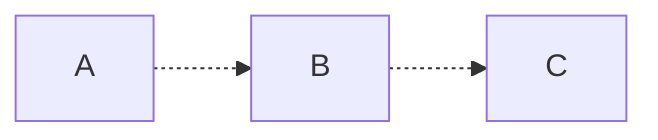

Nodes without demand are no colour, nodes with demand but no changes upstream (queued) are orange, nodes that are running are blue, and those that are running *and have demand* (demanded) are green:

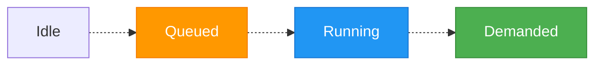

We will denote the number of times a node has updated (its *generation*) with a colon, such that "A:3" indicates A has run 3 times. If a node is ahead of its child, the edge between them will be solid - otherwise, it will be dotted.

##### Cold Start

1) All start idle, with each node starting at generation 0:

    ```mermaid
    flowchart LR
        classDef running fill:#2196F3,stroke:#1976D2,color:#fff;
        classDef queued fill:#FF9800,stroke:#F57C00,color:#fff;
        classDef demanded fill:#4CAF50,stroke:#388E3C,color:#fff;

        A[A:0] .-> B[B:0]
        B .-> C[C:0]
    ```

2) C is given demand and enters the queued state:

    ```mermaid
    flowchart LR
        classDef running fill:#2196F3,stroke:#1976D2,color:#fff;
        classDef queued fill:#FF9800,stroke:#F57C00,color:#fff;
        classDef demanded fill:#4CAF50,stroke:#388E3C,color:#fff;

        A[A:0] .-> B[B:0]
        B .-> C[C:0]:::queued
        C <.- D([Demand]):::queued
    ```

    1) As its parent is idle, C immediately sends demand to B, putting it into the queued state also:

    ```mermaid
    flowchart LR
        classDef running fill:#2196F3,stroke:#1976D2,color:#fff;
        classDef queued fill:#FF9800,stroke:#F57C00,color:#fff;
        classDef demanded fill:#4CAF50,stroke:#388E3C,color:#fff;

        A[A:0] .-> B[B:0]:::queued
        B .-> C[C:0]:::queued
    ```

    2) B then does the same to A:

    ```mermaid
    flowchart LR
        classDef running fill:#2196F3,stroke:#1976D2,color:#fff;
        classDef queued fill:#FF9800,stroke:#F57C00,color:#fff;
        classDef demanded fill:#4CAF50,stroke:#388E3C,color:#fff;

        A[A:0]:::queued .-> B[B:0]:::queued
        B .-> C[C:0]:::queued
    ```

    3) A has no parents, so there's nothing to wait for - it begins its run. Demand is cleared and the node starts, putting it in the running state:

    ```mermaid
    flowchart LR
        classDef running fill:#2196F3,stroke:#1976D2,color:#fff;
        classDef queued fill:#FF9800,stroke:#F57C00,color:#fff;
        classDef demanded fill:#4CAF50,stroke:#388E3C,color:#fff;

        A[A:0]:::running .-> B[B:0]:::queued
        B .-> C[C:0]:::queued
    ```

4) A completes, meaning it has updated relative to B and B can start:

    ```mermaid
    flowchart LR
        classDef running fill:#2196F3,stroke:#1976D2,color:#fff;
        classDef queued fill:#FF9800,stroke:#F57C00,color:#fff;
        classDef demanded fill:#4CAF50,stroke:#388E3C,color:#fff;

        A[A:1] --> B[B:0]:::queued
        B .-> C[C:0]:::queued
    ```

    1) Demand is sent to its parent A, putting it in the queued state:

    ```mermaid
    flowchart LR
        classDef running fill:#2196F3,stroke:#1976D2,color:#fff;
        classDef queued fill:#FF9800,stroke:#F57C00,color:#fff;
        classDef demanded fill:#4CAF50,stroke:#388E3C,color:#fff;

        A[A:1]:::queued --> B[B:0]:::queued
        B .-> C[C:0]:::queued
    ```

    2) Demand is cleared and B starts, putting it in the running state:

    ```mermaid
    flowchart LR
        classDef running fill:#2196F3,stroke:#1976D2,color:#fff;
        classDef queued fill:#FF9800,stroke:#F57C00,color:#fff;
        classDef demanded fill:#4CAF50,stroke:#388E3C,color:#fff;

        A[A:1]:::queued --> B[B:0]:::running
        B .-> C[C:0]:::queued
    ```

    2) A has demand and begins its run simultaneously:

    ```mermaid
    flowchart LR
        classDef running fill:#2196F3,stroke:#1976D2,color:#fff;
        classDef queued fill:#FF9800,stroke:#F57C00,color:#fff;
        classDef demanded fill:#4CAF50,stroke:#388E3C,color:#fff;

        A[A:1]:::running --> B[B:0]:::running
        B .-> C[C:0]:::queued
    ```

5) A completes before B and sits idle:

    ```mermaid
    flowchart LR
        classDef running fill:#2196F3,stroke:#1976D2,color:#fff;
        classDef queued fill:#FF9800,stroke:#F57C00,color:#fff;
        classDef demanded fill:#4CAF50,stroke:#388E3C,color:#fff;

        A[A:2] --> B[B:0]:::running
        B .-> C[C:0]:::queued
    ```

6) B completes, meaning it has updated relative to C and C can start:

    ```mermaid
    flowchart LR
        classDef running fill:#2196F3,stroke:#1976D2,color:#fff;
        classDef queued fill:#FF9800,stroke:#F57C00,color:#fff;
        classDef demanded fill:#4CAF50,stroke:#388E3C,color:#fff;

        A[A:2] --> B[B:1]
        B --> C[C:0]:::queued
    ```

    1) Demand is sent to its parent C, putting it in the queued state:

    ```mermaid
    flowchart LR
        classDef running fill:#2196F3,stroke:#1976D2,color:#fff;
        classDef queued fill:#FF9800,stroke:#F57C00,color:#fff;
        classDef demanded fill:#4CAF50,stroke:#388E3C,color:#fff;

        A[A:2] --> B[B:1]:::queued
        B --> C[C:0]:::queued
    ```

    2) Demand is cleared and C starts, putting it in the running state:

    ```mermaid
    flowchart LR
        classDef running fill:#2196F3,stroke:#1976D2,color:#fff;
        classDef queued fill:#FF9800,stroke:#F57C00,color:#fff;
        classDef demanded fill:#4CAF50,stroke:#388E3C,color:#fff;

        A[A:2] --> B[B:1]:::queued
        B --> C[C:0]:::running
    ```

    3) B has demand and begins its run simultaneously, sending demand back to A:

    ```mermaid
    flowchart LR
        classDef running fill:#2196F3,stroke:#1976D2,color:#fff;
        classDef queued fill:#FF9800,stroke:#F57C00,color:#fff;
        classDef demanded fill:#4CAF50,stroke:#388E3C,color:#fff;

        A[A:2]:::queued --> B[B:1]:::running
        B --> C[C:0]:::running
    ```

    4) A has demand and begins its run simultaneously:

    ```mermaid
    flowchart LR
        classDef running fill:#2196F3,stroke:#1976D2,color:#fff;
        classDef queued fill:#FF9800,stroke:#F57C00,color:#fff;
        classDef demanded fill:#4CAF50,stroke:#388E3C,color:#fff;

        A[A:2]:::running --> B[B:1]:::running
        B --> C[C:0]:::running
    ```

6) A, B and C each eventually complete their run:

    ```mermaid
    flowchart LR
        classDef running fill:#2196F3,stroke:#1976D2,color:#fff;
        classDef queued fill:#FF9800,stroke:#F57C00,color:#fff;
        classDef demanded fill:#4CAF50,stroke:#388E3C,color:#fff;

        A[A:3] --> B[B:2]
        B --> C[C:1]
    ```

This is generally the outcome of a pull-based execution: each node runs the same number of times as the distance from the end of the DAG, with upstream nodes slightly less stale than downstream.

##### Continued Run

1) C is given demand and enters the queued state:

    ```mermaid
    flowchart LR
        classDef running fill:#2196F3,stroke:#1976D2,color:#fff;
        classDef queued fill:#FF9800,stroke:#F57C00,color:#fff;
        classDef demanded fill:#4CAF50,stroke:#388E3C,color:#fff;

        A[A:3] --> B[B:2]
        B --> C[C:1]:::queued
        C <.- D([Demand]):::queued
    ```

2) As its parent is a generation ahead, it starts a run:

    1) Demand is sent to its parent, putting it in the queued state:

    ```mermaid
    flowchart LR
        classDef running fill:#2196F3,stroke:#1976D2,color:#fff;
        classDef queued fill:#FF9800,stroke:#F57C00,color:#fff;
        classDef demanded fill:#4CAF50,stroke:#388E3C,color:#fff;

        A[A:3] --> B[B:2]:::queued
        B --> C[C:1]:::queued
    ```

    2) Demand is cleared and the node started, putting it in the running state:

    ```mermaid
    flowchart LR
        classDef running fill:#2196F3,stroke:#1976D2,color:#fff;
        classDef queued fill:#FF9800,stroke:#F57C00,color:#fff;
        classDef demanded fill:#4CAF50,stroke:#388E3C,color:#fff;

        A[A:3] --> B[B:2]:::queued
        B --> C[C:1]:::running
    ```

3) B repeats the same, sending demand upstream and starting:

    ```mermaid
    flowchart LR
        classDef running fill:#2196F3,stroke:#1976D2,color:#fff;
        classDef queued fill:#FF9800,stroke:#F57C00,color:#fff;
        classDef demanded fill:#4CAF50,stroke:#388E3C,color:#fff;

        A[A:3] --> B[B:2]:::running
        B --> C[C:1]:::running
    ```

4) A has no parents, so can start as soon as it receives demand:

    ```mermaid
    flowchart LR
        classDef running fill:#2196F3,stroke:#1976D2,color:#fff;
        classDef queued fill:#FF9800,stroke:#F57C00,color:#fff;
        classDef demanded fill:#4CAF50,stroke:#388E3C,color:#fff;

        A[A:3]:::running --> B[B:2]:::running
        B --> C[C:1]:::running
    ```

5) A, B and C each eventually complete their run:

    ```mermaid
    flowchart LR
        classDef running fill:#2196F3,stroke:#1976D2,color:#fff;
        classDef queued fill:#FF9800,stroke:#F57C00,color:#fff;
        classDef demanded fill:#4CAF50,stroke:#388E3C,color:#fff;

        A[A:4] --> B[B:3]
        B --> C[C:2]
    ```

Each subsequent run on a previously-executed pull advances each node by one generation, without waiting for the updates to propagate from start to finish.

##### Branching

The chain above is the simplest case. The advantages of demand-driven scheduling become clearer when paths branch and merge. Consider a graph where `C` consumes both `A` and `B`, while `D` consumes only `B`:

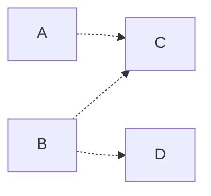

Here `B` is *shared*: it supplies two consumers, `C` and `D`, which may run at different rates. We will follow what happens when `D` is placed under continuous demand but `C` is not.

1) All nodes start idle at generation 0:

    ```mermaid
    flowchart LR
        classDef running fill:#2196F3,stroke:#1976D2,color:#fff;
        classDef queued fill:#FF9800,stroke:#F57C00,color:#fff;
        classDef demanded fill:#4CAF50,stroke:#388E3C,color:#fff;

        A[A:0] .-> C[C:0]
        B[B:0] .-> C
        B .-> D[D:0]
    ```

2) `D` is given continuous demand. As its parent `B` is idle, the demand jumps straight to `B`, which is a source and can begin immediately:

    ```mermaid
    flowchart LR
        classDef running fill:#2196F3,stroke:#1976D2,color:#fff;
        classDef queued fill:#FF9800,stroke:#F57C00,color:#fff;
        classDef demanded fill:#4CAF50,stroke:#388E3C,color:#fff;

        A[A:0] .-> C[C:0]
        B[B:0]:::running .-> C
        B .-> D[D:0]:::queued
    ```

3) `B` and `D` settle into a steady cycle — `B` producing, `D` consuming and re-arming `B` — while `A` and `C` are never touched and remain at generation 0:

    ```mermaid
    flowchart LR
        classDef running fill:#2196F3,stroke:#1976D2,color:#fff;
        classDef queued fill:#FF9800,stroke:#F57C00,color:#fff;
        classDef demanded fill:#4CAF50,stroke:#388E3C,color:#fff;

        A[A:0] .-> C[C:0]
        B[B:6]:::running --> D[D:5]:::running
        B --> C
    ```

    `A` and `C` are left *stale* — and crucially, no compute is wasted producing results nobody consumes. This is the property absent from naive continuous-parallel execution: throttling applies to the *entire sub-graph upstream of the actual demand*, not merely downstream of a bottleneck.

4) Now `C` is given demand. Its parents are `A` (idle) and `B` (running). The demand jumps to the idle `A`, waking it. No demand is sent to `B` because it is not idle:

    ```mermaid
    flowchart LR
        classDef running fill:#2196F3,stroke:#1976D2,color:#fff;
        classDef queued fill:#FF9800,stroke:#F57C00,color:#fff;
        classDef demanded fill:#4CAF50,stroke:#388E3C,color:#fff;

        A[A:0]:::running .-> C[C:0]:::queued
        B[B:6]:::running --> D[D:5]:::running
        B --> C
    ```

    `B` does not run twice to serve two consumers — it continues its single cycle, and both `C` and `D` consume whatever it produces.

5) Once `A` and `B` are both ahead of `C`, `C` runs, taking the freshest result available from each:

    ```mermaid
    flowchart LR
        classDef running fill:#2196F3,stroke:#1976D2,color:#fff;
        classDef queued fill:#FF9800,stroke:#F57C00,color:#fff;
        classDef demanded fill:#4CAF50,stroke:#388E3C,color:#fff;

        A[A:1] --> C[C:0]:::running
        B[B:7]:::running --> D[D:6]:::running
        B --> C
    ```

The shared node `B` runs at the rate of its *fastest* consumer (`D`), and the slower consumer `C` takes the latest result available whenever it happens to run.

##### Continuous Demand

A single demand advances each node once and then settles. To keep a pipeline continuously fresh, the demand is simply *re-asserted* each time the demanded node completes its run. Every completion issues a fresh pull, and the pipeline runs back-to-back at its fastest sustainable rate.

The instructive case is a bottleneck in the *middle* of the chain. Consider `A` (1s) → `B` (3s) → `C` (1s), with `C` continuously demanded:

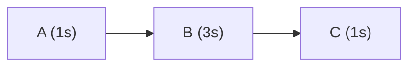

`B` is the bottleneck. A naive parallel scheme would run the 1-second `A` three times for every run of `B`, discarding two of its results. Under pull this does not happen: `A` is re-armed only when `B` actually consumes its output, so `A` is throttled to `B`'s period despite being far quicker. Following the steady-state cycle (times in seconds):

| t | A | B | C | event |
|---|---|---|---|---|
| 0 | runs | — | — | `A` produces the first result |
| 1 | runs | runs | — | `B` starts consuming `A`, and re-arms it; `A` produces one result ahead |
| 2 | idle | running | — | `A` has a result buffered, so it waits |
| 4 | runs | runs | runs | `B` finishes, consumes the buffered `A`, re-arms it; `C` runs |
| 5 | running | running | done | `C` completes and re-asserts its demand |
| 7 | … | runs | runs | the cycle repeats with period 3s |

`A` runs exactly once per cycle, matching `B`'s 3-second period — neither over- nor under-producing. The bottleneck sets the rhythm for the *entire* chain, both upstream and down. The mechanism that achieves this is that a node holding standing demand re-arms its parent only *one generation ahead*: enough to keep the bottleneck fed without it ever idling, but never enough to pile up unconsumed work.

### Push (To Meet Demand)

When continuously demanded, **pull** orchestration maintains low staleness effectively and returns updates as frequently as possible. However, executing demand against a node will only ever take data as fresh as its immediate parents - if there is a requirement for the result of the run to produce data that results from sources *at the time of the request*, the more familiar **push** orchestration is needed. 

Additionally, if data is only required to update at a period far longer than the bottleneck process (e.g. weekly or daily, as is common), **pull** would either be consistently behind or would require executing upstream nodes more than would be expected to be consumed.

Under *push*, an initiated run from upstream is followed by runs from each of its children until the end of the DAG is reached. However, unlike most orchestration approaches, the request is made from the *leaves* of the DAG rather than pushed down from the roots. This maintains most of the advantages of the pull-based approach (paths with no demand are not executed) without the attempt to minimise staleness by executing the path as often as possible.

Under *push*, each node follows the simple rules:

- If I get demand for a given freshness from downstream:
    - Set this demand against each parent, unless they already have a request for something fresher
- Am I waiting on my parents to meet my required freshness?
    - Change gating
    - Emulates a consumer being unable to proceed if there is no stock for this *priority order* from a supplier
- If not (and I'm not already processing):
    - Clear my own demand
    - Start processing
- When my processing completes:
    - Set my freshness to that of my parents

#### Examples

##### Cold Start

Consider the same chain, all idle at generation 0. A push always carries a *target* freshness — the request "produce data at least this fresh". We will write the target as a generation for illustration (in reality it is a timestamp), so a push for generation 1 asks every node to reach generation 1.

1) All start idle at generation 0:

    ```mermaid
    flowchart LR
        classDef running fill:#2196F3,stroke:#1976D2,color:#fff;
        classDef queued fill:#FF9800,stroke:#F57C00,color:#fff;
        classDef pushed fill:#9C27B0,stroke:#7B1FA2,color:#fff;

        A[A:0] .-> B[B:0]
        B .-> C[C:0]
    ```

2) `C` receives a push for generation 1. Unlike a pull, the target is forwarded *eagerly* to every ancestor that isn't already that fresh — it does not wait for runs to complete. The push reaches `B`, then `A`, in a single step:

    ```mermaid
    flowchart LR
        classDef running fill:#2196F3,stroke:#1976D2,color:#fff;
        classDef queued fill:#FF9800,stroke:#F57C00,color:#fff;
        classDef pushed fill:#9C27B0,stroke:#7B1FA2,color:#fff;

        A[A:0]:::pushed .-> B[B:0]:::pushed
        B .-> C[C:0]:::pushed
    ```

3) `A` has no parents, so its inputs trivially satisfy the target and it runs. `B` and `C` hold their push, waiting on their parents:

    ```mermaid
    flowchart LR
        classDef running fill:#2196F3,stroke:#1976D2,color:#fff;
        classDef queued fill:#FF9800,stroke:#F57C00,color:#fff;
        classDef pushed fill:#9C27B0,stroke:#7B1FA2,color:#fff;

        A[A:1]:::running .-> B[B:0]:::pushed
        B .-> C[C:0]:::pushed
    ```

4) `A` completes. `B`'s input now meets the target, so `B` runs. When `B` completes, `C` runs in turn:

    ```mermaid
    flowchart LR
        classDef running fill:#2196F3,stroke:#1976D2,color:#fff;
        classDef queued fill:#FF9800,stroke:#F57C00,color:#fff;
        classDef pushed fill:#9C27B0,stroke:#7B1FA2,color:#fff;

        A[A:1] --> B[B:1]:::running
        B .-> C[C:0]:::pushed
    ```

5) `C` completes, having reached the target. The push is satisfied and cleared at each node, leaving the whole chain current and idle:

    ```mermaid
    flowchart LR
        classDef running fill:#2196F3,stroke:#1976D2,color:#fff;
        classDef queued fill:#FF9800,stroke:#F57C00,color:#fff;
        classDef pushed fill:#9C27B0,stroke:#7B1FA2,color:#fff;

        A[A:1] --> B[B:1] --> C[C:1]
    ```

Unlike pull, no node is left trailing its parent — every node reaches the same target generation. The result is exactly that of triggering a conventional DAG run, but initiated from the *consumer* rather than pushed from the source, so paths with no demand are still never run.

##### Starting After Pull

Recall the staggered state a pull leaves behind, where each node trails its parent by one generation. Suppose the chain has been idle in exactly that state — `A` is two generations ahead of `C`:

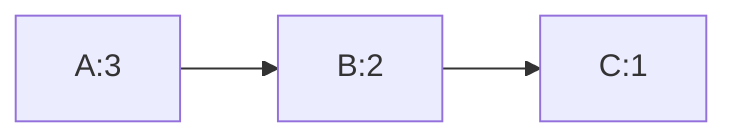

A *single pull* on `C` would advance it to `C:2`, consuming `B:2` — still one behind `A`. To make `C` fully current we issue a **push**. Unlike a pull, it does not wait for runs to complete before moving upstream; it propagates eagerly to every ancestor that is not yet at the target (shown in purple):

1) `C` receives a push, demanding data at current freshness (we will denote this as a generation 4, though in reality it would be a timestamp). `C` is not current, so the push is forwarded to `B`; `B` is not current, so it is forwarded to `A`:

    ```mermaid
    flowchart LR
        classDef running fill:#2196F3,stroke:#1976D2,color:#fff;
        classDef queued fill:#FF9800,stroke:#F57C00,color:#fff;
        classDef demanded fill:#4CAF50,stroke:#388E3C,color:#fff;
        classDef pushed fill:#9C27B0,stroke:#7B1FA2,color:#fff;

        A[A:3]:::pushed --> B[B:2]:::pushed
        B --> C[C:1]:::pushed
    ```

2) `A` has no parents so runs immediately:

    ```mermaid
    flowchart LR
        classDef running fill:#2196F3,stroke:#1976D2,color:#fff;
        classDef queued fill:#FF9800,stroke:#F57C00,color:#fff;
        classDef demanded fill:#4CAF50,stroke:#388E3C,color:#fff;
        classDef pushed fill:#9C27B0,stroke:#7B1FA2,color:#fff;

        A[A:4]:::running --> B[B:2]:::pushed
        B --> C[C:1]:::pushed
    ```

2) When `A` finishes, `B`'s parents satisfy its required freshness, so it runs:

    ```mermaid
    flowchart LR
        classDef running fill:#2196F3,stroke:#1976D2,color:#fff;
        classDef queued fill:#FF9800,stroke:#F57C00,color:#fff;
        classDef demanded fill:#4CAF50,stroke:#388E3C,color:#fff;
        classDef pushed fill:#9C27B0,stroke:#7B1FA2,color:#fff;

        A[A:4] --> B[B:2]:::running
        B --> C[C:1]:::pushed
    ```

3) `B` completes, updating to generation 4, skipping generation 3. This enables C to run:

    ```mermaid
    flowchart LR
        classDef running fill:#2196F3,stroke:#1976D2,color:#fff;
        classDef queued fill:#FF9800,stroke:#F57C00,color:#fff;
        classDef demanded fill:#4CAF50,stroke:#388E3C,color:#fff;
        classDef pushed fill:#9C27B0,stroke:#7B1FA2,color:#fff;

        A[A:4] --> B[B:4]
        B --> C[C:1]:::running
    ```

3) `C` completes, leaving all in the idle state at the same generation and freshness:

    ```mermaid
    flowchart LR
        classDef running fill:#2196F3,stroke:#1976D2,color:#fff;
        classDef queued fill:#FF9800,stroke:#F57C00,color:#fff;
        classDef demanded fill:#4CAF50,stroke:#388E3C,color:#fff;
        classDef pushed fill:#9C27B0,stroke:#7B1FA2,color:#fff;

        A[A:4] --> B[B:4] --> C[C:4]
    ```

The entire sequence is brought up-to-date with a single push, with no additional unconsumed work done upstream.

##### Branching

Push shares pull's most valuable property: it only ever drives the paths it actually needs. Take the same branching graph, where `C` consumes both `A` and `B`, and `D` consumes only `B`:


1) All idle at generation 0. `D` receives a push for generation 1:

    ```mermaid
    flowchart LR
        classDef running fill:#2196F3,stroke:#1976D2,color:#fff;
        classDef pushed fill:#9C27B0,stroke:#7B1FA2,color:#fff;

        A[A:0] .-> C[C:0]
        B[B:0] .-> C
        B .-> D[D:0]:::pushed
    ```

2) `D`'s only parent is `B`, so the target propagates to `B` alone. `A` and `C` are not ancestors of `D` and are never touched:

    ```mermaid
    flowchart LR
        classDef running fill:#2196F3,stroke:#1976D2,color:#fff;
        classDef pushed fill:#9C27B0,stroke:#7B1FA2,color:#fff;

        A[A:0] .-> C[C:0]
        B[B:0]:::pushed .-> C
        B .-> D[D:0]:::pushed
    ```

3) `B` runs and completes, then `D` runs against it and reaches the target. The push is satisfied, leaving `A` and `C` untouched at generation 0:

    ```mermaid
    flowchart LR
        classDef running fill:#2196F3,stroke:#1976D2,color:#fff;
        classDef pushed fill:#9C27B0,stroke:#7B1FA2,color:#fff;

        A[A:0] .-> C[C:0]
        B[B:1] --> D[D:1]
        B .-> C
    ```

Just as with pull, the unconsumed path (`A` and the join `C`) is left stale and no compute is spent on it. The difference between push and pull is *how much* of a demanded path runs — push brings it fully current, pull advances it one step — not *which* paths run. Both are triggered from the point of demand, so both leave low-demand sub-graphs quiet.

### Which Should You Use?

For simple pipelines, especially those that run with a period much less than the pipeline duration (e.g. daily for a 1 hour process), *push* is the most appropriate. It is intuitive and has no unusual side effects, guaranteeing in these conditions:

- At the end of the process, all data will be no older than when the request was made
- No unnecessary execution will occur

Its key disadvantage is that if requests are made more frequently than the bottleneck process can supply, nodes upstream of the process will run faster than the bottleneck can use them.

In the case where requests are likely to be made at similar (or faster) period as the bottleneck duration, *pull* is recommended. In these conditions it assures:

- No node anywhere in the sequence will execute more frequently than it can be consumed
- No node will be more stale than minimum possible

Pull and push are not mutually exclusive. A node may hold pull, push, or *both at once*. There's no great need therefore to be too careful about which to use.

If both tokens are active on a node:

- The node will execute any time the parents are fresher than itself, and apply pull upstream when it does so
- When the freshness eventually reaches the push target, the push is satisfied and it is cleared

The main take away is that triggering from the *point of supply*, as is common in most orchestration, inherently necessitates estimating what demand will be downstream. Triggering instead from the *point of demand* (as both pull and push methods here do) naturally leaves low-demand paths stale, and dramatically reduces the need for good governance over the DAG.

## Triggers

The **pull** and **push** methods can both be executed either once (e.g. linked to a single notification from a consumer) or continuously (e.g. executed back-to-back or on a schedule). Duckstring names each of these four trigger types explicitly:

| | Once | Continuously |
|---|---|---|
| **Pull** | Tap | Wave |
| **Push** | Pulse | Tide |

These are intentionally water-themed, to extend the natural fluid-oriented nomenclature that is common in data engineering (lake, streaming etc.). 

- **Tap**
    - A single resupply, like taking goods off a shelf at a supermarket
    - Pulls data at a given freshness from parents
    - Demand propagates upstream to replenish
- **Wave**
    - Executes a new Tap every time the target node completes
    - Every node updates as frequently as it can, without wasted effort
- **Pulse**
    - A single priority order, like requesting a custom product
    - Causes data at the specified freshness to flow from the roots to the target node
- **Tide**
    - A Pulse sent on a schedule
    - Data will update according to the specified period, unless bottlenecked by a process upstream
    - If bottlenecked, race conditions are avoided and supply is simply throttled to that bottleneck period

## Eager vs Gated

So far every parent has been treated as essential — a node waits for *all* of them before running, i.e. every parent **gates** the run. In practice a node often has parents it would *like* to incorporate but need not wait for, and which it can therefore run **eagerly** without. We distinguish two kinds of parent:

- **Required** (gating): the node must not run until this parent is fresh enough. The node is only as fresh as the *stalest* required parent. Conventional dependencies are required.
- **Optional** (eager): the node incorporates this parent if it happens to be ready, but never waits on it. An optional parent that lags behind simply contributes its latest available result; it never gates a run.

The distinction changes both gating rules:

- A node runs when its **required** parents satisfy the condition (fresher than itself for pull, at-or-past the target for push). Optional parents are ignored when deciding *whether* to run.
- A push target propagates upward only to **required** parents. There is no point forcing an optional parent to a target the node will not wait for; it is taken on a best-effort basis at whatever freshness it has reached.

This means an optional path is never on the critical path. A slow optional parent does not hold up its child, and is itself only run as often as some *other*, demanded path happens to pull it.

##### Example: an optional node slower than the bottleneck

Consider a node `C` with a required parent `A` (1s) and an optional parent `B` (4s), under a continuous Wave on `C`:

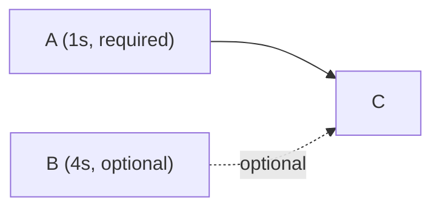

Because `B` is optional, `C` never waits for it. `C` is gated only by `A`, so the chain `A → C` runs back-to-back at `A`'s 1-second period. `B`, meanwhile, runs at its own pace — and `C` simply picks up whatever the latest `B` result is each time it runs:

| t | A | C | B | note |
|---|---|---|---|---|
| 0 | runs | — | runs | both `A` and `B` (optional) begin |
| 1 | runs | runs | running | `C` runs against `A`; `B` is still working, so `C` uses no `B` yet |
| 2 | runs | runs | running | `C` runs again — still gated only by `A`, not waiting on `B` |
| 4 | runs | runs | done | `B` finally completes; the *next* `C` will incorporate it |
| 5 | runs | runs | runs | `C` now includes the latest `B`; `B` starts its next run |

`C` (and `A`) run every second throughout, never throttled to `B`'s 4-second duration. Had `B` been *required*, `C` would have been forced down to a 4-second period to wait for it. Marking it optional keeps the demanded path fast while still folding in `B`'s slower updates whenever they land.

This is what makes optional parents useful for enrichment-style inputs — a large, slowly-rebuilt reference table feeding a fast main path, for example — where stalling the main path to wait on the slow input would be far worse than occasionally using a slightly older copy of it.

## Freshness

In the examples above, **pull** used a generation number for demonstration purposes, while **push** referred to a request for data resulting from root nodes executing after a given timestamp. 

These concepts are unified by a node's **freshness** `F`, which tracks the run start time of the oldest root used to supply that node. The difference between now and the freshness of a node is approximately its staleness or age. Note that it is distinctly *not* the time at which the run finished, as a recent transformation using stale data is still stale.

Freshness has the advantage of being independent of the specific DAG under which nodes were executed, unlike alternatives like run IDs. 

At completion of a run, a node will adopt the freshness of its parents. This is calculated by:

$$
F_{parents} =
\begin{cases}
\min_r F_r & \text{Any required parents } r \text{ exist} \\
\max_k F_k & \text{Only optional parents } k \text{ exist} \\
now & \text{No parents exist (root node)}
\end{cases}
$$

Where there are required parents, a node is only as fresh as the stalest of the set it was waiting on. Where there are only optional parents, a node is as fresh as the freshest, as it was not waiting on any of the others. If there aren't any parents at all, it is the time at the start of the run (roots mint new freshness).

Using **freshness**, the change gating rules for *push* and *pull* are:

- **Pull**: $F_{parents} > F_{self}$
- **Push**: $F_{parents} \ge F_{demand}$

### Example: Diamond Dependency

We will denote a node's freshness with `@`, so `A@9` means `A`'s output is as-of time 9. Consider a diamond where `X` consumes two intermediate nodes drawing on a common source `S`:

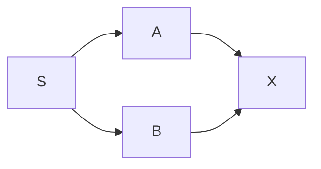

Suppose at time 12 the state is `S@12`, with `A` and `B` having last run against different snapshots of `S`:

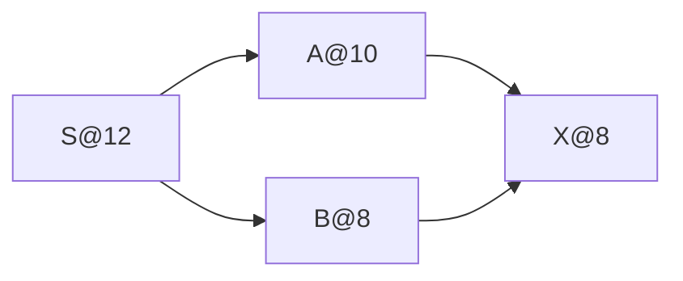

`A` was built from `S` as-of 10, `B` from `S` as-of 8. When `X` runs (both parents required), it can be no fresher than its stalest input: `F_X = min(10, 8) = 8`. The diamond therefore stays internally consistent — `X` reflects a single, coherent point in time across both paths, never a splice of `A` at 10 with `B` at 8. If instead `B` were an *optional* parent, `X` would take the minimum over its required parents alone (`A@10`), using whatever `B` it had on a best-effort basis.

## Ponds and Ripples

The model so far is a flat graph of nodes. In practice it is useful to group nodes into versioned, independently-owned units. We call a single node a **Ripple** — a unit operation exactly as discussed. A **Pond** is a group of Ripples, where all Ripples in that Pond will always execute to completion (push-style) when the Pond is triggered to start. A parent Ripple in a Pond is always treated as required for freshness purposes.

To continue the water-based nomenclature, we introduce the terms:

- **Source**: A parent of a Pond
- **Sink**: A child of a Pond
- **Inlet**: A Pond with no Sources
- **Outlet**: A Pond with no Sinks

The advantage of this grouping is to allow dependency management and version control to be pulled up to the level of the Pond. The Pond keeps track of the Ponds on which it depends and performs a macroscopic transformation - the Ripples are simply the irreducible components of that process.

Consider a Pond `p1` with a DAG of Ripples `r1`, `r2`, `r3` inside it:

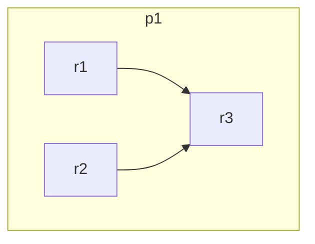

The simplest conceptual framing is to imagine the Pond as two zero-duration boundary nodes, `p1.start` and `p1.end`, before and after the Ripples within it. The head is parent to all root Ripples and the tail child to all leaf Ripples:

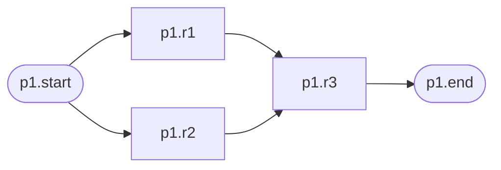

These boundary nodes are not merely conceptual — they sit in the graph as real (if instantaneous) nodes, and the ordinary demand and freshness rules apply to them unchanged. 

Pond relationships are between these boundary nodes. Consider a pond p2 with one Ripple, with p2 depending on p1:

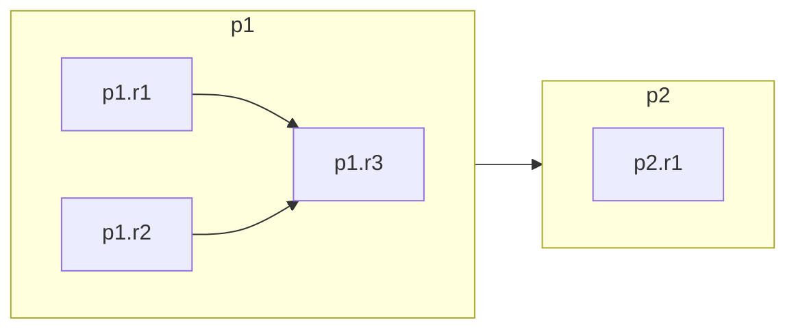

This is in practice the set of nodes:

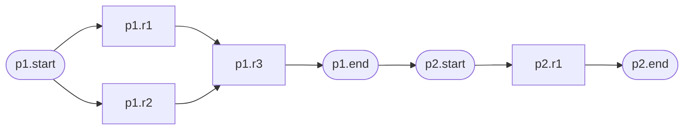

### Pond State Variables

As the boundary nodes are zero-duration, this framing is theoretically identical to setting all root Ripples of the child Pond to have all leaf ripples of the parent Pond:

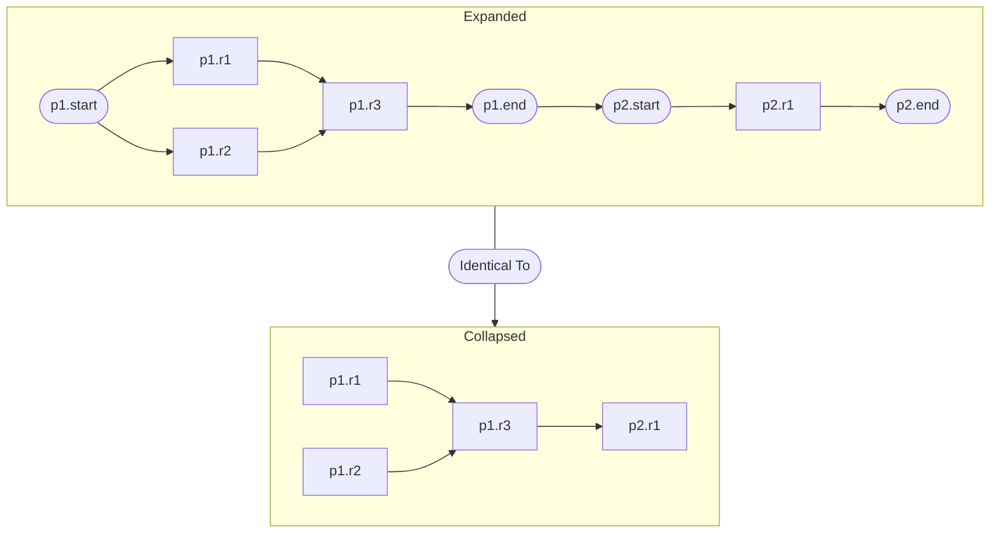

However, including the boundary nodes confers a few simplification advantages.

A Pond start node is always upstream of a Pond end node, and all its Ripples are between them. This implies:

- All events that immediately propagate to all parents are guaranteed to transfer from the end to the start
    - **push** tokens 
    - **pull** tokens, if the start is idle
- Immediately transferred information is shared between the start and end nodes, meaning these can be held as state variables against the Pond

This lets a Pond be triggered as a single unit - a **Pond Run**. This allows the further simplificatinos and abstractions:

- A Pond's freshness is held as both `Pond.startF` and `Pond.endF`
    - Both are required as they are used for different purposes
    - `Pond.startF` is conceptually against the start node, and is used for comparing with the Sources' freshness for change gating
    - `Pond.endF` is conceptually against the end node, and is used for informing Sinks of the Pond's *completed* freshness
- A pull arriving at an idle Pond sets the variable `Pond.hasPull`
    - The *pull* state can only be cleared at the end of a Pond Run, so can be held as a single state variable against the Pond
- A push arriving at a Pond sets the variable `Pond.pushTarget` = now
    - When a Pond Run starts all Ripples inherit this `pushTarget`
- The freshness of a Pond's Sources are held as `Pond.parentFreshness`
    - References the completed freshness of each Source `Source.endF`
    - This is held conceptually against the Pond's start node
    - As the end node has no parents apart from internal Ripples, there's no need to track this value
- A Pond Run can't start unless at least one of its root Ripples is not running
    - This emulates the roots following the Pond start node
    - Demand is only sent to the start node upon a root Ripple starting
- When starting a Pond Run:
    - Set `Pond.startF` = `Pond.parentFreshness`
        - Pond won't start again in pull until `Pond.parentFreshness` advances
    - If `Pond.hasPull`, set `Source.hasPull` = true for all Sources
    - Set `Ripple.pushTarget` = `Pond.startF` for all *non-root* Ripples
        - This ensures the Ripples will always complete to a given freshness
        - The roots are excluded: a root's parent freshness in an Inlet Pond is `now`, so a push against itself would always be satisfiable and the root would run perpetually. The roots are instead governed by pull alone
    - Set `Ripple.hasPull` = `Pond.hasPull`
        - Sets Ripples to run as pull if the Pond is in a pull state
    - Set `Ripple.parentFreshness` for each root Ripple to `Pond.startF`
        - The root Ripples will then begin executing, starting the run
- A Pond Run completes when all leaf `Ripple.F` > `Pond.endF`:
    - Set `Pond.hasPull` = false
        - Sinks will need to reassert pull to sustain pull execution on the next run
    - Set `Pond.endF` = min(`Ripple.F`) for all Ripples
        - This notifies Sinks that the Pond has updated

Under *pull*, a Pond will continuously initiate new Pond Runs any time its parentFreshness advances. This could mean multiple Pond Runs are in operation simultaneously, which is intentional.

Every Ripple in a Pond Run will *eventually* reach the `Pond.startF` freshness, as `Ripple.pushTarget` is set to this at run start. The Pond Runs may therefore be identified (and logged) by their `Pond.startF` freshness.

### Triggers

Triggers are each modelled as a zero-duration pseudo-node (like a Pond's boundary nodes) attached as child to the Pond. These each have special properties:

- **Tap**: Sets `Source.hasPull = true`, then deletes itself
- **Wave**: Sets `Source.hasPull = true` every time the pseudo-node runs
- **Pulse**: Sets `Source.pushTarget = now`, then deletes itself
- **Tide**: Sets `Source.pushTarget = now` on a set schedule

## Summary

Conventional pipelines are triggered from the *point of supply* — a schedule or a completed upstream run pushes work downstream. This forces a choice between running too often (wasting compute and producing results nobody consumes) and running too rarely (accepting stale data), and it demands central governance to decide the rate of every path.

Duckstring instead triggers from the *point of demand*. Two complementary methods drive a graph of unit operations:

- **Pull** is demand-driven resupply, borrowed from Kanban. A node runs when something downstream has asked for its output *and* it has fresher input to consume, re-arming its own parents as it goes. This throttles every path to its actual consumption rate — both upstream *and* downstream of any bottleneck — and leaves unused paths idle at no cost.
- **Push** is a demand-driven *priority order*. A target freshness propagates eagerly from the consumer up through its ancestors, bringing the whole demanded path current in a single coordinated run — the familiar behaviour of triggering a DAG, but still initiated by the consumer so unused paths stay quiet.

Both reduce to a single quantity, **freshness**: a timestamp describing how current a node's output is, inherited from its parents (the stalest of the required ones). Demand is a simple boolean — *is there any?* — so shared and branching paths need no per-consumer accounting, and a slow *optional* parent never holds up a fast required path.

Each method has a one-shot and a continuous form, giving the four triggers — **Tap** and **Wave** for pull, **Pulse** and **Tide** for push — with **Stop** to calm a graph.

Finally, unit operations (**Ripples**) are grouped into versioned, independently-owned **Ponds**. Modelling a Pond as its Ripples book-ended by zero-duration boundary nodes lets dependency management, version control, and triggering be lifted to the Pond level without changing any of the underlying node rules — the boundary nodes are real participants in the graph, not merely a conceptual device. The result is a scheduler that approaches the optimal trade of compute against staleness, while pushing governance of the pipeline down to the owners of each Pond rather than a central authority.